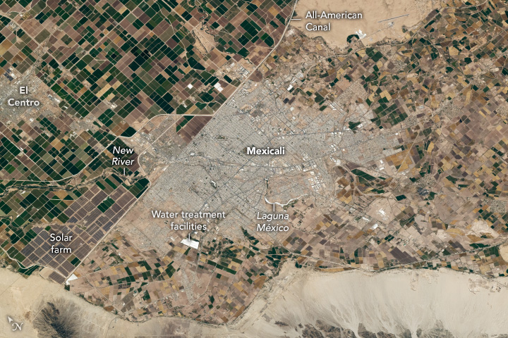

# Entering L12 — the dive from regions to cities

This page walks the L11-to-L12
dive in plain steps: what you approach, what changes on entry, and
the numbers behind it. The bridge behind us lives in
[the L11 bridge](./previous-l11.md);
the part docs (`cities.md`, `towns.md`, `networks.md`,
`farmland.md`, `landscapes.md`) and the timeline (`lifetime.md`) now exist —
the cross-links below say where each sight belongs.

## The approach

You leave the whole region behind and fall toward one patch of its face — a city with its
landscapes about 1 to 100 km across, the size of a large metro, a lake, a valley.
The region thins out into ground: mountains green and parallel, farmland in straight-edged
rectangles, rivers dark and winding, still there, now around you. Far behind lies the region wash:
the coarse land-cover blobs, the broad haze, the city reduced to a dot. Ahead, one marker brightens
among the points: the city portal of this L11 cell, holding one L12 patch — grey built mass below,
suburbs feathering out, roads as pale lines, fields as rectangles, lakes dark and still, valleys
cutting through. Around the point, the city itself swells into view: first the pale patch, then the
street grid, then the field boundaries, then the lake shorelines and valley walls, then the parks
and forest patches inside — with the preview toward the buildings of L13
(see [the L12 bridge](../../L13/documents/previous-l12.md)).

Target visual (file in `images/`, credit and license at the bottom):

The frame holds Mexicali where its street grid meets the border farm grid —
urban blocks on one side, repetitive field rectangles on the other, canals as
thin lines beside roads, the foothills of the Sierra de Los Cucapah along the
bottom. Irrigated cotton and wheat run south and east of the city; alfalfa,
wheat, and sugarcane follow the survey grid to the north with a solar farm of
small grey panels among the fields. One L12 cell carries this mix of built
mass, patchwork, and anchors; a full metro crosses several L12 frames, so what
you see here is the one-cell view.

Sources: `../../../../docs/universes/ladder.md` (L11 and L12 rows, gap note);
[NASA Earth Observatory](https://science.nasa.gov/earth/earth-observatory/) pages;
[USGS land-cover pages](https://www.usgs.gov/centers/eros/science/national-land-cover-database).

## Crossing into L12

The L11–L12 span is short — roughly one to two decades in characteristic size —
so it is crossed through quiet magnification: the dive pushes by proximity
to the targeted portal and unwinds the same way, so generation, snapshots and labels
never see a gap. (The ladder gap note lists no magnification milestones for this leg.)
Then the portal opens (angular radius past 0.14 rad, about a third of the
view) and the cell closes back into its marker below 0.10 rad —
pure origin shifts, with the pre-entry preview having already drawn
the interior inside the marker from 0.02 rad up to the opening
(at most 6 markers preview at once, largest on screen first).

What you see, in order, on this entry:

1. The region thins and goes: the broad patch with its relief shadows and water shapes
   dissolves into the built ground around you — the region reduced to
   city for the landscape.
2. One patch takes everything: a city with its landscapes about 1 to 100 km across, the size of
   a metro or lake, with built mass, fields, and water in one frame —
   the mass mapped in [the cities doc](./cities.md).
3. The patch becomes ground: cities pale grey and beige, fields green and brown in rectangles,
   water dark — the curved face, lit on one side.
4. The grids resolve: the street blocks 0.1–1 km, the farm sections 1.6 km with quarter
   cuts at 800 m and 400 m, with canals and rails as thin lines —
   see [the networks doc](./networks.md) and [the farmland doc](./farmland.md).
5. The relief resolves: valleys as cuts with walls and terraces, hills as green texture,
   lake shores as sharp lines with islands inside —
   see [the landscapes doc](./landscapes.md).
6. The green shows: parks and riparian corridors as darker green inside the grey, forests on
   the hills, with the preview toward the buildings of L13
   (see [the L12 bridge](../../L13/documents/previous-l12.md)) —
   see [the towns doc](./towns.md) for the feathered spread around the core.
7. The markers fill again: from many region portals per L11 cell to many city portals per L12 cell — this dive continues the beyond-MVP tail.

Sources: ladder gap note and R7 preview angles; ADR 0010;
[NASA Earth Observatory](https://science.nasa.gov/earth/earth-observatory/) pages;
[USGS pages](https://www.usgs.gov/science).

## Effects on entry

Entry is gentle here because the L11-to-L12 leg is short — only about one to two
decades in characteristic size, crossed quietly as the dive falls from 10^5 m toward
10^3 m. On entry, the region markers fade out of the frame, and the coarse blobs of L11
land cover fade with them — they belong to the region view, not to the city. What stays and grows is the targeted city marker:
it swells from the preview size at 0.02 rad up to the open angle at 0.14 rad, drawing
its streets, fields, and waters inside itself before the entry completes. Population
points never open (ADR 0010) — they are shown and counted but never targeted, so
only the true city portal carries you through this entry. At most 6 markers preview
at once, largest on screen first, so the entry view stays calm even when the ground
is crowded. The standard palette reads forest, crops, grass, water, and artificial cover
like roads and buildings at Landsat 30 m under the 16-class legend; urban
imperviousness reads as percent developed surface per pixel. Copernicus
Sentinel-2 at 10 m with a 290 km swath resolves the highways and wide
arterials inside that palette, not lane markings.

Sources: `../../../../docs/universes/ladder.md` (L11 and L12 rows, R7 preview
angles, gap note); ADR 0010; [ESA Sentinel-2 pages](https://www.esa.int/Applications/Observing_the_Earth/Copernicus/Sentinel-2);
[USGS land-cover pages](https://www.usgs.gov/centers/eros/science/national-land-cover-database).

## Timing

The L11 span (regions 10^5–10^6 m, decades e 5–6) gives way to
the L12 span (cities 10^3–10^5 m, decades e 3–5) — about one to two decades
closer in characteristic size. Travel time per rung runs `Δe ·
ln 10 / k`, so this leg runs short; the long four-decade
heliopause-to-Sun run is far behind us. Inside L12, distances read
in fractions of the city: metros tens of km across, lakes single to tens
of km, valleys single km wide — with the region 100 to 1,000 km around,
about 8.35 light-minutes from the Sun, the Moon 384,400 km out (about 1.3
light-seconds). Earth spins once in
23.9 hours and circles the Sun in 365.25 days; the cities turn with it from day
into night.

Sources: ladder L11 and L12 rows; [NASA Earth facts](https://science.nasa.gov/earth/facts/) (sizes,
distances, light time); [USGS pages](https://www.usgs.gov/science) (city and field sizes).

## What entry proves

Entry is complete when the region wash is gone, one patch of built ground commands the
view, and the patch shows streets and fields: you count blocks, field edges,
and shorelines, not regions. If you can name the city below as grey mass with suburbs along
it, the day-night change as local light, the road lines and field rectangles, and the lakes
and valleys as dark and cut — you are in L12. The
detailed looks, lifetimes and interactions of each kind live in the
part docs: [the cities and towns](./cities.md), [the networks and farmland](./networks.md),
[the landscapes](./landscapes.md) —
start with the reading guide in [the timeline](./lifetime.md) to map each sight to its stage.

Sources: [NASA Earth Observatory](https://science.nasa.gov/earth/earth-observatory/) pages;
[USGS pages](https://www.usgs.gov/science).

## Where to go next

- [The L11 bridge](./previous-l11.md) — what carries over, what changes at this zoom.
- [Cities](./cities.md), [towns](./towns.md), [networks](./networks.md) — the built mass, the spread, the links.
- [Farmland](./farmland.md), [landscapes](./landscapes.md) — the patchwork and the anchors.
- [Lifetime](./lifetime.md) — dated stages from first settlements to today's cities.
- [L13 bridge](../../L13/documents/previous-l12.md) — where this dive leads next.

## Key numbers

- L11 span: regions 10^5–10^6 m (100 to 1,000 km).
- L12 span: cities 10^3–10^5 m (1 to 100 km); metros 20–100 km; blocks 0.1–1 km; farm sections 1.6 km.
- Portals: many region portals per L11 cell → many city portals per L12 cell (counts fixed in the loop).
- Open angle 0.14 rad, close 0.10 rad, preview from 0.02 rad (at most 6 markers).
- City examples: New York urban area 8,413 km2 (about 100 km across, 19,426,449 people);
  Los Angeles 4,239 km2 (about 73 km across, 12,237,376 people, densest large US area).
- Land-cover palette: forest, crops, grass, water, artificial cover; 10 m Sentinel-2 (290 km swath, 5-day revisit), 30 m NLCD 16-class legend.
- Light travel for context: Moon to Earth about 1.3 s; Sun to Earth about 8.35 minutes.

Sources: ladder L11/L12 rows, R7 preview angles, gap note;
[US Census 2020 urban-area facts](https://www.census.gov/programs-surveys/geography/guidance/geo-areas/urban-rural/2020-ua-facts.html);
[NASA Earth facts](https://science.nasa.gov/earth/facts/);
[USGS land-cover pages](https://www.usgs.gov/centers/eros/science/national-land-cover-database).

## Image credits and licenses

| File | Shows | Credit (required) | License / terms |
|---|---|---|---|
| `mexicali-city-farmland-nasa.jpg` | City grid meeting farmland grids with canals and hills (screensize) | Astronaut photograph ISS071-E-131092 (Expedition 71 crew, Nikon Z9 400mm), ISS Crew Earth Observations Facility and Earth Science and Remote Sensing Unit, NASA Johnson Space Center | Public domain (NASA) (`https://science.nasa.gov/earth/earth-observatory/mexicali-baja-california-153234/`) |

## Sources

- Ladder: `../../../../docs/universes/ladder.md` (L11 and L12 rows, R7 preview, gap note)
- NASA, Earth Observatory: `https://science.nasa.gov/earth/earth-observatory/`
- NASA, Mexicali frame (ISS071-E-131092, May 25 2024): `https://science.nasa.gov/earth/earth-observatory/mexicali-baja-california-153234/`
- NASA, Earth facts (sizes, distances, 8.350022 min light time): `https://science.nasa.gov/earth/facts/`
- US Census, 2020 urban areas: `https://www.census.gov/programs-surveys/geography/guidance/geo-areas/urban-rural/2020-ua-facts.html`
- USGS, land-cover: `https://www.usgs.gov/centers/eros/science/national-land-cover-database`
- ESA, Sentinel-2: `https://www.esa.int/Applications/Observing_the_Earth/Copernicus/Sentinel-2`
