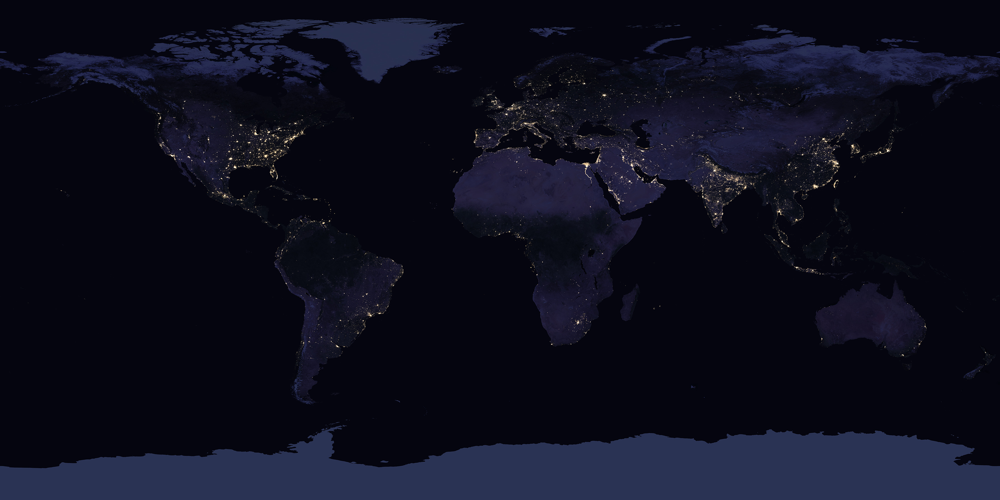

# Lifetime — dated stages for cities and landscapes

This page runs the dated timeline through the L12 parts:
from lake and valley shaping and first farms to ancient cities, medieval towns, industrial growth,
modern sprawl, the present, and the far-future fate. Each stage maps to its part doc; timescales
cross-check across docs.

## Reading guide

- Geologic background (Pleistocene to Holocene) → `landscapes.md` (lakes, valleys).
- First farms (~10000 BCE) → `farmland.md` (fields, countryside).
- Ancient cities (Uruk, Rome) → `cities.md` (cores, districts).
- Medieval towns (500–1500) → `towns.md` (towns, villages).
- Industrial growth (1800s) → `networks.md` (roads, rails) and `cities.md`.
- Modern sprawl (1945–present) → `towns.md`, `farmland.md`, `networks.md`.
- Present (2026 anchor) → all parts.
- Far-future fate (growth, climate, abandonment) → all parts.

Sources: Britannica Neolithic and Rome pages; US Census urban-rural pages; NASA Earth Observatory pages.

## Geologic background — lakes and valleys before humans

About 2,600,000 to 11,700 years before present, Pleistocene glaciations carve valleys, scour lake
basins, and lay till and outwash across North America and Europe; end-moraine and kettle lakes are
typical. About 11,700 years before present the Holocene begins with glacier retreat; modern
floodplains, valley fills, and lake sedimentation start. Every lake and valley stage starts as
carved in the Pleistocene and stabilized in the Holocene — tens of thousands of years before the
first farms. The Grand Canyon downcutting itself runs 5–6 million years on rocks over 2.5 billion
years; Lake Superior is the youngest Great Lake at 10,000–7,500 years.

Target visual (file in `images/`, credit and license at the bottom):

Sources: Britannica Neolithic page (10,000 BCE with Holocene start); NPS geology pages.

## First farming settlements (~10000–3000 BCE)

About 10000 BCE the earliest Neolithic begins in the Fertile Crescent with glacier retreat and the
Holocene. About 9500 BCE first cultivation and animal domestication appear in southwest Asia. About
7000 BCE farming with settled villages is achieved in the Tigris-Euphrates valleys with barley,
wheat, sheep, goats, later cattle and pigs; farming reaches Greece with spread north over 4,000
years, not complete in Britain and Scandinavia until after 3000 BCE. Millet and rice follow in the
Huang He and southeast Asia about 3500 BCE; maize, beans, and squash in Mexico and Central America
6500–2000 BCE to sedentary villages.

Sources: Britannica Neolithic page.

## Ancient cities — Uruk and Rome (~4500 BCE–500 CE)

About 4500–3100 BCE the Uruk Period runs in southern Mesopotamia; Uruk grows from proto-city to true
city about 3200–3000 BCE with writing, ziggurat, and wall, 40,000–80,000 at peak — the first-city
anchor. Traditional founding of Rome runs 753 BCE; kingdom to republic to empire follows. About
100–200 CE imperial Rome holds about 1 million, the largest city in the world, with aqueducts,
roads, and masonry as the model for later infrastructure. In the 5th century the western empire
falls; Rome shrinks but persists as idea and papal seat; in 1870 Rome becomes capital of unified Italy.

Sources: Britannica Rome page; encyclopedia Uruk and Sumer entries.

## Medieval towns (~500–1500)

About 500–1000, post-Roman contraction leaves fortified burhs, monastic centers, and small walled
towns. About 1000–1300, High Medieval revival brings charters, fairs, the Hanseatic League, and
Italian communes; Paris, London, Venice, and Milan reach tens of thousands on agriculture surplus
and trade. About 1347–1352 the Black Death cuts 30–50 percent of Europe with town abandonment and
contraction — the abandonment precedent for the far future. About 1400–1500 recovery and Renaissance
rebuilding follow.

Sources: Britannica Middle Ages and Rome pages.

## Industrial growth (1760–1914)

About 1760–1840 the Industrial Revolution runs from Britain to continent and US with steam, rail,
and factory towns. From 1801 to 1901 the UK urban share rises about 33 to 78 percent; London grows
about 1 to 6.5 million — the classic industrial-urban curve. From 1790 to 1920 the US rises about 5
percent urban to over 50 percent with mass immigration, tenements, and streetcar suburbs. From 1870
to 1914 the second wave of steel, electricity, piped water, and sewers reshapes city layout.

Sources: Britannica Industrial Revolution page; US Census history pages.

## Modern sprawl and farmland change (1945–present)

From 1945 to 1970 US post-war suburbanization explodes the metro footprint while core densities fall:
highways, Levittowns, and white flight. By 2007 the world passes 50 percent urban; by 2020 the US
runs 80–83 percent urban under the 2020 definition (densely settled core of 2,000 housing units or
5,000 people). US farm count peaks about 6.8 million (1935) then falls toward 2 million with larger
average size; exurban fringe converts cropland to housing, paired with night-lights and Landsat
sprawl visuals. Lakes and valleys in this stage gain dammed reservoirs, drained wetlands,
channelized rivers, and eutrophication.

Sources: US Census urban-rural pages; NASA Earth Observatory pages.

## Present — you are here (2026)

About 8.1 billion world population with over 55 percent urban; the US about 340 million with over 80
percent urban. Climate pressure shows as heat islands with flood and drought on the same valley and
lake system and record-low reservoirs. Use this as the you-are-here beat: every part doc describes
today, and the far-future fate below branches from here.

Sources: US Census population pages; NASA Earth and climate pages.

## Far-future fate — growth, climate, abandonment

Growth: projections commonly cited near 9.7 billion by 2050 and 10.4 billion by the 2080s with about
68 percent urban by 2050 → densification, megacity coalescence, and rewilded fringe. Climate: sea
level, heat, and water stress force managed retreat from floodplain and coast with reservoir loss and
valley reshaping. Abandonment: Detroit and rust-belt, mining towns, Angkor and Rome precedents lead
to ruins, forest succession, and lake sediment burying streets — Rome fell but persisted as idea, the
strong closer. The fate of cities is thus growth with retreat and ruins, consistent across `cities.md`,
`towns.md`, `networks.md`, `farmland.md`, and `landscapes.md`.

Sources: NASA climate pages; USGS pages; Britannica Rome page.

## Cross-check of aligned timescales

- Valleys and lakes: Pleistocene carve → Holocene stabilize → present use → future reshape; no gap
  between `landscapes.md` formation and this timeline.
- Farmland: 10000 BCE first farms → 7000 BCE villages → 1935 farm peak → present consolidation;
  matches `farmland.md` creation and change.
- Cities: 3200 BCE first city → 100 CE Rome 1M → 1901 London 6.5M → 2020 New York 19.4M urban;
  matches `cities.md` sizes.
- Towns: 500–1500 walled towns → 1946–55 suburbs 1.45M per year → BosWash 53.1M; matches `towns.md`.
- Networks: 1760–1840 rails → I-90 3,020 miles → present arterials; matches `networks.md`.

Sources: pages named above.

## Image credits and licenses

| File | Shows | Credit (required) | License / terms |
|---|---|---|---|
| `city-lights-nasa.jpg` | Earth at night, city lights showing where cities sit (screensize) | NASA Earth Observatory, using Black Marble data by Ranjay Shrestha / NASA Goddard Space Flight Center, VIIRS day-night band data from Suomi NPP | Public domain (NASA) (`https://science.nasa.gov/earth/earth-observatory/earth-at-night/maps/`) |

## Sources

- Britannica, Neolithic: `https://www.britannica.com/event/Neolithic`
- Britannica, Rome: `https://www.britannica.com/place/Rome`
- US Census, urban-rural: `https://www.census.gov/programs-surveys/geography/guidance/geo-areas/urban-rural.html`
- NASA, Earth Observatory: `https://science.nasa.gov/earth/earth-observatory/`
- USGS: `https://www.usgs.gov/`
- NASA, climate: `https://climate.nasa.gov/`
