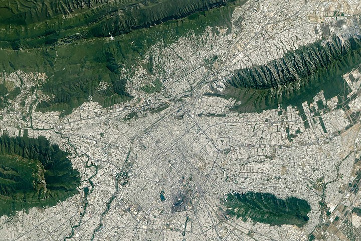

# Towns — suburbs, villages, sprawl

One of five L12 parts: towns, suburbs, villages, and sprawl at 1–100 km.
The bridge from L11 lives in `previous-l11.md`; the dive lives in `entry.md`; the timeline in `lifetime.md`.
For the built mass the spread feeds see [cities](./cities.md); for the links that carry its commuters see
[networks](./networks.md); for the fringe it consumes see [farmland](./farmland.md);
for the walls and edges that bound it see [landscapes](./landscapes.md).

## How it looks

A suburb reads as predominantly residential texture within commuting distance of a large city, lower
density than the inner city: tract housing, curved roads, culs-de-sac, few entries onto collectors [S003][S006].
Sprawl reads as rapid low-density single-use expansion, auto-reliant: separated uses, strip and
leapfrog development, subdivisions, lawns, strip malls and big-box stores, wide arterials, ample
parking. A village reads as dwellings fairly close together, not scattered, historically a church
with farmland around; a town is larger than a village and smaller than a city, with centralized
services and commerce.

By day the suburb feathers out from the city edge, then gives way to farmland rectangles: by day a
large city can blend into the countryside as a grey smudge while the suburbs melt into grey-green
fringe, as the Chicago day frame shows [S003]. By night the same spread is a bright blob with street
grids visible: older neighborhoods irregular with green mercury light, newer western grids rectilinear
with orange sodium light; Japanese cities glow cooler blue-green from mercury vapor with newer orange
sodium developments along bays like Tokyo Bay [S003]. City lights give sharp boundaries for the
densest concentrations of people, and astronaut photography at better than 10 m with long lenses
refines the urban boundaries drawn from satellite data [S003]. Border pairs read the culture of the
grid side by side: Ciudad Juarez dense against El Paso, where Interstate Highway I-10 cuts across
the city as a bright line [S003].

The Monterrey target visual pins the spread to a real place. Astronaut photograph ISS075-E-70481,
taken 26 August 2026 from the International Space Station with a Nikon Z9 at 400 mm on Expedition 75,
looks over Monterrey — Mexico's second-largest metropolitan area at 5.3 million people (2020 census),
an industrial hub for ironworks, steelworks, textiles, processed foods, glass, and plastics — filling
the frame with light urban development against the green parallel ridges of the Sierra Madre Oriental
[S001]. Along the city's southern edge, limestone layers deposited in the late Mesozoic era and folded
about 80–50 million years ago form the ridgelines that bound it; the Rio Santa Catarina carves through
the mountains onto the semiarid floodplain where the city lies, usually carrying little water but
collecting summer-rain runoff and serving as an in-city natural area [S001]. Island-like folded-rock
protrusions stand inside the urban mass, including the Sierra Las Mitras state nature reserve
(established 2000), rising about 1,500 m over the city from cacti and thornscrub to oak and pine forest,
with Cerro de la Silla (Saddle Hill) contrasting against the built environment [S001]. ESA's Sentinel-2
view of 5 March 2023 resolves the same bargain at 10 m: the grey metro at 540 m elevation nestled at
the foothills, the Santa Catarina crossing it, pivot-irrigated fields south of the ranges, and
square-shaped fields thickening along rivers and canals to the east [S002].

Target visual (file in `images/`, credit and license at the bottom):

Sources: NASA Earth Observatory Monterrey page [S001]; ESA Sentinel-2 Monterrey feature [S002];
NASA cities-at-night feature [S003].

## How it changes over time

Villages dominated subsistence-agriculture societies; the Industrial Revolution drew labor to mills
and factories and many villages grew into towns and cities. The earliest suburbs grew with the first
settlements; Roman suburbani villas, 19th-century rail ribbons, the 1860s Metropolitan Railway and
Metro-land, interwar garden suburbs, then the post-war US boom at about 1.45 million homes per year
(1946–55). US developed land rose by about 44 million acres (1982–2017); about 3 percent of US land
is urban. Taylor's scheme runs infantile (no zoning) to mature (defined districts).

Footprints coalesce into ever-larger bright blobs and roads connect into a lace-like web; repeat night
photos from orbit document the growth [S003]. The change is no longer a one-way brightening: the
2014–2022 Black Marble analysis of nearly a decade of VIIRS day-night band data (Suomi NPP, NOAA-20,
NOAA-21) found global radiance up 34 percent with strong bidirectional change side by side [S004].
In the US, West Coast cities brightened with population growth while much of the East Coast dimmed on
energy-efficient LEDs and economic restructuring; light surged with urban development in China and
northern India, while LEDs and conservation dimmed France 33 percent, the UK 22 percent, and the
Netherlands 21 percent, and European nights dimmed sharply in the 2022 energy crisis [S004].

The daytime record now tracks the spread year by year. The USGS Annual National Land Cover Database
(Collection 1.2 adds 2025) maps six products every year at 30 m for the conterminous United States —
land cover on the 16-class Anderson Level II legend, land-cover change, a confidence index, fractional
impervious surface, an impervious descriptor, and spectral-change day of year — back to 1985, and its
1985–2024 urban-growth map shows the year each new patch of development appeared [S007]. Between the
2010 and 2020 censuses, US urban land area fell 2.4 percent while urban population rose 6.4 percent,
so density rose 9.0 percent: the spread grew up, not just out [S005].

Monterrey shows the hollow-core variant: the metro area has grown overall since 1990, but the number
of people living within 5 km (3 miles) of the city center has declined — a trajectory shared with many
of Mexico's metropolitan areas [S001].

Sources: encyclopedia suburb, sprawl, village, town pages (carried over); NASA Black Marble
2014–2022 change analysis (Li et al. 2026) [S004]; USGS Annual NLCD [S007]; US Census 2020 urban-area
facts [S005]; NASA Earth Observatory Monterrey page [S001].

## How it is created

Villages form as homes clustered for sociability and defence with surrounding land farmed; in Britain
a hamlet becomes a village when a church is built. Suburbs form when improved rail and roads allow
commuting, with autos, highways, cheap housing, and standardized tract methods — Levitt's 26 steps
at 30 houses per day. Towns form by market charter, incorporation, and zoning districts. Sprawl is
driven by flight from blight plus population, wages, and better transport allowing life farther from
hubs.

The statistical half of creation is the urban-area delineation. For the 2020 Census, an urban area is
a densely settled core of census blocks meeting minimum housing-unit or population density, plus
adjacent non-residential urban land — qualifying at 2,000 housing units or 5,000 people — drawn after
each decennial census from census and other data [S006]. Landsat-based maps then separate impervious
concrete and rooftops from vegetation at 30 m to model land-use efficiency and forecast growth, while
the Annual NLCD's impervious-surface products track each year's new development back to 1985 [S007].

Sources: encyclopedia suburb, village, town pages and Levittown pages (carried over); US Census
urban-rural guidance and 2020 criteria [S006]; USGS Annual NLCD [S007].

## How it interacts with the others

Towns and suburbs interact as the feeders of [cities](./cities.md). Large walled towns with smaller
villages form a symbiotic market-town relation. Suburbs link economically to the nearby city especially
by commuters — Tokyo de jure 14.05 million rises to 16.75 million by day (see
[cities](./cities.md#how-it-interacts-with-the-others)); job sprawl puts the majority of jobs beyond
5 miles from the center, increasingly on the suburban periphery. Discrete cities tie through
intermeshing suburban zones into a megalopolis — BosWash holds 53.1 million on under 2 percent of US
land. Suburbs consume [farmland](./farmland.md#how-it-interacts-with-the-others) at the fringe, follow
[networks](./networks.md#how-it-interacts-with-the-others) outward, and press against
[landscapes](./landscapes.md#how-it-interacts-with-the-others): hills as walls, rivers as edges,
forests as separators.

Monterrey shows the water bargain underneath the spread: Cumbres de Monterrey National Park, a UNESCO
Biosphere Reserve in the Sierra Madre Oriental, provides about half the water consumed in Monterrey and
its metro area, so forest cover there is water infrastructure [S002]; when supply fails, taps run dry
in outlying districts first (see [landscapes](./landscapes.md#how-it-interacts-with-the-others)).

Sources: encyclopedia suburb and sprawl pages (carried over); US Census pages [S005][S006];
ESA Monterrey feature [S002].

## Typical size and mass

Villages run about 500–2,500 inhabitants by common measure; India counted 649,481 villages in 2011
with 69 percent of Indians in villages. Towns vary by law rather than population: Czech towns usually
1,000–35,000 (median 4,000); Levittown NY holds 51,758 on 6.84 sq mi. Sprawl density runs 2–4 houses
per acre in the US (5–10 per hectare); parking and lawns inflate urbanized land faster than population.

The counted US measure is the 2020 Census urban area: 2,611 urban areas holding 265,149,027 people —
80.0 percent of the US population — on the densely settled-core definition of 2,000 housing units or
5,000 people [S005][S006]. New York–Jersey City–Newark, the largest, holds 19,426,449 people on
3,248.12 sq mi; Los Angeles–Long Beach–Anaheim holds 12,237,376 on 1,636.83 sq mi and is the densest
large US urban area at 7,476 per sq mi [S005]. Globally, the UN World Urbanization Prospects 2025
revision tracks urban and rural populations for 1950–2025 with projections to 2050, consistent with the
2024 World Population Prospects totals [S008]. Mass is not catalogued; built area times impervious
fraction (USGS Annual NLCD [S007]) with building height is the proxy (see
[cities](./cities.md#typical-size-and-mass)).

Sources: encyclopedia village, town, sprawl pages (carried over); US Census 2020 urban-area facts
[S005] and urban-rural guidance [S006]; UN World Urbanization Prospects 2025 [S008]; USGS Annual
NLCD [S007].

## Example objects

- Example: Levittown NY — the first mass-produced suburb, 17,447 homes by 1951; archetype postwar US.
- Example: BosWash corridor — discrete cities tied by suburbs into a megalopolis of 53.1 million.
- Example: Monterrey metro fringe, 5.3 million people (2020 census) against the folded limestone
  ridges of the Sierra Madre Oriental — archetype constrained spread: overall growth since 1990 with a
  hollowing core, the Santa Catarina floodplain as its in-city natural area, and the 1,500 m Sierra Las
  Mitras reserve standing inside the urban mass [S001][S002].
- Example: Bourton-on-the-Water and Shirakawa-go — archetype villages, church and fields, fixed dwellings.

Sources: encyclopedia and place pages named above (carried over); NASA Earth Observatory Monterrey
page [S001]; ESA Monterrey feature [S002].

## Image credits and licenses

| File | Shows | Credit (required) | License / terms |
|---|---|---|---|
| `towns-monterrey-nasa.jpg` | Monterrey urban development against green mountain ridges (screensize) | Astronaut photograph ISS075-E-70481 (26 August 2026, Nikon Z9, 400 mm, Expedition 75), ISS Crew Earth Observations Facility and Earth Science and Remote Sensing Unit, NASA Johnson Space Center | Public domain (NASA) (`https://science.nasa.gov/earth/earth-observatory/monterrey-amid-mountains/`) |

## Sources

- [S001] NASA Earth Observatory, Monterrey Amid Mountains (Image of the Day, 11 Sep 2026;
  ISS075-E-70481, Nikon Z9, 400 mm, Expedition 75). Accessed 2026-10-08. URL:
  `https://science.nasa.gov/earth/earth-observatory/monterrey-amid-mountains/`
  — Supports: 5.3M metro (2020 census), second-largest metro, industrial hub; growth since 1990 with
  decline within 5 km of center (citing Nature Communications 2026); limestone late-Mesozoic deposit
  folded 80–50 Ma; Rio Santa Catarina semiarid floodplain and in-city natural area; Sierra Las Mitras
  reserve (2000) 1,500 m, cacti-to-oak-pine gradient; Cerro de la Silla. Used in: How it looks; How it
  changes over time; How it interacts with the others; Example objects.
- [S002] ESA, Earth from Space: Monterrey, Mexico (Copernicus Sentinel-2, 5 Mar 2023, 10 m).
  Accessed 2026-10-08. URL:
  `https://www.esa.int/ESA_Multimedia/Images/2023/03/Earth_from_Space_Monterrey_Mexico`
  — Supports: grey metro at 540 m at the foothills; Santa Catarina usually fed by underground water;
  Cumbres de Monterrey National Park (UNESCO Biosphere Reserve, ~50% of metro water); Saltillo west;
  pivot fields south; square fields along rivers and canals east. Used in: How it looks; How it
  interacts with the others; Example objects.
- [S003] NASA Earth Observatory, Cities at Night: The View from Space (Evans and Stefanov,
  22 Apr 2008). Accessed 2026-10-08. URL:
  `https://science.nasa.gov/earth/earth-observatory/cities-at-night-the-view-from-space`
  — Supports: day grey-smudge versus night bright-blob readout (Chicago day/night pair); mercury-green
  versus sodium-orange generations; Tokyo blue-green glow; Juarez density versus El Paso with I-10 as a
  bright line; sub-10 m astronaut night photography refining satellite urban boundaries. Used in: How
  it looks; How it changes over time.
- [S004] NASA Earth Observatory, Picturing Earth in a New Light (15 May 2026; Li et al. 2026,
  Nature 652, 379–386, DOI: `10.1038/s41586-026-10260-w`). Accessed 2026-10-08. URL:
  `https://science.nasa.gov/earth/earth-observatory/picturing-earth-in-a-new-light/`
  — Supports: 2014–2022 Black Marble analysis; global radiance up 34 percent with bidirectional change;
  West Coast brightening versus East Coast LED dimming; China/India surge; France −33 percent,
  UK −22 percent, Netherlands −21 percent; 2022 European energy-crisis dimming. Used in: How it changes
  over time.
- [S005] US Census Bureau, 2020 Census Urban Areas Facts (updated June 2023). Accessed 2026-10-08.
  URL: `https://www.census.gov/programs-surveys/geography/guidance/geo-areas/urban-rural/2020-ua-facts.html`
  — Supports: 2,611 urban areas; 265,149,027 urban (80.0 percent); land area −2.4 percent with density
  +9.0 percent 2010–2020; New York 19,426,449 on 3,248.12 sq mi; Los Angeles 12,237,376 on 1,636.83 sq
  mi at 7,476 per sq mi. Used in: How it changes over time; How it interacts with the others; Typical
  size and mass.
- [S006] US Census Bureau, Urban and Rural guidance with 2020 Census urban-area criteria
  (densely settled core; 2,000 housing units or 5,000 people; Federal Register final criteria
  24 Mar 2022). Accessed 2026-10-08. URL:
  `https://www.census.gov/programs-surveys/geography/guidance/geo-areas/urban-rural.html`
  — Supports: urban-area definition and qualification threshold; delineation after each decennial
  census. Used in: How it looks; How it is created; How it interacts with the others; Typical size
  and mass.
- [S007] USGS, Annual National Land Cover Database (Annual NLCD; Collection 1.2 adds 2025; six
  products yearly at 30 m back to 1985 on the 16-class Anderson Level II legend). Accessed 2026-10-08.
  URL: `https://www.usgs.gov/centers/eros/science/annual-national-land-cover-database`
  — Supports: yearly land-cover/change/confidence/impervious products; 1985–2024 urban-growth map.
  Used in: How it is created; How it changes over time; Typical size and mass.
- [S008] UN Department of Economic and Social Affairs, Population Division, World Urbanization
  Prospects 2025 (urban/rural estimates 1950–2025, projections to 2050, consistent with World
  Population Prospects 2024). Accessed 2026-10-08. URL: `https://population.un.org/wup/`
  — Supports: global urban-outlook baseline behind the size-and-mass figures. Used in: Typical size
  and mass.
- General references carried over from the previous version (not re-verified this pass; an
  encyclopedia fetch attempt was blocked): encyclopedia suburb / sprawl / village / town entries;
  Levittown histories; US Census place summaries; corridor summaries.

## References

- Monterrey and mountain frame: [S001](#sources), [S002](#sources)
- Night readout and change 2014–2022: [S003](#sources), [S004](#sources)
- Urban measure and 2020 results: [S005](#sources), [S006](#sources)
- Land-cover watch and global outlook: [S007](#sources), [S008](#sources)
