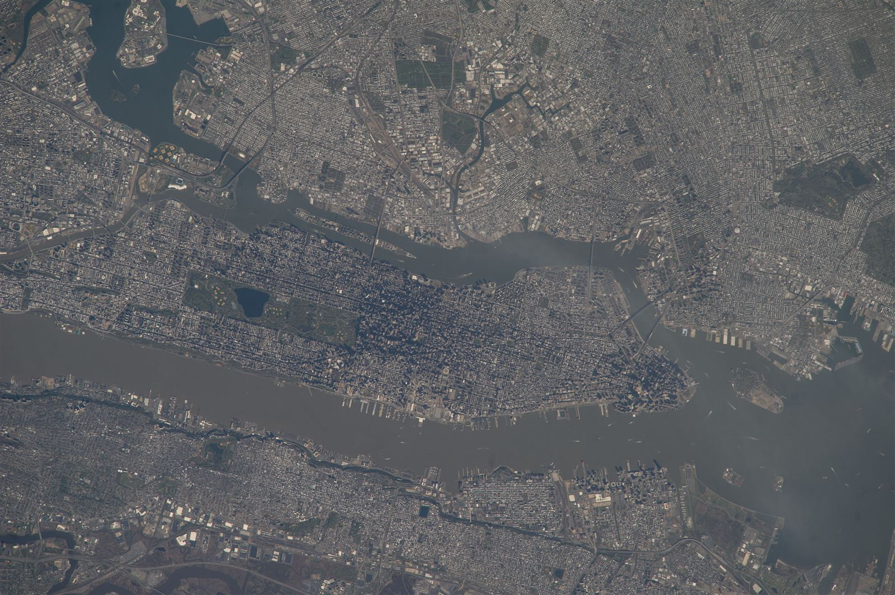

# Blocks — apartment and office towers, slabs, curtain walls

One of six L13 parts: apartment and office blocks at 10–100 m.
The bridge from L12 lives in `previous-l12.md`; the dive lives in `entry.md`; the timeline in `lifetime.md`.
This document covers the mass: point towers, slabs, and curtain-wall blocks, from the Manhattan street grid they stand on to the frames, skins, and conversions that keep them alive.

A tall building here follows the international measuring standard: a building of 14 or more stories, or more than 50 m (165 ft), counts as tall; a supertall reaches 300 m (984 ft) or more; a megatall reaches 600 m (1,968 ft) or more [S01]. As of the current count there are 173 completed supertalls and 3 completed megatalls worldwide [S01]. A mixed-use tower carries two or more functions where each holds a significant share, judged at about 15 percent or more of floor area or height [S01].

## How it looks

A block is a vertical stack of identical floors on a steel or concrete skeleton. The outside
wall usually carries no weight — it hangs like a curtain — so it can be mostly glass in a
regular grid of windows. Two shapes dominate: the point tower, a compact square footprint
rising straight up in the downtown core, and the slab, a long rectangular plate often twinned
at right angles to leave open ground, like the twin 26-story slabs of 860–880 Lake Shore
Drive set at right angles on a trapezoidal site for lake views, joined only by canopy and travertine plaza [S04]. Offices read as full glass curtains with deep uniform
floors, often bronze or grey tint; homes read as smaller punched windows with brick panels,
balconies, and curtains. Older offices step back in Art Deco setbacks with a spire on top.

The ground they stand on is the Manhattan street grid: the 1811 Commissioners' Plan laid avenues
and cross-streets into long narrow blocks, typically about 264 ft by 900 ft (roughly 80 m by 274 m),
with tall-building clusters rising where zoning, transit, and assembled lots allow height.
From orbit the island reads as a narrow strip between the Hudson and East Rivers, Central Park
as the dark rectangle, and the Midtown East and Financial District tower clusters as two dark
zones casting strong shadows even in early-afternoon sun — the exact view in the target image [S07].

Target visual (file in `images/`, credit and license at the bottom):

Sources: 860–880 Chicago Architecture Center pages [S04]; Skyscraper Center criteria pages [S01]; NASA astronaut Manhattan pages [S07].

## How it changes over time

Blocks age through their skin and systems: concrete spalls, steel corrodes, single-pane
curtains leak, elevators and HVAC date. The answer is often recladding — new low-E glass on
the old frame, as at 1271 Avenue of the Americas, which gained more than 50 percent vision
area while keeping its proportions and cut overall energy use by more than 40 percent [S05] — or deep energy retrofit, as at the Empire State's 2009
$106M overhaul that rebuilt all 6,514 windows into high-performance units and won LEED Gold [S02]. Whole towers change purpose:
vacant offices become apartments, the largest Manhattan conversion so far yielding 1,320
rentals from 1.1M sq ft of office, though deep glass plates convert worse than narrow historic
ones [S06]. At the end of life a tower is renovated, demolished, or never completed [S01].

Post-2020 pressure accelerated all three fates. US downtown office vacancy climbed from
about 10 percent at the end of 2019 to nearly 18 percent by late 2023, with suburban vacancy
near 16.4 percent; San Francisco, Portland, and Dayton exceeded 29–33 percent downtown [S06].
Owners answered with recladding for energy and repositioning for lease-up: 1271 Avenue of the
Americas went from vacant to nearly full before construction finished, earning LEED Gold and
the 2022 Council on Tall Buildings Best Tall Building (Renovation) worldwide award [S05];
Willis Tower ran its own 2016–21 lobby, retail, observatory, and systems retrofit while adding
co-working and renewable electricity [S03]. Conversions became policy: New York's City of Yes
plan targets 500,000 new homes in a decade with 20,000 from commercial conversions by legalizing
pre-1990 office-to-housing change where homes are allowed [S06]. Nationally only about 1 percent
of new multifamily projects since 2016 came from office conversions (nearly 20,000 units), with
about 151,000 conversion apartments in the pipeline — useful locally, small against a 3.8M-unit
shortfall [S06]. Narrow prewar plates near transit with high apartment rents convert best;
Class B and C midrise offices with open perimeter on two sides are the prime candidates [S06].

Sources: Pei Cobb Freed recladding pages [S05]; Skyscraper Center Empire State pages [S02]; Center for American Progress conversion pages [S06].

## How it is created

Two frame families carry every tower: all-steel skeletons, and all-concrete cores and slabs,
with composite mixes of both and mixed-structure stacks of one system over the other [S01]. The lineage starts at Chicago's 1885 Home Insurance Building,
a ten-story near-all-metal frame raised on expensive land. Concrete follows with the 16-story
Ingalls Building in Cincinnati (1903); the first all-glass faces follow at Kansas City's Boley
(1908) and San Francisco's Hallidie (1918); the sealed air-conditioned curtain arrives with
Portland's Equitable Building (1948) and Mies's Lake Shore slabs (1949–51). The sequence repeats floor by
floor: clear the site, pile the foundation, raise core and columns, pour each slab, hang the
curtain wall, fit elevators and services — topping out the frame first (structural top-out),
then full cladding and spire (architectural top-out), opening only when fully clad and occupiable [S01]. Speed is the legend: the 102-story Empire State rose
in under 14 months, January 1930 to May 1931 [S02]; today a high-rise still takes two to three years, with
a concrete pour cycle near five days a floor.

Sources: Britannica steel-frame pages; Skyscraper Center criteria pages [S01]; History.com Empire construction pages.

## How it interacts with the others

Towers meet the street through a podium: two or three tall ground floors of shops and lobbies
— about 15 ft floor-to-floor against 10 ft for homes above — with continuous glass, frequent
doors, canopies, and light at human scale. Mies set the 860–880 lobbies back behind glass walls to form an arcade rather than a wall of slabs, with floating canopies sheltering residents before they are indoors [S04]. Above, the uses stack: retail at
grade, offices mid-tower on 30,000 sq ft plates, homes on 18,000; a building counts
mixed-use when each use holds roughly 15 percent or more of floor area or height [S01]. Sixty percent of a block's life
happens at its base, where cafes, lobbies, and transit stops trade with the sidewalk. Towers
rise where house lots assemble into parcels — the detached stock of `houses.md` is the land
bank the next tower buys — and converted offices rejoin that stock as apartments (see `houses.md`
for lot sizes and wood-frame stock, and `commercial.md` for the shopfronts and malls that fill
the podium and the dead-mall stock that competes for reuse capital).
Small floor-plate historic offices with operable perimeter windows convert cleanly; deep
glass plates with windowless cores need major surgery for light, air, and plumbing [S06].

Sources: Portland height/FAR memo pages; SPUR ground-level pages; Chicago landmarks pages [S04].

## Typical size and mass

Tall starts at 14 stories or 50 m; supertall at 300 m, of which 173 stand worldwide, and
megatall at 600 m, of which three [S01]. Homes stack 2.7–3.0 m floor-to-floor, offices 3.3–4.2 m,
ground retail about 4.6 m. The Empire State carries 102 floors to 381 m architectural
(443.2 m to tip, 373.1 m to highest occupied floor) with 208,879 m2 of floor and 73 elevators running 7.1 m/s at top speed [S02]; the
Lake Shore slabs rise 26 stories to 82 m on 21-ft bays [S04].

Heights are measured from the lowest significant open-air pedestrian entrance to the
architectural top (spires count, antennae do not), to the highest occupied floor, or to the
tip, depending on the category [S01]. A structure counts as a building only when at least
50 percent of its height is occupiable floor area [S01].

Density follows the grid: long narrow Manhattan blocks pack many floors onto small footprints,
so floor-area ratios climb where transit and zoning allow towers, while 21-ft structural bays
and 30,000 sq ft office plates versus 18,000 sq ft residential plates set how much daylight
each floor can use. That is why the same block form reads as offices by day and homes by night,
and why narrow prewar plates reuse better than deep glass plates [S06].

Sources: Skyscraper Center criteria and Empire State pages [S01] [S02]; Portland height/FAR memo pages.

## Example objects

- Empire State Building, New York — 1931, 102 stories, 381 m architectural (443.2 m to tip), all-steel Art Deco over limestone, 6,514 windows, tallest in the world 1931–72, LEED Gold after the 2009 retrofit [S02].
- 860–880 Lake Shore Drive, Chicago — 1949–51 Mies van der Rohe twin residential slabs, 26 stories, 82 m, Detroit Graphite black steel and glass on a travertine plaza, the glass-steel prototype for the postwar tower and Chicago Landmark since 1996 [S04].
- Willis (Sears) Tower, Chicago — 1970–74, 108 floors by international count (110 by marketing count), 442.1 m architectural (527 m to tip), bundled-tube all-steel in black aluminum and bronze glass, about 423,638 m2 (4.56M sq ft) of floor, tallest in the world 1974–98 [S03].

Sources: Skyscraper Center Empire State and Willis pages [S02] [S03]; Chicago landmarks and Structurae 860–880 pages [S04].

## Image credits and licenses

| File | Shows | Credit (required) | License / terms |
|---|---|---|---|
| `blocks-manhattan-nasa.jpg` | Manhattan towers casting long shadows over the street grid (screensize, detail of full scene) | Astronaut photograph ISS039-E-18538 (Expedition 39 crew, Nikon D3S 800mm), ISS Crew Earth Observations Facility and Earth Science and Remote Sensing Unit, NASA Johnson Space Center | Public domain (NASA) (`https://eol.jsc.nasa.gov/SearchPhotos/photo.pl?mission=ISS039&roll=E&frame=18538`) |

Proposed image (not yet created): `blocks-point-vs-slab.svg` — point-tower versus slab massing over a Manhattan block, with podium, setback, and curtain-wall callouts. Prefer SVG per image policy; no raster copied without PD-certain license.

## Sources

- S01 — Council on Vertical Urbanism, Tall Building Criteria: `https://www.skyscrapercenter.com/criteria`
- S02 — Council on Vertical Urbanism, Empire State Building: `https://www.skyscrapercenter.com/building/empire-state-building/261`
- S03 — Council on Vertical Urbanism, Willis Tower: `https://www.skyscrapercenter.com/building/willis-tower/169`
- S04 — Chicago Architecture Center, 860–880 North Lake Shore Drive: `https://www.architecture.org/online-resources/buildings-of-chicago/860-880-north-lake-shore-drive`
- S05 — Pei Cobb Freed, 1271 Avenue of the Americas Recladding and Repositioning: `https://www.pcf-p.com/projects/1271-avenue-of-the-americas-recladding-and-repositioning`
- S06 — Center for American Progress, Converting Vacant Office Space Into Housing (2024-07-30): `https://www.americanprogress.org/article/converting-vacant-office-space-into-housing`
- S07 — NASA Gateway to Astronaut Photography, ISS039-E-18538 (2014-05-05, Nikon D3S 800mm): `https://eol.jsc.nasa.gov/SearchPhotos/photo.pl?mission=ISS039&roll=E&frame=18538`
- City of Chicago, 860–880 landmarks: `https://www.chicago.gov/content/dam/city/depts/zlup/Historic_Preservation/Publications/860_880_Lake_Shore_Drive.pdf`
- Britannica, steel-frame high-rises: `https://www.britannica.com/technology/construction/Early-steel-frame-high-rises`
- History.com, Empire construction: `https://www.history.com/articles/empire-state-building-construction`
- NASA, astronaut photography gateway: `https://eol.jsc.nasa.gov/`
- US Census, characteristics of new housing 2025 highlights: `https://www.census.gov/construction/chars/highlights.html`

## References

- [S01](#sources), [S02](#sources), [S03](#sources), [S04](#sources), [S05](#sources), [S06](#sources), [S07](#sources) as listed above.

Related topics: [L13 overview](./README.md), [L12 bridge](./previous-l12.md), [L13 entry](./entry.md), [houses](./houses.md), [commercial](./commercial.md), [lifetime](./lifetime.md).
