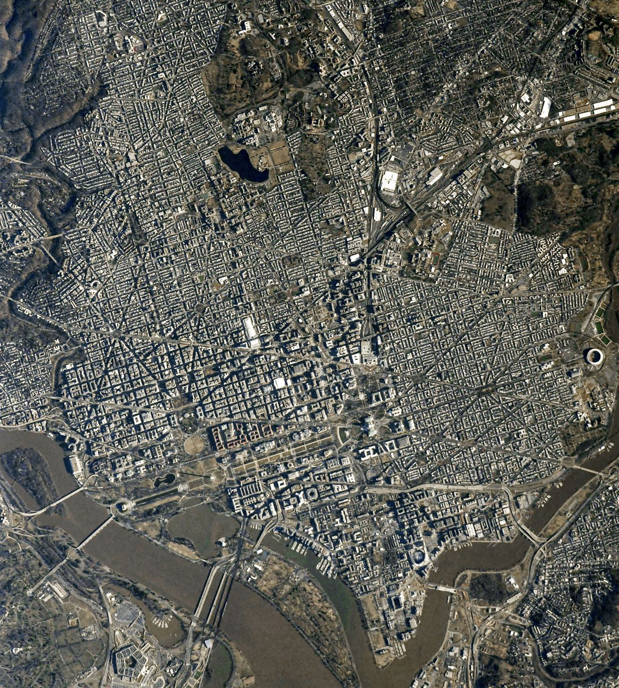

# Civic halls — schools, hospitals, town halls, libraries

One of six L13 parts: civic and shared buildings at 10–100 m.
The bridge from L12 lives in `previous-l12.md`; the dive lives in `entry.md`; the timeline in `lifetime.md`.

## How it looks

Civic buildings read as clusters, not single blocks: a school is classroom wings plus gym,
cafeteria, and auditorium around fields, a bus loop, parking, and later portable classrooms;
a hospital is a tall inpatient block with clinic wings attached, an ER drive, a service yard,
parking structures, and a helipad on the largest. Town halls gather the municipality into one
precinct near the business center — chambers, courts, police and fire headquarters, post
office, sometimes the central library — around open parkland. Libraries anchor neighborhoods
with a landmark reading room, like Boston's 1895 McKim palace for the people, plus branches
that have been retrofitted from concrete bunkers to glass-fronted community hubs. Planned
capitals draw the civic idea at city scale: Washington's diagonal avenues radiate from the
Capitol, meeting to form parks and public spaces, with Pennsylvania Avenue linking the White
House to the legislature.

Target visual (file in `images/`, credit and license at the bottom):

Sources: EIA education and health-care pages; Britannica civic-centre pages; NASA Earth Observatory avenues pages.

## How it changes over time

Civic buildings grow by accretion: new wings rise on the same site while the old school stays
open, so a 1950s block carries additions from the 70s, 80s, 2000s, and 2010s, and the average
school in some districts is over sixty years old. Retired civic buildings get second lives:
Boston's 1862 Old City Hall became offices and restaurants after 1969, and Faneuil Hall has
served as market, town meeting hall, and public forum since 1742. Hospitals expand upward and
outward as medicine changes, and libraries shed their fortress skins for glass. Nothing civic
is demolished lightly; the stone is meant to outlast its builders.

Sources: district facility inventories; NPS Faneuil Hall pages; Boston City Hall study pages.

## How it is created

Schools, hospitals, and halls go up permanent — steel, concrete, and masonry — funded over
years with the site approved before the drawings are finished. Energy modelers treat them as
sixteen reference types covering four-fifths of US commercial floor area, which is how the
nation prices heating a classroom versus ventilating a ward. Sites are chosen by rule:
off major thoroughfares, away from rail and high-tension lines, on public water and sewer,
near parks and libraries, bought before the need turns critical. An elementary must sit so no
pupil crosses a major arterial; a middle school only where crossings are signaled or bridged.

Sources: NYSED school-site pages; DOE reference-building pages; Orange USD site-selection pages.

## How it interacts with the others

A school bends the whole neighborhood around its timetable: bus loops and drop-off lines at
eight and three, playing fields shared after hours, crossing guards at the corners. Hospitals
run the opposite rhythm — ambulances, shift changes, and loading docks around the clock — and
burn energy far out of proportion, holding 4 percent of commercial floorspace but 9 percent of
its energy. Town halls pull the lawyers, the clerks, and the lunch counters into one precinct.
Every civic building is a utility bargain struck with the city: classrooms drink heat, wards
drink air, and the taxpayer funds the meters. And civic buildings increasingly arrive
second-hand: empty mall anchors become the clinics and classrooms of `commercial.md`, and
retired power stations become the galleries of `industrial.md`.

Sources: EIA education and health-care pages; Georgia and NCSC site guides.

## Typical size and mass

Education buildings average 31,100 sq ft, though most run under 10,000; hospitals average
264,800 sq ft against 13,700 for a clinic. States prescribe ground by the pupil: New York
wants 3 acres plus one per hundred elementary pupils, 10 plus one per hundred for secondary,
and best practice runs 10/20/30 acres for elementary/middle/high. Classrooms budget about
145 sq ft per elementary pupil rising to 185 per high-schooler; enrollments band 450–750
elementary, 750–1,200 middle, 1,600–2,400 high. A guildhall great hall can still humble them
all: London's runs over 150 ft long in stone that survived fire and bombing.

Sources: EIA education and health-care pages; NYSED and Maine DOE space pages; Britannica Guildhall pages.

## Example objects

- Faneuil Hall, Boston — 1742 market and town hall expanded 1806, the Cradle of Liberty, still a public forum.
- Boston City Hall — 1968 Brutalist headquarters by Kallmann McKinnell and Knowles, transparency and access cast in concrete.
- London Guildhall and Manchester Town Hall — medieval hall with a 150-ft chamber and crypt intact; 1869 Victorian Gothic municipal palace begun under Waterhouse.

Sources: NPS Faneuil Hall pages; Boston City Hall study pages; Britannica Guildhall and Manchester pages.

## Image credits and licenses

| File | Shows | Credit (required) | License / terms |
|---|---|---|---|
| `civic-dc-avenues-nasa.jpg` | Washington avenues radiating from the Capitol with the Mall and monuments (screensize, detail of full scene) | Astronaut photograph ISS064-E-40657 (Expedition 64 crew, Nikon D5 1200mm), ISS Crew Earth Observations Facility and Earth Science and Remote Sensing Unit, NASA Johnson Space Center | Public domain (NASA) (`https://science.nasa.gov/earth/earth-observatory/the-avenues-of-america-148534/`) |

## Sources

- EIA, education buildings: `https://www.eia.gov/consumption/commercial/pba/education.php`
- EIA, health care buildings: `https://www.eia.gov/consumption/commercial/pba/health-care.php`
- EIA, building flipbook: `https://www.eia.gov/consumption/commercial/data/2018/pdf/CBECS_2018_Building_Characteristics_Flipbook.pdf`
- Britannica, civic centre: `https://www.britannica.com/technology/civic-centre`
- Britannica, Guildhall: `https://www.britannica.com/topic/Guildhall-administrative-center-London`
- Britannica, Manchester Town Hall: `https://www.britannica.com/place/Town-Hall-building-Manchester-England`
- NYSED, school sites: `https://www.nysed.gov/facilities-planning/school-sites`
- NPS, Faneuil Hall: `https://www.nps.gov/articles/000/fh-overview.htm`
- NASA, avenues of America: `https://science.nasa.gov/earth/earth-observatory/the-avenues-of-america-148534/`
- Library of Congress, L'Enfant plan: `https://www.loc.gov/resource/g3851g.ct011268/`
