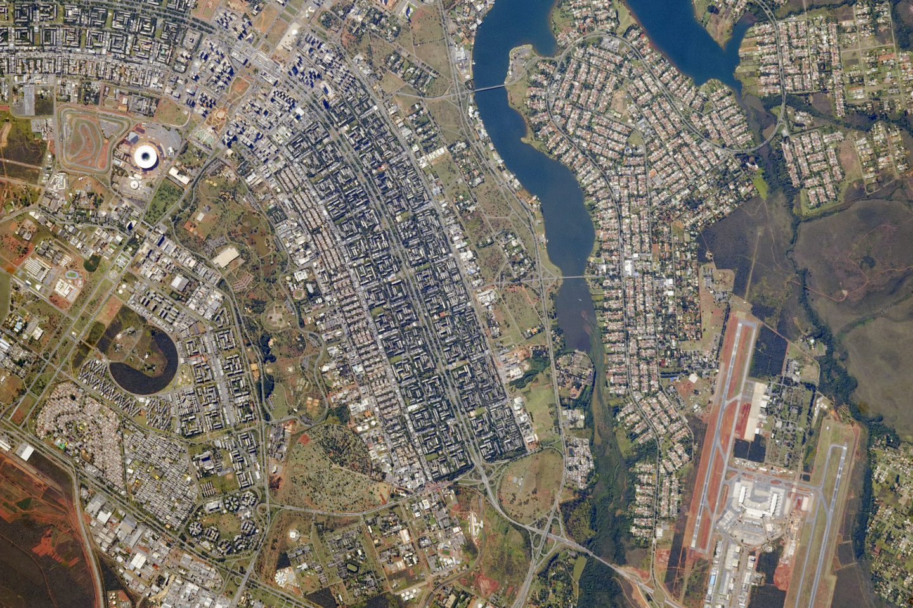

# Entering L13 — the dive from cities to buildings

Loop doc for Issue #230 (Round 1 pilot, refreshed in the Round 2 loop). This page walks the L12-to-L13
dive in plain steps: what you approach, what changes on entry, and
the numbers behind it. The bridge behind us lives in `previous-l12.md`;
the part docs and the timeline now exist —
the cross-links below say where each sight belongs.

## The approach

You leave the whole city behind and fall toward one patch of its face — a block with its
buildings about 10 to 100 m across, the size of a stadium, a street, a row of houses.
The city thins out into ground: streets grey and straight, roofs pale and dark in rows,
stadium white and ringed, still there, now around you. Far behind lies the city wash:
the coarse grey mass, the broad haze, the block reduced to a dot. Ahead, one marker brightens
among the points: the building portal of this L12 cell, holding one L13 patch — house rows below,
blocks rising beside them, shops with glass fronts, the stadium roof as a white ring,
parking stripes and yards between. Around the point, the block itself swells into view: first the pale patch, then the street lines, then the roof edges, then the walls and windows, then the doors and fences inside — with the preview toward the rooms of L14.

Target visual (file in `images/`, credit and license at the bottom):

Sources: `docs/universes/ladder.md` (L12 and L13 rows, gap note); NASA Earth
Observatory pages; USGS pages.

## Crossing into L13

The L12–L13 span is crossed through quiet magnification the dive pushes by proximity
to the targeted portal and unwinds the same way, so generation, snapshots and labels
never see a gap. Then the portal opens (angular radius past 0.14 rad, about a third of the
view) and the cell closes back into its marker below 0.10 rad —
pure origin shifts, with the pre-entry preview having already drawn
the interior inside the marker from 0.02 rad up to the opening.

What you see, in order, on this entry:

1. The city thins and goes: the broad patch with its grey mass and green rectangles
   dissolves into the built ground around you — the city reduced to
   street for the buildings.
2. One patch takes everything: a block with its buildings about 10 to 100 m across, the size of
   a stadium or street, with houses, walls, and roofs in one frame.
3. The patch becomes ground: houses pale and dark in rows, streets grey with lane lines,
   roofs flat and pitched — the curved face, lit on one side.
4. The lines resolve: the residential streets 32–40 ft paved, the lanes about 10 ft,
   with curbs and fences as thin lines.
5. The walls resolve: blocks as stacked floors with window grids, shops as glass fronts,
   stadium bowls as white rings with aisles inside.
6. The yards show: parking stripes and grass lots as pale and green inside the grey, trees on
   the verges, with the preview toward the rooms of L14.
7. The markers fill again: from many city portals per L12 cell to many building portals per L13 cell — this dive continues the beyond-MVP tail.

Sources: ladder gap note and R7 preview angles; ADR 0010; NASA Earth
Observatory pages; NACTO lane pages.

## Effects on entry

Entry is gentle here because the L12-to-L13 leg is short — only about one to two
decades in characteristic size, crossed quietly as the dive falls from 10^3 m toward
10^1 m. On entry, the city markers fade out of the frame, and the coarse blobs of L12
grey mass fade with them — they belong to the city view, not to the street. What stays and grows is the targeted building marker:
it swells from the preview size at 0.02 rad up to the open angle at 0.14 rad, drawing
its houses, walls, and roofs inside itself before the entry completes. Population
points never open (ADR 0010) — they are shown and counted but never targeted, so
only the true building portal carries you through this entry. At most 6 markers preview
at once, largest on screen first, so the entry view stays calm even when the street
is crowded. The stadium roof reads brilliant white; the swept-wing boulevards of a planned
city read as curves, and the airport on the far side of the lake reads as a second grey patch.
Urban detail at this zoom runs at meters per pixel: the Reliant subset resolves 2–3 m,
so a house is a handful of pixels and a stadium roof about a hundred.

Sources: `docs/universes/ladder.md` (L12 and L13 rows, R7 preview
angles, gap note); ADR 0010; NASA Earth Observatory pages; NACTO pages.

## Timing

The L12 span (cities 10^3–10^5 m) gives way to
the L13 span (buildings 10^1–10^2 m) — about one to two decades
closer in characteristic size. Travel time per rung runs `Δe ·
ln 10 / k`, so this leg runs short; the long four-decade
heliopause-to-Sun run is far behind us. Inside L13, distances read
in fractions of the block: stadiums hundreds of m across, streets tens of m wide, houses
about 15 m — with the city 1 to 100 km around,
about 8 light-minutes from the Sun, the Moon 384,400 km out. Earth spins once in
23.9 hours and circles the Sun in 365.25 days; the buildings turn with it from day
into night.

Sources: ladder L12 and L13 rows; NASA Earth pages (sizes,
distances, light time); Census pages (house sizes).

## What entry proves

Entry is complete when the city wash is gone, one patch of built ground commands the
view, and the patch shows houses and walls: you count roofs, lane lines,
and windows, not cities. If you can name the block below as house rows with streets along
it, the day-night change as local light, the lane lines and roof edges, and the stadium
as a white ring — you are in L13. The
detailed looks, lifetimes and interactions of each kind will live in the
part docs to come: the houses and blocks, the shops and halls, the stadiums —
start with the reading guide to map each sight to its stage.

Sources: NASA Earth Observatory pages; Census pages.

## Where to go next

- `previous-l12.md` — the L12 bridge: what carries over, what changes at this zoom.
- `houses.md`, `blocks.md`, `commercial.md` — the homes, the mass, the trade.
- `civic.md`, `industrial.md`, `stadiums.md` — the shared, the made, the crowds.
- `lifetime.md` — dated stages from early shelters to today's buildings.

## Key numbers

- L12 span: cities 10^3–10^5 m (1 to 100 km).
- L13 span: buildings 10^1–10^2 m (10 to 100 m); stadiums hundreds of m; streets 10–15 m; houses about 15 m.
- Portals: many city portals per L12 cell → many building portals per L13 cell (counts fixed in the loop).
- Open angle 0.14 rad, close 0.10 rad, preview from 0.02 rad (at most 6 markers).
- Brasilia stadium: ISS040-E-5839, May 28, 2014, Nikon D3S 800 mm; renovation began 2010, second costliest after Wembley; swept-wing boulevards with the airport beyond Lake Paranoa.
- Reliant detail: 2–3 m per pixel; house a handful of pixels, stadium roof about a hundred.
- Light travel for context: Moon to Earth about 1.3 s; Sun to Earth about 8 minutes.

Sources: ladder L12/L13 and R7 and gap note; pages named above.

## Image credits and licenses

| File | Shows | Credit (required) | License / terms |
|---|---|---|---|
| `brasilia-stadium-nasa.jpg` | Brasilia national stadium: white ring roof between the city wings (screensize) | Astronaut photograph ISS040-E-5839 (Expedition 40 crew, Nikon D3S 800mm), ISS Crew Earth Observations Facility and Earth Science and Remote Sensing Unit, NASA Johnson Space Center | Public domain (NASA) (`https://science.nasa.gov/earth/earth-observatory/national-stadium-of-brasilia-83866/`) |

Note: the Round 2 audit confirms each file, credit and term before the
loop continues; replacements are separate updates, never silent swaps.

## Sources

- Ladder: `docs/universes/ladder.md` (L12 and L13 rows, R7 preview, gap note)
- NASA, Earth Observatory Brasilia page: `https://science.nasa.gov/earth/earth-observatory/national-stadium-of-brasilia-83866/`
- NASA, Earth Observatory Reliant Park page: `https://science.nasa.gov/earth/earth-observatory/reliant-park-area-houston-texas-46945/`
- US Census, new-housing highlights: `https://www.census.gov/construction/chars/highlights.html`
- NACTO, lane width: `https://nacto.org/publication/urban-street-design-guide/street-design-elements/lane-width/`
