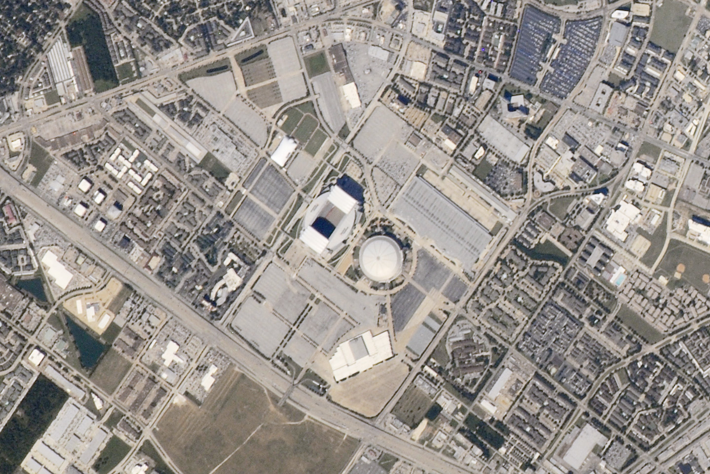

# L12 behind us — Cities and landscapes as previous level

This page is the bridge
from L12 (Cities and landscapes) into L13 (Buildings): what
the previous level looks like, what carries over when you zoom in,
and what changes at L13 scale. The part docs from the loop's first
pass now exist — follow the cross-links below.
Entry itself — the visual transition and its effects — lives in
[the L12-to-L13 entry](./entry.md). The dated timeline runs through
[the L13 lifetime](./lifetime.md).

## What L12 is and how it looks

L12 is the city scale at the R11 anchor (10 km, 1.0e4 m, e 4.00).
large metros, lakes, valleys, farmland blocks. Its content per the ladder
is cities, lakes, valleys, with the part docs covering cities and urban cores,
towns and suburbs, road and rail networks, farmland and countryside, lakes and
landscapes at city scale. Our example city is Houston seen by an astronaut:
grey built mass below, suburbs feathering out, roads as pale lines, fields as
rectangles, with the preview toward the buildings of L13.

Inside the view are the parts. The mass is the cities: downtown cores, districts,
urban form and growth — the New York urban area covers 8,413 km2, about 100 km
across. The spread is the towns: suburbs, villages, sprawl, tracts and annexation.
The lines are the networks: roads, rails, infrastructure corridors — the longest
road, I-90 Seattle–Boston, runs 3,020.44 mi per the FHWA Route Log and Finder List (longest US Interstate; other FHWA tallies differ by measurement year) whole, and a single L12 cell holds
only a 10–100 km segment with its street grid. The patchwork is the farmland:
fields, countryside, sections and pivots — the US survey section of 1 sq mi
(2.6 km2, 640 acres) with quarter cuts at 800 m and 400 m. The anchors are the
landscapes: lakes, rivers at city scale, valleys, hills, forests and parks.
The single house is not yet visible; the median new single-family home completed in 2025 is
2,142 sq ft of floor area (about 199 m2), far below this zoom (homes sold in 2025 median 2,194 sq ft).

Target visuals (files in `images/`, credits and licenses at the bottom):

Sources: `../../../../docs/universes/ladder.md` (L12 row, L13 row);
[L12 README](../../L12/documents/README.md) (L12 part docs
[cities](../../L12/documents/cities.md), [towns](../../L12/documents/towns.md),
[networks](../../L12/documents/networks.md),
[farmland](../../L12/documents/farmland.md), [landscapes](../../L12/documents/landscapes.md));
NASA Earth Observatory Reliant Park page;
US Census new-housing highlights (2025).

## What carries over into L13

Everything L12 shows at city scale is still there, only closer.
The city L12 frames as one patch becomes the ground: the downtown axis, the
highway path, the rail corridor, the park and water tint — still around us. The face L12 watches
as grey mass and green patchwork becomes the streets under our feet — houses you can count,
blocks you can trace, stadium roofs you can circle. The networks L12 draws as pale lines
become the streets with lane widths, curbs, and rows of houses — urban lanes about
10 ft wide per NACTO (appropriate in urban areas without harming operations; AASHTO/FHWA allow
10–12 ft on arterials and collectors, 9–12 ft on locals), residential streets about 32–40 ft paved within a 50 ft right-of-way.
The mixed land use L12 reads from above becomes the neighbor-by-neighbor mix at eye level:
Houston is notable among major US metros for its lack of formal zoning ordinances
(other forms of regulation play a similar role), so around Reliant Park large asphalt parking lots
sit beside vacant grass lots and both single- and multi-family residential areas.
Many building portals per L13 cell continue the beyond-MVP tail; populations
(shown points) never open — only portals do (ADR 0010). Sources: ladder
L12 and L13 rows; NASA Earth Observatory Reliant Park page; NACTO and FHWA lane pages.

## What changes at this zoom

**From cities to buildings.** At L12 the view holds
cities at the R11 anchor (10 km, 1.0e4 m, e 4.00). At L13 each L12 cell opens
through two milestones into buildings at the R11 anchor (large building, 32 m, 3.16e1 m,
e 1.50): houses, blocks, stadiums — the houses, apartment and office blocks, shops and
commercial buildings, civic and industrial buildings, and stadiums and arenas (see [houses](./houses.md),
[blocks](./blocks.md), [commercial](./commercial.md), [civic](./civic.md), [industrial](./industrial.md),
[stadiums](./stadiums.md)). Building portals sit on block edges along streets, and the room
portal sits inside its building box at a floor height; the city blocks stay faintly around
the building until the next open.

**From a patch to a built ground.** The L12 patch — grey mass, green rectangles, dark water —
fills past the edges and becomes walls and roofs: the ground flat to the eye (true curvature
from the planet radius) with a horizon line and no sky, the day-night line becomes local light.
A stadium roof about 300 m across spans roughly three-tenths of a 1 km L12 patch;
a 15 m house spans roughly fifteen-thousandths (about one-sixtieth of that stadium). The Reliant Stadium was built in 2002 to host
the Houston Texans and was the first American football stadium with a retractable roof,
shown retracted; beside it the Astrodome, built in 1965 as the world's first fully
enclosed domed stadium, no longer hosts major events — proposals have covered renovation and
repurposing. A forested patch sits less than
2 km from the parking lots — at L13 the trees become trunks and the lots become stripes.
Sources: ladder L12 and L13 rows; ADR 0010 (portal vs
population); NASA Earth Observatory Reliant Park page (November 15, 2010; ISS025-E-8532).

**From reading a city to standing on a street.** L12 shows a city — mass, spread, lines,
patchwork, and anchors. L13 shows what one patch of that city holds up close: the rows of the
houses, the walls of the blocks, the glass of the shops, the white ring of the stadium roof,
the asphalt stripes of the lots. The city is still there, 1 to 100 km around — but here the story is the building, not the city.
The rooms of L14 wait one rung down (see [the L14 bridge](../../L14/documents/previous-l13.md)).
Sources: NASA Earth facts page; USGS science pages.

## How the parts fit together

One block runs through the part docs. The rows
([houses](./houses.md)) set the homes — houses, residential buildings, yards; the walls
([blocks](./blocks.md)) set the mass — apartment and office blocks, mid- and high-rise; the glass
([commercial](./commercial.md)) sets the trade — shops, offices, commercial cores; the halls
([civic](./civic.md), [industrial](./industrial.md)) set the shared and made — schools, hospitals, warehouses, factories;
and the bowls ([stadiums](./stadiums.md)) set the crowds — stadiums, arenas, large-span structures with
the street-block fabric. The dated version of this story runs through [the lifetime](./lifetime.md), and the dive
that brings you here is in [the entry](./entry.md). Sources: L12 part docs
as the pattern; NASA Earth and USGS pages.

## Where to go next

- [entry](./entry.md) — the L12-to-L13 dive in plain steps, effects on entry, timing.
- [houses](./houses.md), [blocks](./blocks.md), [commercial](./commercial.md) — the homes, the mass, the trade.
- [civic](./civic.md), [industrial](./industrial.md), [stadiums](./stadiums.md) — the shared, the made, the crowds.
- [lifetime](./lifetime.md) — dated stages from early shelters to today's buildings.

## Key numbers

- L12 anchor: city 10 km, 1.0e4 m (e 4.00); cities and landscapes, lakes, valleys per ladder row.
- L13 anchor: large building 32 m, 3.16e1 m (e 1.50); buildings, streets, houses, stadiums per ladder row.
- Reliant subset: 2–3 m per pixel, one of the highest spatial-resolution ISS images; Nikon D3X with effective 1000 mm lens, October 5, 2010.
- Stadiums: Reliant Stadium built 2002 (first retractable-roof NFL, shown retracted); Astrodome built 1965 (first domed stadium), retired from majors; forested patch under 2 km from the lots.
- Houses: median new single-family home completed in 2025 2,142 sq ft (about 199 m2; sold median 2,194 sq ft); urban lanes about 10 ft; residential streets 32–40 ft paved in a 50 ft right-of-way.
- City to building step: a 300 m stadium is about 0.3 of a 1 km patch; a 15 m house about 0.015; street widths in the same range.

Sources: ladder L12 and L13 rows; pages named above; NASA and USGS object pages.

## Image credits and licenses

| File | Shows | Credit (required) | License / terms |
|---|---|---|---|
| `reliant-park-houston-nasa.jpg` | Reliant Park Houston: stadium and Astrodome among houses, lots and streets (screensize) | Astronaut photograph ISS025-E-8532 (Expedition 25 crew, Nikon D3X 1000mm), ISS Crew Earth Observations Facility and Image Science and Analysis Laboratory, NASA Johnson Space Center | Public domain (NASA) (`https://science.nasa.gov/earth/earth-observatory/reliant-park-area-houston-texas-46945/`) |

Proposed images (not downloaded, per image policy): no new raster files this pass — the Reliant Park
frame covers the L12-to-L13 bridge. Proposed for a future pass (no file added here): one PD-certain
SVG scale strip (`l13-scale-strip.svg`: 15 m house vs 300 m stadium vs 1 km L12 patch vs 100 km metro,
with the 10 ft lane and 50 ft right-of-way for scale), drawn as a vector once public-domain sources
are confirmed, with alt text and a link from this page.

## Sources

- Ladder: `../../../../docs/universes/ladder.md` (L12 and L13 rows, gap note, R8 form)
- L12 reference index: [L12 README](../../L12/documents/README.md)
- L12 part docs (pattern for L13 parts): [cities](../../L12/documents/cities.md), [towns](../../L12/documents/towns.md), [networks](../../L12/documents/networks.md), [farmland](../../L12/documents/farmland.md), [landscapes](../../L12/documents/landscapes.md)
- [NASA, Earth Observatory Reliant Park page (ISS025-E-8532, October 5, 2010; Nikon D3X, effective 1000 mm lens; 2–3 m per pixel)](https://science.nasa.gov/earth/earth-observatory/reliant-park-area-houston-texas-46945/)
- [US Census, new-housing highlights (2025: 2,142 sq ft completed median)](https://www.census.gov/construction/chars/highlights.html)
- [NACTO, lane width (10 ft appropriate in urban areas)](https://nacto.org/publication/urban-street-design-guide/street-design-elements/lane-width/)
