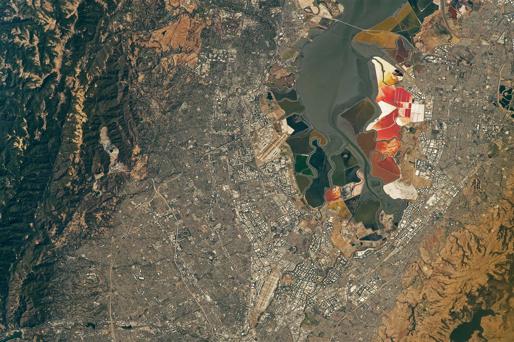

# Bowls — stadiums, arenas, large-span structures

One of six L13 parts: stadiums and arenas at 10–100 m and past it.
The bridge from L12 lives in `previous-l12.md`; the dive lives in `entry.md`; the timeline in `lifetime.md`.
This document covers the crowds: continuous tiered bowls, domed and retractable roofs,
and the transport aprons around them — from Houston's dome pair and Brasilia's white ring
to Wembley under its arch and the Bay-shore bowl that hosted the 2026 World Cup [S01] [S02] [S03] [S04].

A bowl here follows the tournament usage: a large tiered venue holding tens of thousands,
measured by seated capacity, roof span, and pitch geometry — with the 2026 World Cup
drawing 6,810,966 fans across 104 matches in 16 stadiums at an average 99.7 percent capacity [S11].

## How it looks

A stadium is a continuous tiered bowl around a rectangular pitch: one ring of seats, no columns
breaking the view, a roof over every head. From orbit the great roofs read as signatures — a
brilliant white ring between city wings, an arch drawn across a capital, a dome and its
rectangular neighbor parked side by side in asphalt [S03] [S04] [S02]. Modern roofs are lightweight membranes on
steel: Wembley's sliding section opens to feed the grass sun while the fans stay covered, and
its 133-m arch — the world's longest single-span roof support structure — carries the whole
north roof [S04]. Brasilia's rebuilt bowl answers with a double-layer suspended membrane roof,
concentric with an outer compression ring on the balanced-suspension-wheel principle, covering
55,155 m2 [S06]. Houston pairs the two American answers side by side: the 1965 Astrodome,
the world's first fully enclosed domed stadium, beside the 2002 retractable-roof NFL stadium
shown with its roof retracted [S02]. Inglewood's newest answer is a freestanding translucent
canopy of 302 ETFE panels over a cable net — a million square feet sheltering stadium, plaza,
and performance venue together, with 27,000 embedded LED pucks visible from landing aircraft [S10].
Around the bowl runs the apron — parking lots, vacant grass, transit stops — and on the Bay shore a stadium can sit
between the water and the freeway with the whole metro behind it [S01] [S02].

Target visual (file in `images/`, credit and license at the bottom):

The view is the astronaut photograph ISS067-E-202213, taken 2022-07-26 with a Nikon D5 at
400 mm: Levi's Stadium in Santa Clara — the San Francisco Bay Area Stadium of the 2026 World
Cup — ringed by recreational, housing, and business infrastructure, with the southern San
Francisco Bay and its salt-pond restoration wetlands beyond [S01]. The stadium, completed in
2014, hosted six 2026 World Cup matches starting with Qatar against Switzerland on June 13 [S01] [S08].

Sources: Wembley official pages [S04]; NASA Brasilia and World Cup pages [S03] [S01]; NASA Reliant pages [S02]; sbp Brasilia pages [S06]; StadiumDB Levi's and Los Angeles pages [S08] [S10].

## How it changes over time

Bowls are rebuilt more often than retired. Houston's Astrodome opened in 1965 as the world's
first fully enclosed, domed sports stadium, and after decades of sports, conventions, and
concerts it hosts no more majors while proposals for its renovation and repurposing pile
up [S02]. Its rectangular neighbor — designed from 1997 as the first NFL venue with movable
roof segments riding on two 206-m trusses, opening in 2002 — took the league's retractable
roof first, with the canopy sliding over the pitch in about seven minutes [S02] [S09].
Brasilia's Mane Garrincha bowl was completely remade from May 2010 to mid-2013 for the 2014
World Cup — nothing of the predecessor kept, a new Castro Mello bowl with a forest of slender
roof supports — opening 18 May 2013 at some R$1.4 bn and hosting seven tournament games
including the quarterfinal and the third-place game [S07]. At its 2014 opening it read as the
second most expensive stadium in the world after Wembley [S03]; its tournament capacity was
69,349 against about 71,000 seats in the engineering data [S07] [S06]. Rio's Maracana opened in 1950 for 200,000 standing
and shrank through the 2000, 2006, and 2013 rebuilds to 73,139 all-seater. London's old Empire
Stadium stood 1923–2000, came down in 2002–03, and the arched successor opened in 2007 at
GBP 798M and is still being refitted — new pitch, new floodlights, new sound [S04].

Sources: NASA Reliant and Brasilia pages [S02] [S03]; StadiumDB Brasilia and Houston pages [S07] [S09]; sbp Brasilia pages [S06]; Wembley official pages [S04]; Britannica Maracana and Astrodome pages.

## How it is created

The sequence runs demolition and piling, concrete bowl, steel roof lift, fit-out and turf.
Wembley stands on some 4,000 piles down to 35 m; its 1,650-ton arch was lifted in weekend
stages over temporary steelwork to carry a 7,000-ton roof, breaking ground in 2002 and
opening in 2007 at GBP 798M [S04]. Domes were the earlier moonshot: the Astrodome's lamella steel
truss spanned a record 642 ft under 2,150 tons of roof steel, built 1963–65 with its cooling
plant moving two million cubic feet of air a minute. Maracana went up fastest — cornerstone
January 1948, open June 1950, still unfinished with the canopy on scaffolding and no press
box. Roofs keep score: Wembley's 315-m arch is the longest single-span roof support standing [S04],
Brasilia's membrane covers 55,155 m2 on a concentric double-layer suspension wheel with an
outer compression ring [S06]. Houston's retractable runs its segments along two 206-m trusses,
parking the canopy over the end stands and sliding it shut in about seven minutes [S09].
Santa Clara's 2014 bowl was drawn by HNTB with an exposed steel structure, rooftop garden,
and solar plant at about $1.27 bn — three stand levels over 68,500 seats, expandable toward
75,000, LEED-certified — then took a $120M 2026 refit of premium seats and scoreboards [S08].
Inglewood's canopy was engineered as a cable net carrying a million square feet of ETFE, and
for 2026 the field was widened past 73 m with new natural turf and re-cut corner seating in
two phases around the NFL season [S10].

Sources: Wembley official pages [S04]; Library of Congress Astrodome survey; sbp Brasilia pages [S06]; StadiumDB Houston, Levi's, and Los Angeles pages [S09] [S08] [S10].

## How it interacts with the others

A stadium is a transport machine one day a week: Wembley counts itself a public-transport
destination with three stations in walking range — Wembley Park on the Jubilee and
Metropolitan lines, Wembley Stadium one stop from Marylebone on Chiltern Railways, Wembley
Central on the Bakerloo and Overground — plus event coaches from more than fifty towns
and a fan walk down Olympic Way [S05]. World Cup hosts rebuild nearly every mode of transport, airports
first — the Brasilia portrait reads stadium-to-airport across the lake [S03]. Houston shows the
unplanned version: stadium, dome, and surface parking set down zoning-free among houses,
vacant lots, and forest — mixed single- and multi-family streets with a dark-green woodlot
under two kilometers from the lots — in a city with no formal zoning ordinances [S02].
Maracana rides the train and the metro to its own station. Tournament overlays bend all of
this at once: for 2026, FIFA neutral names replaced sponsor names — Levi's became San
Francisco Bay Area Stadium, NRG became Houston Stadium, SoFi became Los Angeles Stadium —
and NFL turf gave way to natural grass with widened pitches and expanded technical
compounds [S08] [S09] [S10]. When the crowd leaves, the bowl goes quiet and the parking apron empties until next week. The concourse
is a mall on game days — beer, shirts, and pies sold by the same playbook as `commercial.md` —
and every rebuild lands dated in `lifetime.md`, from the 1950 terraces to the 2013 membrane.

Sources: Wembley visitor pages [S05]; NASA Brasilia pages [S03]; NASA Reliant caption pages [S02]; StadiumDB 2026 stadium pages [S08] [S09] [S10].

## Typical size and mass

The pitch measures 105 by 68 m by FIFA guidance. Wembley seats 90,000 — largest in Britain,
second in Europe — under a 315-m arch 133 m high, enclosing four million cubic meters with
2,000 toilets inside [S04]. Maracana now seats 73,139, down from 200,000 standing, its paid-final
record 173,850. Michigan's Big House seats 107,601, the largest in the hemisphere, on
foundations poured in 1927 for a future 150,000. The Astrodome spans 710 ft across and 642 ft
clear, 62 m tall on 9 acres; Brasilia's rebuild cost roughly R$1.4 bn, second only to Wembley
in its day, with about 71,000 seats and a 69,349 tournament capacity [S03] [S06] [S07].
The 2026 scale runs larger still: Azteca 80,824 and New York New Jersey 80,663 top the
sixteen, Dallas 70,649 and Los Angeles 70,492 follow, and the L13 bowls sit mid-table —
San Francisco Bay Area 68,827, Houston 68,777 — down to Toronto's 43,036 [S11].

Sources: FIFA pitch pages; Wembley official pages [S04]; Britannica Maracana pages; Library of Congress Astrodome survey; NASA Brasilia pages [S03]; sbp Brasilia pages [S06]; StadiumDB Brasilia and 2026 overview pages [S07] [S11].

## Example objects

Name note: Houston's NFL stadium opened as Reliant Stadium, later took the NRG sponsor name,
and played the 2026 World Cup under the neutral FIFA name Houston Stadium; the same
neutral-name rule made Levi's into San Francisco Bay Area Stadium and SoFi into Los Angeles
Stadium [S09] [S08] [S10].

- Maracana, Rio de Janeiro — opened 1950 for 200,000, now 73,139, home of the 1950 and 2014 finals and the 2016 ceremonies, still Brazil's largest.
- Wembley, London — opened 2007 for 90,000 under the 315-m arch, England's home, cup finals, NFL London games, concerts [S04].
- Michigan Stadium, Ann Arbor — opened 1927 for 107,601, the Big House, record crowd 115,109, largest stadium in the Americas.
- Reliant pair, Houston — the 1965 Astrodome, world's first fully enclosed domed stadium, beside the 2002 first retractable-roof NFL stadium (~72,000, two 206-m trusses, seven-minute slide), seven 2026 World Cup games as Houston Stadium [S02] [S09].
- Mane Garrincha National Stadium, Brasilia — remade May 2010 to June 2013 at R$1.4 bn, ~71,000 seats under a 55,155 m2 double-layer membrane, seven 2014 games, white ring between the city wings from orbit [S03] [S06] [S07].
- Levi's Stadium, Santa Clara — opened 2014 for 68,500-plus (to 75,000), HNTB steel, solar, and rooftop garden at $1.27 bn, six 2026 games as San Francisco Bay Area Stadium after a $120M refit [S01] [S08].
- SoFi Stadium, Inglewood — opened 2020 on the old Hollywood Park racetrack, million-square-foot ETFE canopy on a cable net with the oval Samsung Infinity Screen, eight 2026 games as Los Angeles Stadium up to the quarterfinal [S10].

Sources: Britannica Maracana pages; Wembley official pages [S04]; Michigan tour pages; NASA Reliant, Brasilia, and World Cup pages [S02] [S03] [S01]; sbp Brasilia pages [S06]; StadiumDB Brasilia, Levi's, Houston, Los Angeles, and 2026 overview pages [S07] [S08] [S09] [S10] [S11].

## World Cups 2022–2026

Qatar 2022 was the compact, cooled tournament: eight arenas — seven built new, only Khalifa
rebuilt — all inside a 75-km radius, all with cooling, two with retractable roofs (Al Bayt in
Al Khor, Al Janoub in Al-Wakrah), headlined by the 88,966-seat Lusail final of Argentina
against France and the demountable 974-container Stadium 974, with 172 goals the tournament
record and the first November–December scheduling [S12]. North America 2026 inverted the
formula: the largest edition — 48 teams, 104 matches, 16 cities across the USA, Mexico, and
Canada — played entirely in existing stadiums, none built new for the event, closing with the
final at New York New Jersey Stadium on July 19 [S11] [S01]. The L13 bowls carried mid-tournament
weight: Houston took five group games plus round-of-32 and round-of-16 ties; San Francisco Bay
Area took five group games plus a round of 32; Los Angeles took five group games, two rounds
of 32, and a quarterfinal [S09] [S08] [S10]. Summer heat was the running constraint — surveyed
summer conditions exceeded safe playing limits at ten of the sixteen venues, pushing early
kicks toward covered and air-conditioned bowls — and every NFL host converted to natural grass
with widened pitches for the tournament [S10] [S09].

Sources: StadiumDB Qatar 2022 and 2026 overview pages [S12] [S11]; NASA World Cup pages [S01]; StadiumDB Houston, Levi's, and Los Angeles pages [S09] [S08] [S10].

## Image credits and licenses

| File | Shows | Credit (required) | License / terms |
|---|---|---|---|
| `stadiums-levis-nasa.jpg` | Levi's Stadium on the Bay shore with freeways and metro behind (screensize, detail of full scene) | Astronaut photograph ISS067-E-202213 (Expedition 67 crew, Nikon D5 400mm), ISS Crew Earth Observations Facility and Earth Science and Remote Sensing Unit, NASA Johnson Space Center | Public domain (NASA) (`https://science.nasa.gov/earth/earth-observatory/the-world-cup-from-250-miles-up/`) |

Proposed image (not yet created): `stadiums-bowl-vs-dome-vs-canopy.svg` — open bowl vs dome vs retractable vs cable-net canopy in section, with arch, truss, membrane, and pitch callouts. Prefer SVG per image policy; no raster copied without PD-certain license.

## Sources

- S01 — NASA Earth Observatory, The World Cup From 250 Miles Up (2026-07-07; photo ISS067-E-202213, 2022-07-26, Nikon D5 400 mm; Levi's completed 2014; six 2026 matches; MetLife final 2026-07-19; NRG/SoFi/Akron/BC Place from above): `https://science.nasa.gov/earth/earth-observatory/the-world-cup-from-250-miles-up/`
- S02 — NASA Earth Observatory, Reliant Park Area, Houston, Texas (2010-11-15; photo ISS025-E-8532, 2010-10-05, Nikon D3X 1000 mm; Astrodome 1965 first enclosed dome; Reliant Stadium 2002 first NFL retractable roof; no zoning; parking, vacant lots, forest): `https://science.nasa.gov/earth/earth-observatory/reliant-park-area-houston-texas-46945/`
- S03 — NASA Earth Observatory, National Stadium of Brasilia (2014-06-16; photo ISS040-E-5839, 2014-05-28, Nikon D3S 800 mm; white ring between wings; renovation from 2010; second most expensive after Wembley; airport rebuild): `https://science.nasa.gov/earth/earth-observatory/national-stadium-of-brasilia-83866`
- S04 — Wembley Stadium, facts (90,000 seats; largest UK, second Europe; 133-m arch longest single-span roof support; sliding roof; GBP 798M; 2007 opening): `https://www.wembleystadium.com/about/stadium-facts-and-features`
- S05 — Wembley Stadium, getting to Wembley (public-transport destination; three stations — Park, Stadium, Central; 55+ coach locations): `https://www.wembleystadium.com/plan-your-visit/getting-to-wembley`
- S06 — sbp, Brasilia National Stadium (double-layer suspended membrane roof; 55,155 m2; ~71,000 seats; balanced suspension wheel; outer compression ring): `https://www.sbp.de/en/project/brasilia-national-stadium`
- S07 — StadiumDB, Estadio Nacional de Brasilia (tournament capacity 69,349; construction 2010-05–2013-06; R$1.4 bn; Castro Mello; seven 2014 games): `https://stadiumdb.com/tournaments/world_cup/2014/estadio_nacional`
- S08 — StadiumDB, San Francisco Bay Area Stadium 2026 (tournament capacity 68,827; Santa Clara; HNTB; 68,500+ seats to 75,000; $1.27 bn; LEED; $200M naming; $120M 2026 refit; six games): `https://stadiumdb.com/tournaments/world_cup/2026/levis_stadium`
- S09 — StadiumDB, Houston Stadium 2026 (tournament capacity 68,777; designed 1997; opened 2002; two 206-m trusses; seven-minute slide; ~72,000; 1,352 m2 screens; seven games): `https://stadiumdb.com/tournaments/world_cup/2026/reliant_stadium`
- S10 — StadiumDB, Los Angeles Stadium 2026 (tournament capacity 70,492; Inglewood; ETFE canopy 302 panels; cable net; 27,000 LED pucks; Infinity Screen; field past 73 m; eight games): `https://stadiumdb.com/tournaments/world_cup/2026/sofi_stadium`
- S11 — StadiumDB, World Cup 2026 overview (48 teams; 104 matches; 16 cities; Azteca 80,824; NY/NJ 80,663; 6,810,966 spectators at 99.7%; final 2026-07-19): `https://stadiumdb.com/tournaments/world_cup/2026`
- S12 — StadiumDB, World Cup 2022 Qatar (eight arenas; Lusail 88,966; 75-km radius; cooling; Al Bayt and Al Janoub retractable; Stadium 974 demountable; 172 goals; Nov–Dec): `https://stadiumdb.com/tournaments/world_cup/2022`
- FIFA, pitch dimensions (105 by 68 m guidance): `https://inside.fifa.com/innovation/stadium-guidelines/technical-guidelines/stadiums-guidelines/pitch-dimensions-and-surrounding-areas`
- Britannica, Maracana: `https://www.britannica.com/place/Maracana-Stadium`
- Britannica, Astrodome: `https://www.britannica.com/topic/Astrodome`
- Library of Congress, Astrodome survey: `https://tile.loc.gov/storage-services/master/pnp/habshaer/tx/tx1000/tx1045/data/tx1045data.pdf`
- Michigan athletics, Michigan Stadium tour pages (Big House 107,601; record crowd 115,109; carried from prior revision, URL not re-verified this pass): `https://mgoblue.com/`

## References

- [S01](#sources), [S02](#sources), [S03](#sources), [S04](#sources), [S05](#sources), [S06](#sources), [S07](#sources), [S08](#sources), [S09](#sources), [S10](#sources), [S11](#sources), [S12](#sources) as listed above.

Related topics: [L13 overview](./README.md), [L12 bridge](./previous-l12.md), [L13 entry](./entry.md), [houses](./houses.md), [blocks](./blocks.md), [commercial](./commercial.md), [civic](./civic.md), [industrial](./industrial.md), [lifetime](./lifetime.md).
