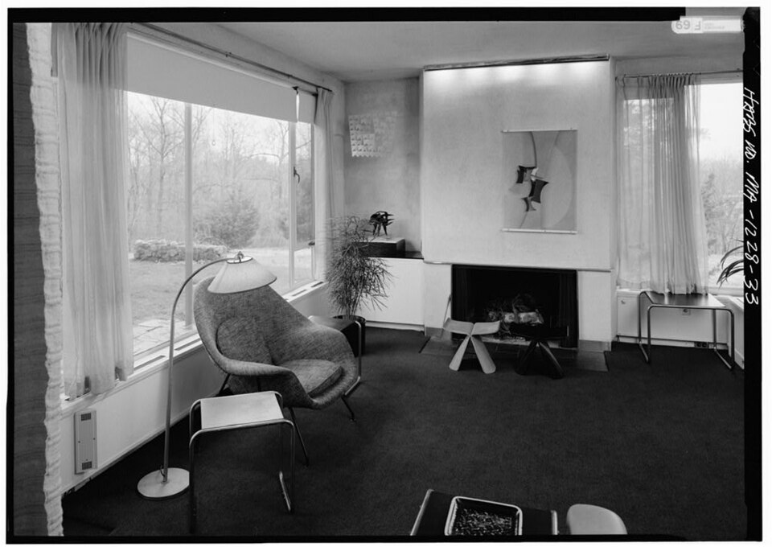

# Furniture — beds, sofas, chairs, tables

One of six L14 parts: the large furniture at 1–10 m.
The bridge from L13 lives in `previous-l13.md`; the dive lives in `entry.md`; the timeline in `lifetime.md`.

## How it looks

Furniture is the use made solid: beds for lying, sofas and chairs for sitting, tables for working
and eating. Sofas scale the chair up — a three-seat frame near two meters wide, seat depth
near half a meter, seat height matching chairs near 18 in so feet rest flat — built as a wood
or steel frame over sinuous springs or webbing, foam or down over the top, covers removable
for the re-cover cycle. Mattress sizes are standardized — Twin 38 by 75 in, Twin XL 38 by 80, Full 54 by 75,
Queen 60 by 80, King 76 by 80, California King 72 by 84. A standard dining table stands 28 to 30
in floor-to-top (30 most common) with chair seats at 17 to 19 in (18 typical); the comfort rule
holds 10 to 12 in from seat top to table apron — under 9 thighs press, over 13 arms reach.
Counter tables run 34 to 36 in with 24 to 26 in stools; bar height 40 to 42 in with 28 to 30 in
stools. Measure clearance to the apron, not the top: a 30-in top minus a 4-in apron leaves 26
in usable. Table sizing runs 24 in of edge per person (30 generous), each setting about 15 in deep:
four seats take a 48-by-30 rect or a 48 round, six take 60 to 72 by 36, eight take 78 to 96. Work
tables follow the same seated geometry — a writing or computer desk stands near 28 to 30 in,
knee space underneath, drawers or a return holding supplies — but the computer moved the work:
late-1980s knee-hole credenzas held terminals, 1990s U-suites centered the monitor, and flat
panels on arms later freed the top again. The
classics read at a glance — Thonet's No.14 bistro chair (1859): six steam-bent beech pieces, ten
screws, two nuts, cane seat that drains spills; the Eames Lounge Chair and Ottoman (1956): three
curved plywood shells in veneer with leather cushions.

Target visual (file in `images/`, credit and license at the bottom):

The target room is the 1938 Gropius House living room in Lincoln, Massachusetts, designed by
Walter Gropius with Marcel Breuer — who designed much of the house's furniture — and kept by
Historic New England since 1985: the furnished-box ideal, modern seating and tables against a
fireplace wall, in one frame.

Sources: Sleep Foundation mattress sizes; Coleman and Cradle table-height guides; No.14 chair, Eames Lounge Chair, desk-history, and Gropius House pages; MoMA Frankfurt Kitchen interactive; HABS Gropius House photo MASS,9-LIN,16-33.

## How it changes over time

Furniture ages by use. Mattresses keep a general 7-to-10-year rule — innerspring 5-and-a-half to
6-and-a-half, foam 6 to 7, hybrid 6-and-a-half to 7-and-a-half, latex longest at 7-and-a-half to
8-and-a-half; sag, pain, partner motion, and seven-plus years say replace. The comfort layer
fails first, which is why double-sided mattresses flip and single-sided ones rotate, and why a
replaceable topper can stretch the core's life. A 2003 randomized trial found medium-firm
mattresses associated with less back pain, a result later cited in clinical guidelines; a 2015
review favored medium-firm, custom-inflated surfaces for pain and neutral spinal alignment.
Since the 2010s the mattress business itself changed shape: direct-to-consumer bed-in-a-box
foam and hybrid sellers — more than 175 in the United States alone, a global market near 28.5
billion dollars in 2018 — compress, roll, and ship what used to need a showroom and a truck.
Adjustable bases that raise head and foot, long standard in parts of Europe, ride the same
wave and pair best with latex or memory foam rather than stiff innerspring.
Styles march by movement — the Victorian parlor suite, Stickley's Craftsman (Arts-and-Crafts, started 1900,
renamed Craftsman Workshops 1903, ceased 1916), Mid-Century Modern flat planes. Pieces themselves
evolve inside one design: Eames shells ran five-ply with Brazilian rosewood from 1956 into the
early 1990s, then seven-ply with cherry, walnut, and palisander after rosewood was discontinued,
hardware and labels changing across the decades — a 2006 fiftieth-anniversary run used
sustainable palisander veneer, and a taller, deeper variant followed in 2008. Charles Eames
wanted the chair to have the warm look of a well-used first baseman's mitt; the model numbers
are 670 for the chair and 671 for the ottoman. Change comes by re-cover and replace — new
mattress on the old frame, new upholstery on the good bones — and by movement turnover from
bentwood to tube steel to molded plywood to mesh. The newest turnover is the sit-stand desk:
height-adjustable from about 70 to 128 cm so one top serves sitting and standing, a lineage
running back through drafting tables to a 1778 mechanical table made for Marie Antoinette.
Trials find sit-stand options cut sitting by roughly half an hour to two hours a day in the
first year, with some relief for low back pain — but the evidence quality is low, effects fade
with time, and no international consensus sets sit-stand ratios.

Sources: Sleep Foundation mattress-life pages; mattress ergonomics and industry pages; Craftsman furniture pages; Eames Lounge Chair and Aeron chair pages; standing-desk studies.

## How it is created

The industrial method starts with Thonet's No.14: the world's first mass-produced furniture,
buildable by unskilled workers, disassemblable for transport and export — 50 million sold
between 1859 and 1930. Slats heat to 100 C, press in cast-iron moulds, dry near 70 C for 20
hours; later chairs add two diagonal braces between seat and back for an eight-piece version.
The design is public domain now, so it keeps being reissued — a 1961 plastic version from
IKEA, a 2009 James Irvine redesign retailed through Muji. The fitted method starts with the
Frankfurt Kitchen (1926–27): interchangeable parts at low cost, Taylorist time-motion studies
behind the drawers, some 10,000 installed across New Frankfurt. The joinery constraint persists
into flat-pack: the apron rail steals clearance (a 30-in top minus a 4-in apron leaves 26 in
usable), so pedestal and trestle tables with no apron forgive most; extending tables must clear
in the open state, and loose leaves need storage — butterfly leaves self-store, separate leaves
can warp.

Sources: No.14 chair and Europeana Thonet pages; MoMA Frankfurt Kitchen interactive; Frankfurt kitchen plan pages; V&A Frankfurt kitchen object pages; Cradle table-buying guide.

## How it interacts with the others

Furniture negotiates with the shell for every inch. Leave about 24 in around each side of a bed
and measure the footprint before buying. Dining needs about 32 to 36 in from table edge to
wall or furniture to pull out and sit (32 minimum with nobody passing, 36 to squeeze past),
42 to 48 in where people walk behind seated diners —
under 36 turns awkward, under 30 unusable; the bench is the one legal cheat, sliding in from
the end so wall-side clearance can drop to about 12 in. Tables anchor rooms the way rugs anchor
tables: the setting depth sets the top width, the walkway sets the room. Work desks add their
own triangle — chair, top, and screen: seat height adjustable so feet rest flat and thighs run
level, monitor at arm's length with its top near eye level, cables and power strips tamed
behind the modesty panel so the top stays work. Every piece answers the
shell's outlet spacing and the storage's reach band, and the layout (`layout.md`) folds them all
into the 1-to-10 m plan.

Sources: Sleep Foundation size guide; Coleman and Cradle clearance guides.

## Typical size and mass

A queen mattress covers 60 by 80 in (about 3.1 m2); a king 76 by 80. Dining tops sit at 30 in
with 18-in seats and a 12-in seat-to-apron gap; counters at 36 in with 24-to-26-in stools. A
three-seat sofa spans on the order of two meters wide with seat depth near half a meter. Work
desks repeat the dining numbers near 28 to 30 in seated, then stretch them: sit-stand tops
travel about 70 to 128 cm so one desk serves chair and standing, screens and cables riding
along. One
bedroom's set — queen bed, two side tables, one dresser, one chair — fills roughly half the
floor of an 11-by-12-ft room and masses a few hundred kilograms of wood, steel, foam, and
fabric.

Sources: Sleep Foundation mattress sizes; Coleman and Cradle guides.

## Example objects

- Thonet Chair No.14, Vienna, from 1859 — six bent-beech pieces, gold medal at the 1867 Paris Exposition, praised by Le Corbusier, still produced as the Thonet 214; 50 million sold by 1930.
- Eames Lounge Chair and Ottoman (670/671), 1956 — Charles and Ray Eames for Herman Miller, three plywood shells with leather cushions; the 1956 rosewood set sits in MoMA's permanent collection, a 1960 Herman Miller gift.
- The Frankfurt Kitchen, 1926–27 — Grete Schütte-Lihotzky's 1.9-by-3.4 m fitted laboratory for New Frankfurt: swivel stool, gas stove, built-in storage, fold-down ironing board, labeled aluminum bins; some 10,000 installed, the prototype of every fitted kitchen after.
- The Aeron chair, 1994 — Don Chadwick and Bill Stumpf for Herman Miller: no upholstery, just a breathable mesh pellicle over glass-fibre frames in three sizes, made from recycled material and 94 percent recyclable; remastered in 2016 with denser mesh and better spine support, the dot-com office chair and MoMA permanent-collection piece.

Sources: No.14 chair pages; Eames Lounge Chair and Aeron chair pages; MoMA Frankfurt Kitchen interactive.

## Image credits and licenses

| File | Shows | Credit (required) | License / terms |
|---|---|---|---|
| `furniture-gropius-habs.jpg` | Gropius House living room from the east: modern seating, tables, sofa and fireplace wall (screensize, detail of full scene) | Library of Congress, Prints & Photographs Division, HABS MASS,9-LIN,16-33 | Public domain (U.S. federal HABS work) (`https://commons.wikimedia.org/wiki/File:Gropius_House_LIVING_ROOM,_FROM_EAST,_HABS_MASS,9-LIN,16-33.jpg`) |

## Sources

- Sleep Foundation, mattress sizes: `https://www.sleepfoundation.org/mattress-sizes`
- Sleep Foundation, mattress life: `https://www.sleepfoundation.org/mattress-information/how-long-should-a-mattress-last`
- Coleman, dining table height guide: `https://colemanfurniture.com/resources/buying-guides/standard-dining-table-height-guide`
- Cradle, table and chair height guide: `https://www.cradleandhearth.com/guides/dining-table-and-chair-height`
- No.14 chair: `https://en.wikipedia.org/wiki/No._14_chair`
- Eames Lounge Chair development and MoMA holding: `https://en.wikipedia.org/wiki/Eames_Lounge_Chair`
- MoMA, Frankfurt Kitchen interactive: `https://www.moma.org/interactives/exhibitions/2010/counter_space/the_frankfurt_kitchen/`
- Craftsman furniture: `https://en.wikipedia.org/wiki/Craftsman_furniture`
- Bed sizes (ISPA North-American standard): `https://en.wikipedia.org/wiki/Bed_size`
- Mattress types, ergonomics, and industry: `https://en.wikipedia.org/wiki/Mattress`
- Aeron chair development and remaster: `https://en.wikipedia.org/wiki/Aeron_chair`
- Standing and sit-stand desks: `https://en.wikipedia.org/wiki/Standing_desk`
- Desk history and computer-era suites: `https://en.wikipedia.org/wiki/Desk`
- Frankfurt kitchen plan and history: `https://en.wikipedia.org/wiki/Frankfurt_kitchen`
- Gropius House design and furnishings: `https://en.wikipedia.org/wiki/Gropius_House`
