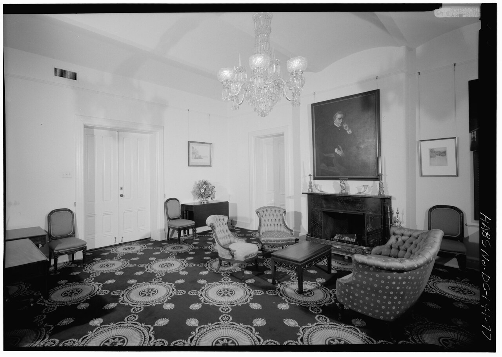

# Layout — how the pieces sit in 1–10 m, circulation, the 1 m end point

One of six L14 parts: the plan at 1–10 m.
The bridge from L13 lives in `./previous-l13.md`; the dive lives in `./entry.md`; the timeline in `./lifetime.md`.
This document uses trade inches with metric where the source gives it, ADA section numbers
(308 reach, 305 clear floor, 304 turning, 307 protrusions, 403 routes, 404 doors), and NKBA
2022 planning numbers unless noted. Currency: verified against Access Board guides and
2026-available sources; NKBA PDF fetched as metadata (content-type unsupported for direct
fetch) and cross-checked via the work-triangle summary.

## How it looks

Layout reads as zones plus circulation: named activity centers — sleep, work, eat, keep, move —
with clear floor space and passageways between them, not just furniture footprints. A zone
is a floor area sized for one activity plus its clearances; circulation is the connected
network of walkways, aisles, hallways, and door clearances that joins zones without
crossing work. Two orders
divide the history: cellular rooms, each with one function behind a door off a corridor, and
open plans, where living, dining, and kitchen flow without dividing walls. Wright's Willey
House (1933–34) drew the break: no walls or doors dividing the non-private areas, living and
dining combined, kitchen exposed through built-in cabinets and open shelving, renamed
"workspace" to mark its new esteem. The 1 m end point
is reach plus shelf plus door swing: unobstructed forward and side reach runs 15 in low to 48
in high above the floor [S004][S005]; over an obstruction the max drops — 44 in forward over a 20-to-25-in
counter (48 in holds only to 20 in deep), 46 in
side at 10-to-24-in depth over an obstruction at most 34 in high [S004][S005]. Clear floor space
30 by 48 in stays free at each approach, centered on work surfaces [S006].

Target visual (file in `images/`, credit and license at the bottom):

The target room is the Smithsonian Institution Building (the Castle) Room 201, East Wing
second floor, looking northwest — the secretary's anteroom (parlor) recorded by the Historic
American Buildings Survey as DC,WASH,520B-77. The frame shows the cellular order intact:
a furnished anteroom with arranged pieces around its walls, circulation reading as the
open floor between them. It is the counterpoint to the open-plan examples in
`How it changes over time` below: same scale, opposite logic.

Sources: NKBA planning guidelines; Willey House and Jacobs House pages; Access Board reach guides [S004][S005] and clear-floor guides [S006]; HABS Smithsonian photo DC,WASH,520B-77.

## How it changes over time

Single-function rooms were not original. From the 17th century rooms acquired one function each
and went reachable only from corridors and halls; central fireplaces moved to walls; the great
chamber as best dining room gave way to the saloon by the early 18th century. The open plan
arrived in December 1933, when Wright drew the Willey single-level inline-ell (scheme of
13 December 1933, after Nancy Willey's late-November ultimatum for an $8,000–$10,000 house):
kitchen communicating with dining and living through a glass screened partition — the first full
exposure of kitchen to formal space, with china, pottery, and glass shelving making the
partition beautiful and a Dutch door confirming the intent. Wright renamed the kitchen
"workspace" for the servant-less household, adding a phone-closet pass-through so Nancy
Willey could talk while working. Lewis Mumford noted the same window in the
*New Yorker* of 12 February 1938: pots and pans in serial pattern at the far end, intimacy
with one of the most important parts of a house. The scheme consolidated in Jacobs I (1936–37),
the first built Usonian near 1,500 sq ft — challenged at $5,000, built near $5,500 with land —
open living-dining-kitchen flow, prototype for
140-plus Usonians and the postwar ranch, later adopted as Broadacre City's prototype home. Small-house planning standardized with the FHA: the
National Housing Act signed 27 June 1934 (Pub. L. 73-479), creating the Federal Housing
Administration and its mutual mortgage-insurance system; the 1936 Principles of Planning Small Houses
(maximum accommodation within minimum means) the gold standard — the basic minimum house
living plus kitchen plus two bedrooms plus bath. Change comes by wall removal and zone merger,
and by code minimums ratcheting what a legal room must hold.

Sources: domestic-interiors encyclopedia pages; Wright Willey and Jacobs House pages; National Housing Act pages (Pub. L. 73-479, 27 June 1934).

## How it is created

Layouts are drawn from clearance numbers. Walkways run 36 in minimum where no work happens;
work aisles 42 in for one cook, 48 for several, measured face to face. Dining pull-out needs
32 in from the table edge with nobody passing behind, 36 to squeeze past, 44 to walk past.
Hallways hold 36 in minimum per the dwelling code; egress doors clear 32 in open at 90
degrees, measured stop to face (36 in minimum where a passage exceeds 24 in deep); vertical
clearance 80 in minimum (78 in at closers and stops) [S007]. Doorways clear 32 in minimum (34 the access standard for hardware
height 34–48 in). The work triangle sums sink, cook, and fridge center-to-center: each leg 4 to 9 ft,
total 13 to 26 ft, no leg crossing an
island or tall cabinet by more than 12 in, no full-height obstacle between any two points,
no major traffic through it. The rule descends from Lillian Moller Gilbreth's 1920s motion
studies and circular routing (Kitchen Practical, 1929) through the University of Illinois
Small Homes Council 1946–49 standardization study for the one-cook kitchen; in single-wall
kitchens no true triangle is possible and the same leg spacings govern the line. Landing
counters ride with it: 24 in on one side of the sink and 18 on the other, 15 in on the
handle side of the fridge (or within 48 in across), 15 in one side of the stove and 12 on
the other, 36 in of prep beside the sink. Bed sides take about 24 in tight
(trade guidance; 30 to 36 comfortable). The code floor under everything: habitable rooms at
least 70 sq ft (kitchens excepted) and 7 ft in every horizontal direction. Accessible routes hold
36 in continuous clear width (32 in minimum for 24 in maximum at points such as doorways),
passing space 60 by 60 in every 200 ft, 180-degree turns around narrow obstructions 48 in at
the turn with 42 in approaches (or 60 in at the turn with 36 in approaches) [S008]. Passageways hold 36
in wide by 80 high with wall projections capped at 4 in where the leading edge sits above
27 in cane sweep and below 80 in headroom (handrails 4.5 in maximum); post-mounted objects
12 in maximum; free headroom 80 in minimum everywhere [S009]. Clear floor space 30 by 48 in stays free
at each approach; where confined on three sides for more than half the depth it widens
(36 in wide forward, 60 in long side); doors may swing into turning space but only into
clear floor space where the standard permits, so locate swings outside required clearances
where possible [S006][S007]. Every clearance
touches two parts — a 42-in aisle is cabinet face to cabinet face, a passageway 36 wide by 80
high with projections capped at 4 in, clear floor space 30 by 48 in never blocked by door
swings or cabinetry.

Sources: NKBA kitchen-planning guidelines [S001]; IRC R311 egress and hallway pages and R304 room-size pages [S003]; work-triangle history [S002]; Access Board route, door, and protrusion guides [S006][S007][S008][S009].

## How it interacts with the others

Layout binds all five other parts into one plan. The shell's doors swing through it, its
windows light it (8 percent glazing minimum), its outlets ring it every 12 ft (see
`./shell.md`). The furniture's pull-outs and
walk-behinds size it — 32 in to sit, 36 to squeeze past, 42 to 48 to walk behind (see
`./furniture.md`). The storage's triangle and reach band anchor it —
4-to-9-ft legs, 15-to-48-in reach (see `./storage.md`). The lamps layer it and the vents cross it: supplies
near window and door, returns central, registers never blocked top or bottom (see
`./light-power.md`). The rugs
zone it, with 12 to 18 in of bare floor to the wall and 24 to 30 in past the table edge (see
`./textiles-decor.md`). Nothing in a room stands alone: move the table and the
walkway moves, move the walkway and the rug moves, move the rug and the lamp moves. The
reading guide for the whole story runs through `./lifetime.md`; the zoom out through
`./previous-l13.md` and the zoom in through `./entry.md`.

Sources: NKBA guideline pages [S001]; part docs named above.

## Typical size and mass

A legal room starts at 70 sq ft and 7 ft across; a Usonian open plan near 1,500 sq ft; a
Nakagin capsule 2.5 by 2.5 m by 4.0 m with a 1.3-m-diameter circular window — about 10 sq m
of floor, one compact bath and a wall of built-in appliances inside. The layout itself masses nothing — it is lines
on paper and clearances in air — but it commands every kilogram in the room: one 11-by-12-ft
bedroom's plan places roughly half a ton of shell, furniture, storage, and textiles; one
kitchen wall of three bases, two walls, and a counter run spans about 3 m and masses on the
order of a hundred kilograms. Turning space adds its own footprint: a 60-in-diameter circle
or 60-by-60-in T with 36-in arms, overlappable only by knee and toe space [S006].

Sources: IRC R304 pages [S003]; Jacobs House pages; Nakagin Capsule Tower pages [S010].

## Example objects

- The Frankfurt Kitchen, 1926–27 — 1.9 by 3.4 m double-file one-worker plan by Margarete Schütte-Lihotzky for Ernst May's New Frankfurt, entrance opposite the window, stove left with sliding door to dining room, cabinets and sink right, workspace under the window; Taylorist labeled bins, beech tops, oak flour bins, blue fronts, revolving stool; some 10,000 installed, rents up about one mark a month; too small for two workers, later a feminist-criticism case for isolation; most discarded in the 1960s–70s for easy-clean surfaces.
- The Willey House open plan, 1933–34 — first full kitchen-to-formal-space exposure through a glass screened partition; template for Jacobs I and every open plan after; the only Wright house in Nelson and Wright's 1945 *Tomorrow's House* though predating the rest by up to 12 years.
- The Nakagin Capsule Tower capsule, Tokyo, 1972–2022 — 2.5 by 2.5 m by 4.0 m with a 1.3-m circular window, 140 plug-in units on two concrete cores (11 and 13 floors), four high-tension bolts each, built-in furniture and aircraft-size bath: the small-room plan at its endpoint. Kisho Kurokawa's Metabolist plug-in vision; 80 percent owner vote for demolition in 2007, hot water off 2010, demolition from 12 April 2022; 23 capsules preserved (SFMOMA, M+, MoMA display, museums in Japan), the rest digitally archived by 3D scan.

Sources: Frankfurt kitchen pages; Wright Willey and Jacobs House pages; Nakagin Capsule Tower pages [S010].

## Image credits and licenses

| File | Shows | Credit (required) | License / terms |
|---|---|---|---|
| `layout-smithsonian-parlor-habs.jpg` | Smithsonian Castle Room 201 parlor: furnished secretary's anteroom, arranged pieces and circulation (screensize, detail of full scene) | Historic American Buildings Survey HABS DC,WASH,520B-77, Library of Congress, Prints & Photographs Division | Public domain (U.S. federal HABS work) (`https://commons.wikimedia.org/wiki/File:ROOM_201_(PARLOR_-_SECRETARY%27S_ANTEROOM),_EAST_WING,_SECOND_FLOOR,_LOOKING_NORTHWEST_-_Smithsonian_Institution_Building,_1000_Jefferson_Drive,_between_Ninth_and_Twelfth_Streets,_HABS_DC,WASH,520B-77.tif`) |

## Sources

- [S001] NKBA, planning guidelines: `https://media.nkba.org/uploads/2022/05/Kitchen-Planning-Guidelines.pdf`
- [S002] Kitchen work triangle (Gilbreth, Illinois Small Homes Council, NKBA rules): `https://en.wikipedia.org/wiki/Kitchen_work_triangle`
- [S003] IRC, room sizes: `https://codes.iccsafe.org/s/IRC2021P3/chapter-3-building-planning/IRC2021P3-Pt03-Ch03-SecR304.1`
- [S004] Access Board, reach guides: `https://www.access-board.gov/ada/guides/chapter-3-operable-parts/`
- [S005] UpCodes, ADA reach ranges 308 (forward/side, obstructed): `https://up.codes/s/reach-ranges`
- [S006] Access Board, clear floor and turning space: `https://www.access-board.gov/ada/guides/chapter-3-clear-floor-or-ground-space-and-turning-space/`
- [S007] Access Board, entrances, doors, and gates (32-in clear, maneuvering, thresholds): `https://www.access-board.gov/ada/guides/chapter-4-entrances-doors-and-gates/`
- [S008] Access Board, accessible routes (36-in width, passing, turns): `https://www.access-board.gov/ada/guides/chapter-4-accessible-routes/`
- [S009] Access Board, protruding objects (4-in limit, 27-in cane sweep, 80-in headroom): `https://www.access-board.gov/ada/guides/chapter-3-protruding-objects/`
- Wright, Willey House open-plan kitchen: `https://franklloydwright.org/willey-house-stories-part-1-open-plan-kitchen/`
- Wright, Jacobs House: `https://franklloydwright.org/site/herbert-jacobs-house/`
- National Housing Act: `https://en.wikipedia.org/wiki/National_Housing_Act_of_1934`
- Frankfurt kitchen: `https://en.wikipedia.org/wiki/Frankfurt_kitchen`
- [S010] Nakagin Capsule Tower (capsule size, 140 units, 2022 demolition, preservation): `https://en.wikipedia.org/wiki/Nakagin_Capsule_Tower`

## References

- [S001](#sources) · [S002](#sources) · [S003](#sources) · [S004](#sources) · [S005](#sources) · [S006](#sources) · [S007](#sources) · [S008](#sources) · [S009](#sources) · [S010](#sources)
