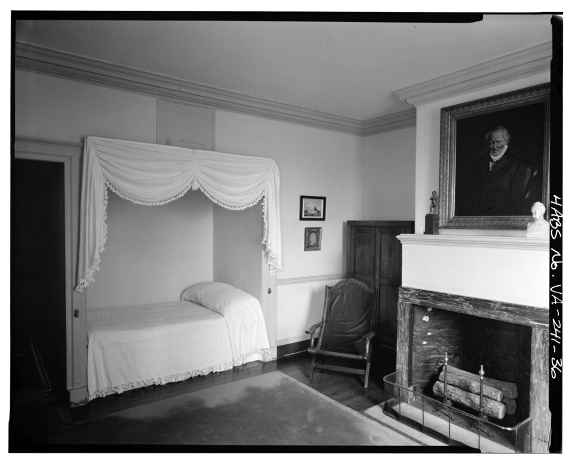

# Lifetime — dated stages for rooms

The full dated timeline for L14 (Room): single-room
huts before houses, ancient rooms, medieval halls, early modern specialization, industrial
furniture and light, modern fitted rooms, the present, and the far-future fate. Each stage maps
to its part doc in the reading guide; timescales cross-check at the bottom.

## Reading guide

- Single-room huts → `shell.md` (chalk walls, thatch) and `layout.md` (one room, central hearth).
- Ancient rooms → `shell.md` (mudbrick, atria) and `furniture.md` (couches, stools) and `storage.md` (bins, shelves).
- Medieval halls → `layout.md` (great hall giving way to chambers) and `furniture.md` (benches, trestles).
- Early modern specialization → `layout.md` (kitchen, parlor, bedchamber) and `shell.md` (chimney stacks, glazing).
- Industrial furniture and light → `furniture.md` (Thonet 1859 factory method; Eames 1956
covered in the same doc as the modern endpoint of that lineage), `light-power.md`
(1879 lamps, 1882 power), `storage.md` (Frankfurt 1926–27).
- Modern fitted rooms → `storage.md` and `shell.md` (drywall 1917, open plans 1933–37, FHA small houses 1934–36), `textiles-decor.md` (soft layer turnover).
- Present and far future → all part docs; the fate in `layout.md` (capsule endpoint) and `light-power.md` (LED efficiencies).

Target visual (file in `images/`, credit and license at the bottom):

Sources: English Heritage Neolithic houses; Met Roman housing; BBC great-hall and kitchen pages; DOE light-bulb history; MoMA Frankfurt Kitchen interactive; HABS Monticello photo VA,2-CHAR.V,1-36.

## Single-room huts (before ~2500 BCE)

The first rooms are one room: Neolithic houses about 5 m square, chalk-plastered walls
and floors that reflect sun and hold hearth heat, central hearth, thatched roof of wheat
straw over a hazel-woven frame — reconstructions from the 2006–07 Durrington Walls digs,
radiocarbon-dated to about 2600–2500 BCE, the sarsen-raising phase at Stonehenge some
3 km away. Excavated floors held postholes and slots for box beds, dressers, and
shelving; the settlement likely housed hundreds, feasting seasonally on pig and cattle
brought from far afield. Rectangular long houses of mudbrick, timber, and reeds follow:
one door, no windows, the hearth heating and cooking at once. Nothing is dated to a year;
the one-room plan persists into every later era as the vernacular under the monuments.

Sources: English Heritage Neolithic-houses pages; Stonehenge Riverside Project reports
(Parker Pearson et al.); UNESCO Durrington Walls settlement notice (Feb 2007).

## Ancient rooms (~2500 BCE–500 CE)

Walls divide and rooms multiply. The Roman domus, best preserved where Vesuvius buried
Pompeii and Herculaneum in 79 AD, names them: atrium (shaded reception hall around a
central impluvium pool, where the owner met clients), cubicula (bedrooms), tablinum
(reception and office opening off the atrium), triclinium (dining room), culina
(kitchen), peristyle garden — often over two storeys, the upper rarely surviving.
Mudbrick rectangles grow rooms as families grow; storehouse and shrine (lararium) split
off from the house — the first storage and civic parts. Walls settle into the two
families still standing: load-bearing walls carrying floors and roofs, nonbearing walls
merely dividing.

Sources: Met Roman-housing essay (Lockey 2009); Khan Academy domus guides; Britannica house pages.

## Medieval halls (~500–1600)

One great room holds the household: the great hall — dining, receiving guests, sleeping,
holding court — timber-roofed by tradition, never stone-vaulted like a church. Services
(kitchen, buttery, pantry) cluster at the low end, family chambers at the high end.
Owners withdraw over centuries to private chambers: the solar or great chamber above,
reached from the dais end, later called the retiring room, with its squint watching the
hall below; by the 17th century many halls demote to servants' halls or entrance
vestibules, though the hall stays the largest chamber and grand houses keep building
them into the 1600s. Timber framing fills the towns beside stone churches and
guildhalls; the chimney stack rises to carry smoke above the roof, freeing the central
hearth; market halls double as government. The chamber as a private room is born here.

Sources: BBC great-hall pages; Britannica solar-architecture pages; English Heritage
manor-house pages; Britannica construction pages.

## Early modern specialization (1600s–1800s)

Rooms take single functions. In the 1600s the hall splits into kitchen, parlor, and bedchamber;
Plymouth inventories 1670–85 relabel the hall as kitchen, the parlor becoming the best
multi-purpose room. Kitchens move away from living areas for smell and privacy once surplus
allows. The Victorian peak proliferates billiard rooms, morning rooms, parlours, studies —
later unaffordable, never repeated. Monticello's 1809 kitchen runs state-of-the-art French
stew-stove technology under enslaved chefs Edith Fossett (Hern) and Frances Hern; its dome
room keeps 8 round windows and a 4-ft
oculus over a 26-ft circle.

Sources: Plymouth folk-house pages; BBC kitchen-history pages; Monticello 1809-kitchen
and South Pavilion excavation pages (stew stoves among the earliest in British North
America); Monticello oculus-restoration pages (4-ft, 49-lb mouth-blown lens set
1 December 1989).

## Industrial furniture and light (1850s–1920s)

The room industrializes. Thonet's Chair No.14 (1859, the Vienna coffee-house chair) makes
furniture by factory: six steam-bent beech pieces, ten screws, two nuts — slats heated
to 100 C, pressed in cast-iron moulds, dried near 70 C for 20 hours — flat-pack in
1-cubic-metre boxes holding 36 disassembled chairs, 50 million sold 1859–1930, gold
medal Paris 1867. Swan demonstrates the carbon lamp December 1878, lights his own house
first, then some 700 witnesses at Newcastle on 3 February 1879 (first lit public
building); Mosley Street follows in 1880 as the first lit street. Edison's team tests
22 October 1879 (thirteen and a half hours), files the carbon-filament patent
4 November 1879, settles on bamboo past 1,200 hours. Pearl Street starts central power
4 September 1882 — six 100 kW Jumbo dynamos on a 50-by-100-ft site, 400 lamps to
82 customers rising past 10,000 lamps to 508 customers by 1884 — and the Savoy plays
under some 1,200 Swan lamps from its 10 October 1881 opening, stage gas only until
28 December 1881. Central heating matures — Strutt hot-air 1793,
Perkins high-pressure hot water in the 1830s, San Galli radiators 1855–57,
American Radiator 1892 — and indoor plumbing standardizes near 1900. Sackett Board
patents 1894, Sheetrock rebrands 1917; the Frankfurt Kitchen (1926–27) fits the kitchen
into 1.9 by 3.4 m for some 10,000 New Frankfurt flats.

Sources: Thonet company press kit (2025) and No.14 chair pages; DOE light-bulb history;
Rutgers Edison papers (Pearl Street headnote); IEEE Pearl Street milestone (4 Sept 1882);
Savoy Theatre pages; central-heating pages; USG history; MoMA Frankfurt Kitchen interactive.

## Modern fitted rooms (1930s–2000s)

The plan opens and the box standardizes. Willey draws the break 13 December 1933 —
after Nancy Willey's late-November ultimatum for an $8,000–$10,000 house — exposing the
kitchen through a glass screened partition, renaming it "workspace" for the servant-less
household; Jacobs I 1936–37 builds the Usonian open flow (designed 1936, constructed
1936–37, prototype of 140-plus Usonians and the postwar ranch). The FHA (National Housing
Act signed 27 June 1934, Pub. L. 73-479) and its 1936 Technical Bulletin 4
(Principles of Planning Small Houses) set the minimum house — living, kitchen, two
bedrooms, bath, maximum accommodation within minimum means. Drywall covers half of new
American homes by 1955, nearly all today; the 8-ft ceiling becomes two stacked sheets.
Frankfurt kitchens mostly discard in the 1960s–70s for easy-clean surfaces — the V&A's
Am Hohenblick example served some 80 years before rescue (W.15-2005); Eames shells change
ply and veneer across decades (Brazilian rosewood into the early 1990s, then cherry,
walnut, palisander); mattresses settle on the 7-to-10-year rule; carpets on 8 to 10. The
soft layer turns over fastest, the shell slowest.

Sources: Wright Foundation Willey stories (Nov–Dec 1933) and Jacobs House pages; UNESCO
Wright nomination (Jacobs designed/constructed 1936–37); National Archives FHA records
(27 June 1934) and FHA Bulletin 4 (1936); HUD history timeline; USG Sheetrock history;
Eames pages; Sleep Foundation and NAHB life pages.

## Present and far future (2000s–)

Today's room layers daylight with LED past 200 lumens per watt at the top end (best
commercial non-directional lamps near 210 lm/W, high-power packages to 228 lm/W),
heats through panels and floors, keeps in frameless boxes, dresses in washable softness —
and the capsule endpoint waits at about 2.5 by 2.5 by 4.0 m with a 1.3-m circular
window: Nakagin's 1970–72 plug-in rooms (140 units on two concrete cores), each near
10 sq m with built-in furniture and compact bath (MoMA's salvaged A1305 records
255 x 270 x 423 cm with fittings and frame; `layout.md` uses the same rounded plan
figures). The tower was dismantled April–October 2022; 23
capsules were rescued and preserved (SFMOMA, M+, MoMA's A1305 on show July 2025–July
2026), the rest digitally archived by 3D scan. The labeled trends (not facts): smart
rooms integrating light, shade, heat, and voice since the 1990s open standards;
sustainable, minimal, warm-natural material direction in the 2020s. The fate, if growth,
material change, and abandonment run on: shells stripped to panel and stud, furniture to
frame and foam, textiles first to go — rooms reverting to enclosures awaiting their next
soft layer.

Sources: IEA LED sales analysis (best commercial 210 lm/W) and DOE efficacy targets;
Cree LED efficacy notices; Nakagin Capsule Tower pages; MoMA A1305 object record
(255 x 270 x 423 cm) and Many Lives exhibition (2025–26); NYT capsule-rescue report
(Jan 2024); smart-home history pages.

### 2020–2026: the present, measured

The Census Survey of Construction fills the recent gap the timeline used to skip. New
American houses shrank through the affordability squeeze: 2023 completions hit the
smallest median in 13 years (single-family built-and-sold median 2,286 sq ft at $428,600,
$154.70 per sq ft); 2024 starts dipped further (median 2,153 sq ft for the year) before a
fourth-quarter uptick to 2,205; 2025 completions settled at 2,142 sq ft (sold median
2,194 sq ft at $417,400), multifamily rentals at 1,000 sq ft. Buyer surveys hold the plan
open — 85 percent want kitchen open to dining, 79 percent kitchen open to family room —
while remote and hybrid work (about a third of non-retired consumers since 2021)
promotes the home office into the top-five specialty rooms and stages one-bedrooms as
offices. Builders overshoot buyers on openness (54 percent build fully open
kitchen-family against 32 percent asking for it), and smaller lots plus incentives narrow
the new/existing price gap. The labeled 2020s direction — sustainable, minimal,
warm-natural — now reads against measured smaller footprints, not just mood boards:
reclaimed and FSC-certified wood, bamboo, cork, linen/hemp/organic cotton, natural
pigment paints, and warm wood veneers return as the luxury surface, with wellness and
biophilic cues (daylight, acoustics, natural texture) as the stated planning principle.

The capsule afterlife is now museum history, not speculation. Of the 23 rescued capsules,
14 were restored to original condition under Kisho Kurokawa Architects and Associates;
16 had permanent homes by mid-2025 — SFMOMA's A1302 (Kurokawa's own, 13th floor, with
Minami's 1972 series), MoMA's A1305 (top floor of Tower A, restored 2022–23 with
salvaged audio electronics, on show July 2025–July 2026 with some 45 contextual pieces),
plus M+ Hong Kong, MAXXI Rome, and museums in Saitama and Wakayama — and Archi Hatch
recorded the whole tower in 3D photogrammetry before demolition. The plug-in vision the
timeline cites as the far endpoint literally came true: capsules unplugged and shipped
worldwide.

Sources: Census Characteristics of New Housing (2023 medians; 2024 highlights; 2025 data
published 1 July 2026); NAHB Eye on Housing (2023–24 size trend) and What Home Buyers
Really Want (2021, 2024 eds.); Fannie Mae remote-work housing study (2023); gb&d and
Livingetc sustainable-material surveys (2022–25); SFMOMA acquisition notes (A1302, 2023–24);
MoMA Many Lives press release and A1305 record (2025); Artnet/Japan Times rescue counts (2025).

## Timescale cross-check

- Hut to domus: ~2500 BCE → 79 AD (two-plus millennia, one room → named rooms).
- Hall to chamber: ~500 → 1600s (a millennium, one hall → withdrawing rooms).
- Specialization to peak: 1600s → 1800s Victorian (two centuries, split → proliferation).
- Industrial room: 1859 → 1927 (seventy years, chair → fitted kitchen).
- Modern room: 1917 → 1955 (forty years, Sheetrock → half of new homes).
- Soft turnover inside one shell: carpets 8–10 yr, mattresses 7–10 yr, paint 5–15 yr.
- Open plan to small house: 1933 → 1936–37 (Willey exposure → Jacobs Usonian flow).
- Small house to tract boom: 1934 → 1955 (FHA Act → drywall in half of new homes).
- Capsule to archive: 1972 → 2022 → 2025–26 (plug-in rooms → demolition and 23 rescues
  → MoMA Many Lives show).
- New-house shrink: 2023 → 2025 (sold median 2,286 sq ft → completions median
  2,142 sq ft).

Sources: pages named in each section above.

## Image credits and licenses

| File | Shows | Credit (required) | License / terms |
|---|---|---|---|
| `lifetime-monticello-bedroom-habs.jpg` | Monticello northeast bedroom: canopy bed, fireplace, aged plaster and period furnishings (screensize, detail of full scene) | Walter Smalling, creator, Historic American Buildings Survey HABS VA,2-CHAR.V,1-36, Library of Congress, Prints & Photographs Division | Public domain (U.S. federal HABS work) (`https://commons.wikimedia.org/wiki/File:INTERIOR,_NORTHEAST_BEDROOM_-_Monticello,_State_Route_53_vicinity,_Charlottesville,_Charlottesville,_VA_HABS_VA,2-CHAR.V,1-36.tif`) |

## Sources

- English Heritage, Neolithic houses: `https://www.english-heritage.org.uk/visit/places/stonehenge/things-to-do/neolithic-houses`
- Met, Roman housing: `https://www.metmuseum.org/essays/roman-housing`
- BBC, great hall: `https://www.bbc.co.uk/history/british/middle_ages/great_hall_01.shtml`
- Britannica, solar architecture: `https://www.britannica.com/technology/solar-architecture`
- Monticello, 1809 kitchen: `https://www.monticello.org/exhibits/post-1809-kitchen`
- Monticello, South Pavilion excavation: `https://www.monticello.org/stories/excavating-monticellos-first-kitchen-and-south-wing`
- Monticello, oculus restoration: `https://www.monticello.org/encyclopedia/oculus-restoration-1989`
- Thonet, company press kit (2025): `https://www.thonet.de/fileadmin/media/08-company/Press_releases/EN/Thonet_Company_Press_Kit_May_2025_EN.pdf`
- DOE, light-bulb history: `https://www.energy.gov/articles/history-light-bulb`
- IEEE, Pearl Street milestone: `https://ethw.org/Milestones:Pearl_Street_Station,_1882`
- MoMA, Frankfurt Kitchen: `https://www.moma.org/interactives/exhibitions/2010/counter_space/the_frankfurt_kitchen/`
- Wright Foundation, Willey open-plan kitchen: `https://franklloydwright.org/willey-house-stories-part-1-open-plan-kitchen/`
- Wright Foundation, Jacobs House: `https://franklloydwright.org/site/herbert-jacobs-house/`
- National Archives, FHA records: `https://www.archives.gov/research/guide-fed-records/groups/031.html`
- HUD, history timeline (archived): `https://archives.hud.gov/hud50/hud50.hud.gov/hud_history_timeline/index.html`
- HUD, FHA history (current): `https://www.hud.gov/aboutus/fhahistory`
- Census, Characteristics of New Housing: `https://www.census.gov/construction/chars`
- Census, 2024 highlights: `https://www.census.gov/construction/chars/highlights.html`
- NAHB, Eye on Housing size trend: `https://eyeonhousing.org/2023/11/home-size-trending-lower`
- Fannie Mae, remote-work housing study: `https://www.fanniemae.com/media/48891/display`
- IEA, LED lighting sales: `https://www.iea.org/reports/targeting-100-led-lighting-sales-by-2025`
- MoMA, capsule A1305 record: `https://production-gcp.moma.org/collection/works/434291`
- MoMA, Many Lives exhibition: `https://www.moma.org/calendar/exhibitions/5830`
- SFMOMA, capsule acquisition: `https://www.sfmoma.org/read/a-towering-acquisition`
- Nakagin Capsule Tower: `https://en.wikipedia.org/wiki/Nakagin_Capsule_Tower`
- Hermitage, Pazyryk carpet: `https://hermitagemuseum.org/wps/portal/hermitage/digital-collection/25.+archaeological+artifacts/879870`
