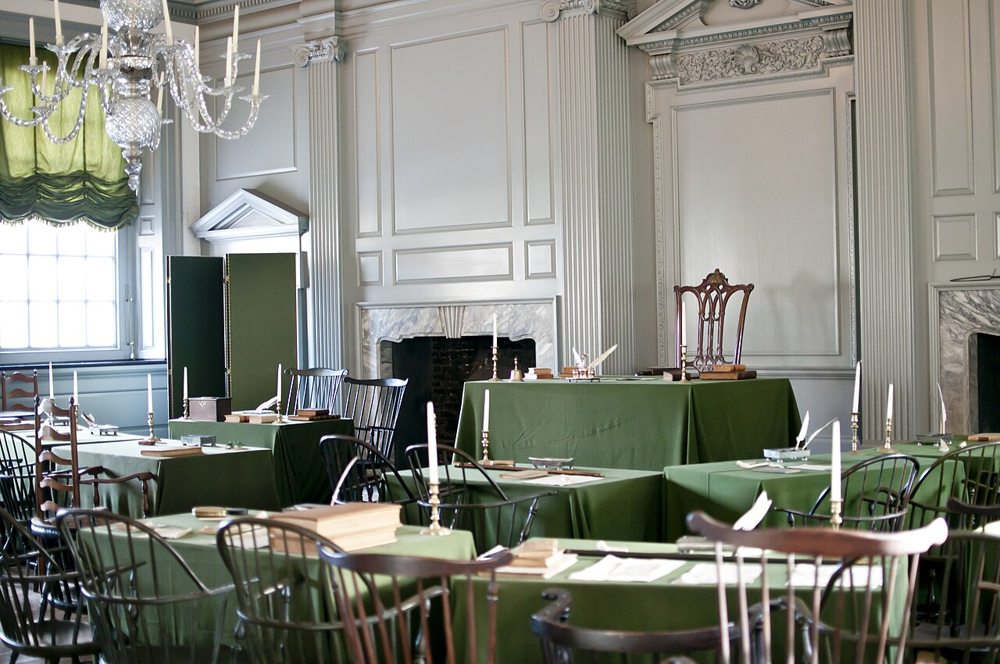

# L13 behind us — Buildings as previous level

This page is the bridge
from L13 (Buildings) into L14 (Room): what
the previous level looks like, what carries over when you zoom in,
and what changes at L14 scale. The part docs from the loop's first
pass now exist — follow the cross-links below.
Entry itself — the visual transition and its effects — lives in
[the L13-to-L14 entry](./entry.md). The dated timeline runs through
[the L14 lifetime](./lifetime.md).

## What L13 is and how it looks

L13 is the building scale at the R11 anchor (large building, 32 m, 3.16e1 m, e 1.50).
houses, blocks, stadiums. Its content per the ladder
is streets, houses, stadiums, with the part docs covering houses and residential buildings,
apartment and office blocks, shops and commercial cores, civic and industrial buildings,
and stadiums and arenas. Our example building is Independence Hall seen from its Assembly Room:
a brick hall tens of meters long holding one famous room — the Assembly Room where the
Continental Congress declared Independence in 1776 and the Constitution was debated and
signed in 1787 — chairs in rows, green-baize-covered
tables — the preview toward the rooms of L14.

Inside the view are the parts. The rows are the houses: detached homes, yards, subdivisions —
the median new single-family home completed in 2025 carries 2,142 sq ft of floor area (about 199 m2;
homes sold in 2025 median 2,194 sq ft), far above
this zoom. The walls are the blocks: apartment and office towers, stacked floors with window
grids. The glass is the commercial core: shops, offices, malls. The shared and the made are
civic and industrial: schools, hospitals, warehouses, factories. The bowls are the stadiums:
large-span roofs hundreds of meters across. The single room is not yet visible; a bedroom of
about 11 by 12 ft (132 sq ft) sits far below this zoom.

Target visuals (files in `images/`, credits and licenses at the bottom):

Sources: `../../../../docs/universes/ladder.md` (L13 row, L14 row);
[L13 README](../../L13/documents/README.md) (L13 part docs
[houses](../../L13/documents/houses.md), [blocks](../../L13/documents/blocks.md),
[commercial](../../L13/documents/commercial.md), [civic](../../L13/documents/civic.md),
[industrial](../../L13/documents/industrial.md), [stadiums](../../L13/documents/stadiums.md));
NPS NPGallery Assembly Room asset page;
US Census new-housing highlights (2025).

## What carries over into L14

Everything L13 shows at building scale is still there, only closer.
The building L13 frames as one object becomes the enclosure: the exterior weather wall becomes
the interior finish and the furniture wall, the roof becomes the ceiling — the 7 to 8 ft
headroom plane carrying the light. The face L13 watches
as walls and roofs becomes the surfaces around us — floors you stand on,
walls within reach, a ceiling just overhead. The block and street L13 draws around the building
become the circulation inside the room: hallways at least 36 in wide per the dwelling code,
walkways past a sofa of 30 to 36 in, the seat-to-tabletop gap held at 10 to 12 in.
The mixed fabric L13 reads house by house becomes the neighbor-by-neighbor mix at arm's length:
beds 60 by 80 in for a queen, counters finished at 36 in, wall cabinets 12 in deep hung
18 in above the counter. The room never opens (terminal); the building walls stay faintly
around the room until the end of the dive.
populations (shown points) never open — only portals do (ADR 0010). Sources: ladder
L13 and L14 rows; NPS Assembly Room page; IRC R304/R305/R311 dwelling rules; kitchen cabinet
size guides.

## What changes at this zoom

**From buildings to rooms.** At L13 the view holds
buildings at the R11 anchor (large building, 32 m, 3.16e1 m, e 1.50). At L14 each L13 cell opens
with no milestones into rooms at the R11 anchor (5 m, 5.01e0 m, e 0.70): the size of
a bedroom, a parlor, a laboratory module — the shell, the large furniture, the storage,
the light and power, the textiles and small objects, and the layout with the 1 m end point
(see [shell](./shell.md), [furniture](./furniture.md), [storage](./storage.md),
[light and power](./light-power.md), [textiles and decor](./textiles-decor.md),
[layout](./layout.md)).

**From an object to an interior.** The L13 object — walls, roof, mass — fills past the edges
and becomes the room around you: the curve of the block flattens into wall planes, the
day-night line becomes the lamp and the window, the haze becomes indoor air. A queen bed
60 by 80 in spans roughly half of an 11 by 12 ft bedroom; a 36-in counter sets the working
height; a 32-in clear door sets the passage. The Assembly Room that held a congress becomes a
measuring stick: rows of chairs at 17 to 19 in seat height, tables at 28 to 30 in — furniture
dimensions the body already knows. Sources: ladder L13 and L14 rows; ADR 0010 (portal vs
population).

**From reading a building to standing in a room.** L13 shows a building — rows, walls, glass,
halls, works, bowls. L14 shows what one chamber of that building holds up close: the floor
underfoot, the wall within reach, the ceiling just overhead, the chairs, tables, shelves and
lamps arranged in a 1 to 10 m plan. The building is still there, 10 to 100 m around — but here
the story is the room, not the building. The orbital-room endpoint of this zoom — the Destiny
laboratory module with equipment racks lining both walls — is the target visual of
[the entry](./entry.md) (ISS view `iss007e11800`). Sources: NASA ISS Destiny module page; NPS pages.

## How the parts fit together

One room runs through the part docs. The shell
([shell](./shell.md)) sets the enclosure — floors, walls, ceilings, doors, windows; the big pieces
([furniture](./furniture.md)) set the use — beds, sofas, chairs, tables; the held things
([storage](./storage.md)) set the keeping — shelves, cabinets, closets, counters; the served systems
([light and power](./light-power.md), [textiles and decor](./textiles-decor.md)) set the light, air, power and softness — lamps,
fixtures, outlets, vents, rugs, curtains, art; and the plan
([layout](./layout.md)) sets the arrangement — how the pieces sit in 1–10 m, circulation, the 1 m
end point. The dated version of this story runs through [the lifetime](./lifetime.md), and the dive
that brings you here is in [the entry](./entry.md). Sources: L13 part docs
as the pattern; NASA and NPS pages.

## Where to go next

- [entry](./entry.md) — the L13-to-L14 dive in plain steps, effects on entry, timing.
- [shell](./shell.md), [furniture](./furniture.md), [storage](./storage.md) — the enclosure, the big pieces, the keeping.
- [light and power](./light-power.md), [textiles and decor](./textiles-decor.md), [layout](./layout.md) — the served, the soft, the plan.
- [lifetime](./lifetime.md) — dated stages from single-room huts to today's rooms.

## Key numbers

- L13 anchor: large building 32 m, 3.16e1 m (e 1.50); buildings, streets, houses, stadiums per ladder row.
- L14 anchor: room 5 m, 5.01e0 m (e 0.70); furniture, layout, the 1 m end point per ladder row.
- Assembly Room subset: screensize derivative (1280 px wide) of the 4288 by 2848 NPS NPGallery photo `4e4d7280-1dd8-b71b-0ba3-d7bec43b2b9c`; chairs at 17–19 in seat height, tables at 28–30 in.
- Rooms: habitable rooms at least 70 sq ft with 7 ft in every direction; ceilings conventionally 8 ft (2.44 m); bedrooms about 11 by 12 ft; interior doors 30 by 80 in stock; hallways 36 in minimum.
- Furniture: queen 60 by 80 in; sofa about 72–90 in wide; counters finished at 36 in; wall cabinets 12 in deep, 18 in above the counter.
- Building to room step: a 60-in bed is about 0.15 of a 10 m building face; a 36-in hallway about 0.09; door widths in the same range.

Sources: ladder L13 and L14 rows; pages named above; NPS and NASA object pages.

## Image credits and licenses

| File | Shows | Credit (required) | License / terms |
|---|---|---|---|
| `assembly-room-independence-nps.jpg` | Assembly Room in Independence Hall: rows of wooden chairs and green-baize-covered tables (screensize, detail of full scene) | NPS Photo, National Park Service | Public domain (U.S. NPS work) (`https://npgallery.nps.gov/AssetDetail/4e4d7280-1dd8-b71b-0ba3-d7bec43b2b9c`) |

Proposed images (not downloaded, per image policy): no new raster files this pass — the Assembly Room
frame covers the L13-to-L14 bridge. Proposed for a future pass (no file added here): one PD-certain
SVG scale strip (`l14-scale-strip.svg`: 10 m building face vs 1.5 m queen bed vs 0.9 m hallway vs
1 m end point, with the 30 by 80 in door for scale), drawn as a vector once public-domain sources
are confirmed, with alt text and a link from this page.

## Sources

- Ladder: `../../../../docs/universes/ladder.md` (L13 and L14 rows, gap note, R8 form)
- L13 reference index: [L13 README](../../L13/documents/README.md)
- L13 part docs (pattern for L14 parts): [houses](../../L13/documents/houses.md), [blocks](../../L13/documents/blocks.md), [commercial](../../L13/documents/commercial.md), [civic](../../L13/documents/civic.md), [industrial](../../L13/documents/industrial.md), [stadiums](../../L13/documents/stadiums.md)
- [NPS, NPGallery Assembly Room asset page (4288 by 2848 original, NPS Photo, public domain)](https://npgallery.nps.gov/AssetDetail/4e4d7280-1dd8-b71b-0ba3-d7bec43b2b9c)
- [US Census, new-housing highlights (2025: 2,142 sq ft completed median; 2,194 sq ft sold median)](https://www.census.gov/construction/chars/highlights.html)
- [ICC, IRC dwelling room and ceiling rules (R304/R305)](https://codes.iccsafe.org/s/IRC2021P3/chapter-3-building-planning/IRC2021P3-Pt03-Ch03-SecR304.1)
