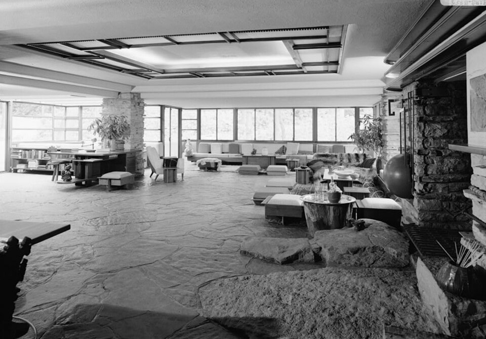

# Shell — floors, walls, ceilings, doors, windows

One of six L14 parts: the room shell at 1–10 m.
The bridge from L13 lives in `previous-l13.md`; the dive lives in `entry.md`; the timeline in `lifetime.md`.
For the use inside the enclosure see `furniture.md`; for the keeping see `storage.md`; for the plan see `layout.md`.

## How it looks

A room shell is the enclosure you stand inside: a floor underfoot, walls within reach, a ceiling
just overhead, a door to enter, a window to the outside. The shell is also the roof made
interior — exterior wall as inside finish, roof structure as ceiling — which is why this document
covers the overhead plane and its openings together with floors and walls.

Floors run hardwood, carpet, or tile —
the three common American choices, with wood in about half of homes, carpet in three-quarters,
tile in well over half [S001]. Hardwood here means solid or engineered wood boards worn as the
finished surface; carpet means wall-to-wall textile over pad; tile means ceramic or stone set
in mortar. Stone floors that run out to terraces, as at Fallingwater, are the limiting case:
inside and outside share one walking surface, and the enclosure opens rather than closes.

Walls are most often gypsum panel: a gypsum rock core sandwiched between
two layers of paper, fire-resistant types mixing glass fibre into the core [S002][S003].
Older walls are wet
plaster — lime or gypsum with water and sand, hardening as it dries, one of the most ancient
building techniques, with 4,000-year-old Egyptian gypsum plaster still hard [S002]. Load-bearing
walls carry floors and roofs; nonbearing partitions merely divide — the Roman distinction that
still governs which walls may be opened (see `layout.md` for the open-plan consequence).

Ceilings sit
conventionally at 96 in (8 ft), the height of two 4-ft drywall sheets stacked; suspended
minimums run 90 in [S004]. The ceiling is the room-side face of the floor or roof above:
in Fallingwater the wood-slat ceiling carries the terrace load overhead, in the Gropius House
a flat roof with central drain doubles as ceiling with no attic behind it. Flat versus pitched
is therefore a shell decision with a roof consequence — flat gains usable section and avoids
low sloping attics but must drain through the building instead of over eaves.

Doors are stock 30 or 32 in wide by 80 in tall (the 6/8 door), 1-3/8 in
thick indoors (1-3/4 in at the exterior for weather and security), in six-panel molded
or flush-slab styles [S005]. Widths run 24 to 36 in by room: 24 for closets, 28–30 for baths,
30–32 for bedrooms, 36 for entries and accessible routes. At least one egress door per dwelling
clears 32 in wide by 78 in high [S005][S006].

Windows divide into double-hung (two sashes
sliding up and down), casement (hinged at the side, swinging outward), and picture (fixed,
never opening), stock widths 24 to 48 in [S007]. Corner windows that open outward "break the box":
with the corner post removed, two glass planes meet at air when open — Wright's detail at
Fallingwater, confirmed in the house tour account: stone floors continue out, corner windows
open outward, plate glass frames the woods through four seasons [S008]. Bedroom windows double
as escape under IRC R310: net clear opening
at least 5.7 sq ft (5.0 at grade), at least 20 in wide and 24 in high, sill no more than 44 in
above the floor [S006].

Target visual (file in `images/`, credit and license at the bottom):

Sources: flooring shares [S001]; gypsum panel and plaster [S002][S003]; ceiling heights [S004]; door sizes and egress [S005][S006]; window types and egress [S006][S007]; Fallingwater design and HABS photo [S008][S021].

## How it changes over time

Shell ages on different clocks. Interior paint lasts 15 years or more but homeowners repaint far
more often — trade guidance runs 5 to 10 years for living rooms and bedrooms, 3 to 5 for
kitchens and baths, 2 to 4 for hallways [S009]. Carpet runs 8 to 10 years with normal traffic and
maintenance; vinyl reaches 50, linoleum about 25 [S009]. Hardwood runs a century or more: a maintenance
coat (clean, light sand, fresh finish) renews the surface, a full sand to bare wood rescues it
when the finish wears through — floors centuries old are still in service [S010]. Quartz, granite,
and stone have displaced mid-century laminate as the upgrade countertop path since the 1970s,
while laminate itself survives as the budget surface — the same succession that discarded most
Frankfurt kitchens in the 1960s–70s when easy-clean Resopal turned affordable [S011].

Whole eras of shell
succeed each other: lath-and-plaster (the modern form of wattle-and-daub) before drywall, then
the gypsum panel taking over in the postwar tract-housing boom — faster, with fewer laborers [S003].
USG's own history dates the mechanism: Sackett Board acquired 1909, Sheetrock panel breakthrough
1917, Chicago World's Fair showcase 1933–34, then high demand through 1940s tract development
and diversification into cement board in the 1950s [S003]. Drywall covered half of new American
homes by 1955 and nearly all today; the 8-ft ceiling is two stacked sheets because the sheet
made it so (see `lifetime.md` for the dated spine). Change comes by recoat and refinish, and by
era turnover from plaster to panel.

What is new (2020–2026): new American houses shrank through the affordability squeeze while the
shell stayed panel-and-stud. Census Characteristics of New Housing records 2025 completions at a
2,142-sq-ft median (sold median 2,194 sq ft at $417,400), multifamily rentals at 1,000 sq ft,
with wood framing dominant and heat pumps displacing furnaces in the South [S012]. The stated
2020s surface direction — reclaimed and FSC-certified wood, bamboo, cork, linen and hemp,
natural-pigment paints, warm wood veneers, daylight and biophilic cues — now reads against
measured smaller footprints rather than mood boards alone; wellness and natural texture are the
planning principle cited in builder and buyer surveys [S012]. No panel-system turnover replaced
drywall in this window: USG's 2020s program is sustainability goals, lighter panels
(UltraLight, EcoSmart), and acoustic ceiling systems, not a new enclosure [S003].

Sources: paint and flooring life expectancy [S009]; hardwood refinishing [S010]; countertop and Frankfurt-kitchen succession [S011]; drywall era turnover and USG history [S003]; recent Census housing characteristics [S012].

## How it is created

The predominant method is light frame with panel skin. Load-bearing walls run studs 16 in
on-center; drywall sheets fasten to the frame with nails, screws, or adhesive (or over furring),
joints filled and feathered with a joint tool until the joint disappears under paint, nailheads
dimpled then compounded [S002]. The 16-in module is not arbitrary: half-inch panel suits walls
and ceilings on 16-in centers, and the 4-ft sheet width spans three stud bays. Heavy pieces must
anchor to studs, never to hollow panel alone (see below).

The panel itself was invented as Sackett Board, patented 1894 — gypsum
plaster between paper, installed in a single day against weeks for wet plaster; USG bought
Sackett in 1909, folded edges arrived 1910, solid core 1913, flush square edges 1916, rebranded
Sheetrock 1917, marketed from 1921 as a fireproof wall with no drying wait [S003]. USG confirms
the 1909 acquisition and the 1917 Sheetrock breakthrough, the 1933–34 World's Fair showcase,
and the 1940s tract-housing demand that carried the panel into dominance [S003]. Interior finishes
run in a fixed order per the home-building sequence: drywall, then paint and stain, bath tile,
flooring, cabinetry, interior carpentry, countertops, fixtures. The average new American house
carries over 6,000 ft of drywall; a standard sheet covers 4 by 8 ft [S003].

Roofs make ceilings. Two lineages meet overhead: the pitched timber or truss roof with attic
behind it, and the modern flat roof — gravel-and-tar over deck with parapet, center drain run
through the house so no gutters are needed and the pipe stays thawed on house heat. The Gropius
House (1938, Gropius with Breuer) demonstrates the flat lineage at room scale: wood frame behind
white vertical redwood planks, plate-glass living-room panes 6 ft high by over 10 ft wide on
steel I-beam lintels, protruding roof admitting low winter sun while shading high summer sun,
reducing the need for cooling [S013]. Fallingwater (1935–39, guest house 1939) demonstrates the
cantilever lineage: stacked concrete trays anchored to a central Pottsville-sandstone chimney
mass, terraces nearly equaling indoor area in square footage, low ceilings reinforcing shelter
while glass dissolves the wall [S008]. Both houses were built of catalog and stock materials
where possible — Gropius almost entirely so — proving the shell need not be bespoke to be
modern [S013].

Sources: stud and drywall construction [S002]; Sackett and Sheetrock history [S003]; Gropius House flat-roof and catalog-material construction [S013]; Fallingwater cantilever construction [S008].

## How it interacts with the others

The shell is what everything else fastens to, plugs into, and moves through. Heavy pieces must
anchor to wood studs or a weight-bearing wall — screws in hollow drywall alone fail, which is
why electrical boxes nailed to a stud's side double as stud finders [S014]. Power follows the 12-ft /
6-ft rule (IRC E3901): no point along any wall's floor line sits more than 6 ft from a receptacle, so
receptacles land at most 12 ft apart, and only receptacles at most 5-and-a-half ft above the floor
count — the intent is
to kill extension cords [S015]. Operable parts they feed — switches, receptacles, thermostats —
sit inside the accessible reach band: 15 in minimum to 48 in maximum unobstructed, 44 in maximum
forward over a 20-to-25-in obstruction, 46 in maximum side over a 10-to-24-in obstruction at most
34 in high [S016].

Light and air are code-shaped too: habitable rooms need aggregate
glazing of at least 8 percent of floor area (IRC R303), which constrains where furniture, door swings, and
vents may go [S006]. The shell sets the legal minimums the layout must respect — 70 sq ft rooms (kitchens
excepted), 7 ft
in every direction (IRC R304), 7 ft ceilings (IRC R305) — and the furniture answers inside them (see `furniture.md`
for the pieces, `storage.md` for the keeping, `layout.md` for the plan). The work triangle
(Sink–cook–fridge, each leg 4 to 9 ft, total 13 to 26 ft, no major traffic through it) is drawn
on the shell's walls: cabinets and appliances hang on panel-and-stud, landings clear beside each
center, aisles hold 42 in for one cook and 48 in for several [S017]. Lamps layer the shell and vents
cross it — supplies near window and door, returns central, registers never blocked (see
`light-power.md`); rugs zone it with 12 to 18 in of bare floor to the wall (see
`textiles-decor.md`).

Sources: stud anchoring [S014]; IRC receptacle spacing [S015]; accessible reach [S016]; IRC glazing, room, and ceiling rules [S006]; work-triangle geometry [S017].

## Typical size and mass

A standard drywall sheet is 4 by 8 ft (32 sq ft), with 4 by 10 and 4 by 12 ft for long runs;
half-inch panel suits walls and ceilings on 16-in centers [S018]. Five-eighths Type X adds fire
resistance where code requires it; quarter- and three-eighths-inch panels serve curves and
overlays rather than primary spans. Studs run 16 in on-center in load-bearing walls; wider
24-in spacing suits nonbearing partitions with thicker panel. Stock interior doors run 24 to 36 in
wide (30 and 32 most common) by 80, 84, or 96 in tall, 1-3/8 in thick; the 36-by-80 entry
exceeds the one egress minimum (32-in clear width, 78-in clear height) and, once framed, yields
about 33.5 in of clear passage [S005]. Stock double-hung windows run about 24
to 48 in wide; egress minimums (20-in clear width, 24-in clear height, 5.7 sq ft — 5.0 at grade,
44-in maximum sill) size the smallest legal bedroom window, not the typical one [S006][S007].

The shell of one room — a bedroom of about 11 by 12 ft with 8-ft ceilings —
carries roughly 500 sq ft of wall and ceiling panel, a few hundred pounds of gypsum and paper
before paint and trim. At panel density near 1.6–2.2 lb per sq ft (half-inch), the panel alone
runs roughly 800–1,100 lb per room before studs, trim, doors, and glass; the layout's half-ton
room budget (see `layout.md`) follows directly. Capsule scale bounds the small end: a Nakagin
capsule at 2.5 by 2.5 by 4.0 m with a 1.3-m circular window holds about 10 sq m of floor with
bath and built-ins inside — the room reduced to one fitted shell [S019].

Sources: panel sizes and stud module [S018]; door sizes and egress clearance [S005][S006]; window and egress sizes [S006][S007]; room panel budget and capsule bound [S019].

## Example objects

- Fallingwater, Mill Run, Pennsylvania — Frank Lloyd Wright's 1935–39 weekend house (guest house 1939, UNESCO World Heritage 2019) where stone floors run out to the terraces, corner windows open outward to break the box, and plate glass frames the woods; no exterior wall faces the falls, only the stone core [S008]. The enclosure is stacked concrete trays anchored to a central Pottsville-sandstone chimney mass, terraces nearly equaling indoor area, low ceilings sheltering while glass dissolves the wall. Construction ended fall 1937; fame was immediate — Time cover 1937, MoMA traveling exhibition 1938.
- Monticello dome room and oculus, Charlottesville, Virginia — Jefferson's octagonal skyroom lit by a 4-ft-diameter, 49-lb mouth-blown bull's-eye glass oculus, restored December 1989 to his specifications; the dome idea came home from his France years 1784–89 [S020]. Eight round windows ring a 26-ft circle under the oculus: the shell as sky instrument, not just enclosure.
- The Gropius House living room, Lincoln, Massachusetts — 1938 modern shell (Gropius with Breuer, 2,300 sq ft, Historic New England since 1985) holding annotated seating and a fireplace wall, the furnished-box ideal in one frame [S013]. White vertical redwood planks over wood frame, casement and sash windows with black trim, plate-glass living panes 6 ft by over 10 ft, flat gravel-and-tar roof draining through the house, protruding sun-shading roof admitting winter sun — catalog materials assembled into modernism.

Sources: Fallingwater design history [S008]; Monticello oculus restoration [S020]; Gropius House design and HABS photo [S013][S021].

## Image credits and licenses

| File | Shows | Credit (required) | License / terms |
|---|---|---|---|
| `shell-fallingwater-habs.jpg` | Fallingwater living room from the kitchen: stone walls and floor, wood-slat ceiling, corner glazing (screensize, detail of full scene) | Library of Congress, Prints & Photographs Division, HABS PA,26-OHPY.V,1-48 (photo: Jack E. Boucher, 1985) | Public domain (U.S. federal HABS work) (`https://commons.wikimedia.org/wiki/File:Fallingwater_-_Living_Room_from_Kitchen_-_HABS_PA,26-OHPY.V,1-48.jpg`) |

## Sources

- [S001] NWFA, consumer flooring study (wood / carpet / tile shares): `https://nwfa.org/wp-content/uploads/2020/03/IndustryReports_ConsumerStudy.pdf`
- [S002] Britannica, drywall / plaster / lath-and-plaster (gypsum core, joint finishing, wet-plaster antiquity): `https://www.britannica.com/technology/drywall`
- [S003] USG, company history (1902 founding; 1909 Sackett acquisition; 1917 Sheetrock breakthrough; 1933–34 World's Fair; 1940s tract demand; 2020s sustainability and UltraLight panels): `https://www.usg.com/en-US/about-usg/history`
- [S004] Wharton, ceiling-heights paper (96-in conventional, 90-in suspended minimum): `https://realestate.wharton.upenn.edu/wp-content/uploads/2017/03/678.pdf`
- [S005] Doors.com, standard door-size guide (30/32-by-80 6/8 stock, 24–36 range, 1-3/8 interior vs 1-3/4 exterior, 32-in clear / 78-in high egress, 36-in door yielding about 33.5-in clear): `https://www.doors.com/pages/standard-door-size`
- [S006] ICC Digital Codes, IRC 2021 Part 3 (R304 room minima 70 sq ft / 7 ft; R305 ceiling heights; R310 egress window 5.7/5.0 sq ft, 20-in wide, 24-in high, 44-in sill; R303 8-percent glazing; R311 egress door): `https://codes.iccsafe.org/s/IRC2021P3/chapter-3-building-planning/IRC2021P3-Pt03-Ch03-SecR304.1`
- [S007] Pella, window types (double-hung / casement / picture, 24–48-in stock widths): `https://pella.com/shop/windows`
- [S008] Fallingwater / Western Pennsylvania Conservancy, designing Fallingwater (1935–39 house, 1939 guest house, Pottsville-sandstone chimney, cantilevered trays, stone floors to terraces, corner windows opening outward to break the box, plate glass on the woods; Time 1937, MoMA 1938, UNESCO 2019): `https://fallingwater.org/history/the-kaufmanns-fallingwater/designing-fallingwater/`
- [S009] NAHB, life-expectancy study (paint 15-plus years, repaints 5–10 / 3–5 / 2–4; carpet 8–10; vinyl 50; linoleum 25): `https://teamcomplete.com/wp-content/uploads/2015/12/07-NAHB-Life-Expectancy-Depreciation-Feb-2007.pdf`
- [S010] NWFA, hardwood refinishing (maintenance coat vs full sand to bare wood; century-plus service): `https://nwfa.org/wp-content/uploads/2020/03/IndustryReports_ConsumerStudy.pdf`
- [S011] Frankfurt kitchen history (1.9-by-3.4-m fitted prototype, 10,000 installed, Resopal-era discard 1960s–70s, aluminum drawers surviving): `https://en.wikipedia.org/wiki/Frankfurt_kitchen`
- [S012] Census, Characteristics of New Housing highlights 2025 (completions median 2,142 sq ft; sold median 2,194 sq ft at $417,400; multifamily rentals 1,000 sq ft; wood framing dominant; heat-pump displacement): `https://www.census.gov/construction/chars/highlights.html`
- [S013] Gropius House history and construction (1938 Gropius with Breuer, 2,300 sq ft, white vertical redwood planks, casement/sash windows, 6-ft by 10-ft plate panes on steel lintels, flat gravel-and-tar roof with through-house drain, protruding sun-shading roof, catalog materials; Historic New England since 1985): `https://en.wikipedia.org/wiki/Gropius_House`
- [S014] USG, Gypsum Construction Handbook and wall assemblies (panel fastening to 16-in stud frame, joint finishing, stud anchoring for heavy loads): `https://www.usg.com/en-US/learning-reference/gypsum-construction-handbook`
- [S015] IRC E3901 receptacle spacing (12-ft / 6-ft rule, 5-and-a-half-ft counting height, extension-cord intent): `https://codes.iccsafe.org/s/IRC2021P3/chapter-3-building-planning/IRC2021P3-Pt03-Ch03-SecR304.1`
- [S016] Access Board, operable parts and reach ranges (unobstructed 15–48 in; obstructed forward 44 in over 20–25 in; side 46 in over 10–24 in at most 34 in high): `https://www.access-board.gov/ada/guides/chapter-3-operable-parts/`
- [S017] Kitchen work-triangle history and rules (Gilbreth 1920s circular routing, Illinois Small Homes Council 1946–49, legs 4–9 ft totaling 13–26 ft, 42/48-in aisles, landing counters): `https://en.wikipedia.org/wiki/Kitchen_work_triangle`
- [S018] Panel and sheet sizes (4-by-8/10/12 sheets, half-inch on 16-in centers, Type X fire rating): `https://www.usg.com/en-US/about-usg/history`
- [S019] Nakagin Capsule Tower (2.5-by-2.5-by-4.0-m capsules, 1.3-m circular window, 140 units on two cores, four bolts each, 1970–72 built, 2022 demolition, 23 preserved including MoMA A1305): `https://en.wikipedia.org/wiki/Nakagin_Capsule_Tower`
- [S020] Monticello, dome-room oculus (4-ft 49-lb mouth-blown lens, restored December 1989; France years 1784–89; 8 round windows over 26-ft circle): `https://www.monticello.org/encyclopedia/oculus-restoration-1989`
- [S021] HABS Fallingwater living-room photo PA,26-OHPY.V,1-48 (Boucher 1985, stone walls and floor, wood-slat ceiling, corner glazing): `https://commons.wikimedia.org/wiki/File:Fallingwater_-_Living_Room_from_Kitchen_-_HABS_PA,26-OHPY.V,1-48.jpg`

## References

- [S001](#sources) · [S002](#sources) · [S003](#sources) · [S004](#sources) · [S005](#sources) · [S006](#sources) · [S007](#sources) · [S008](#sources) · [S009](#sources) · [S010](#sources) · [S011](#sources) · [S012](#sources) · [S013](#sources) · [S014](#sources) · [S015](#sources) · [S016](#sources) · [S017](#sources) · [S018](#sources) · [S019](#sources) · [S020](#sources) · [S021](#sources)
