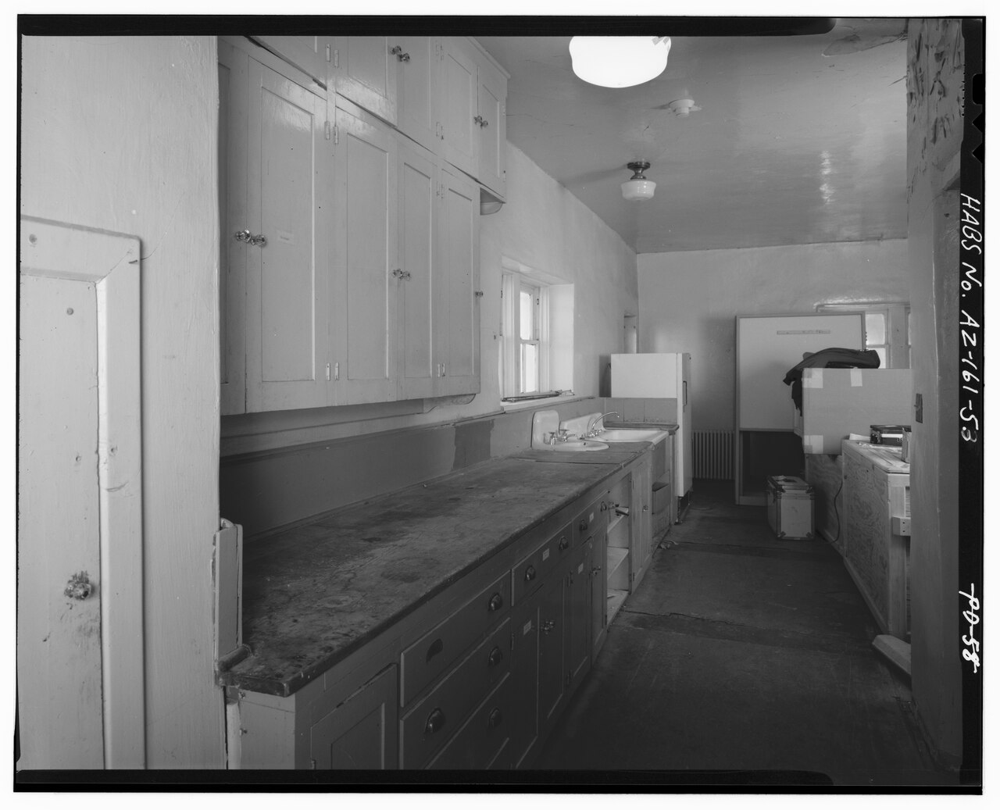

# Storage — shelves, cabinets, closets, counters

One of six L14 parts: the keeping at 1–10 m.
The bridge from L13 lives in `./previous-l13.md`; the dive lives in `./entry.md`; the timeline in `./lifetime.md`.
Currency: dimensions verified against 2026-available trade guides and the Access Board reach
guides; 2020–2026 developments checked October 2026; the Monticello 1809-kitchen page was not
directly fetchable this pass (see [S016](#sources)) and its claims are carried over unchanged.

## How it looks

Storage is the keeping made fitted: cabinets and counters in the kitchen, shelves and closets
everywhere else. A US base cabinet stands 34-and-a-half in tall by 24 in deep; the countertop
adds an inch and a half for a 36-in finished work surface; widths run 9 to 42 in in 3-in steps,
gaps closed with filler strips [S001]. Wall cabinets run 12 in deep standard (24-in bridges over
the fridge), 30, 36, or 42 in tall — 30 suits 8-ft ceilings, 42 reaches the ceiling in 9-ft
rooms — hung with about 18 in of backsplash clearance above the 36-in counter, bottom edge near
54 in off the finished floor [S001]. Tall pantry cabinets run 84, 90, or 96 in tall by 24 in
deep, paired to their wall height — 84 with 30-in walls, 90 with 36-in, 96 with 42-in [S001].
The trade reads codes at a glance: B36 is a 36-in-wide base, W3030 a 30-by-30 wall, UP2484 a
24-by-84 pantry [S001]. Countertops run about 25 to 26 in front to back, the extra inch or two
past the 24-in base forming the front overhang that also shelters the cabinet faces, at a
finished height of 35 to 36 in [S010]. Closets sit 24 in deep comfortable (20 minimum for
hangers), shoe and small-item shelves 12 in deep, folded-clothes drawers 18 in minimum, deeper
24-in drawers holding multiple folding rows [S002]. Open shelves span 30 to 36 in in
three-quarter stock at ordinary loads; at a 10-in width under book loading the no-sag span runs
about 26 in for particleboard, 32 for plywood, 36 for yellow pine, 44 for red oak [S003].
Bookshelves run 10 to 12 in deep with 7 to 15 in between shelves, 8 to 12 most common, tighter
spacings high and wider ones low so the case never reads top-heavy [S003].

Target visual (file in `images/`, credit and license at the bottom):

The frame is the HABS record view of the Room 101 kitchen east wall, cabinets looking south:
base and upper cabinets with counter and sink wall, the fitted wall photographed as the survey
found it (HABS ARIZ,1-NAVA.V,1-53) [S014].

Sources: cabinet sizes and codes [S001]; closet depths [S002]; shelf spans, depths, and
spacings [S003]; countertop depth and height [S010]; HABS Painted Desert Inn photo [S014].

## How it changes over time

Storage ages at its joints and surfaces. Cabinet change runs through hardware and racking — the
face frame's stiles and rails resist the out-of-square tilt that misaligns doors and drawers,
while frameless boxes rack more easily in shipping and handling [S004]. Countertops run through
material succession: mid-century plastic laminate — the Formica-type high-pressure paper sheet,
invented 1912–13 as a mica substitute, decorative from the 1927 printed patterns and melamine
resins of 1938, popularized in the 1950s for low cost and wipe-clean durability [S012] — then
natural granite, then engineered quartz: Breton-method vibrocompressed slabs from the 1960s,
about 93 percent crushed stone in 7 percent polyester resin, which had supplanted granite as
the people's choice for counters by 2017 [S011]. Quartz, granite, and stone together form the
upgrade path off laminate. Closets change by retrofit inside the shell — rod-and-shelf swapped
for drawers, 12-in shoe shelves, inclined racks — without touching the 20-to-24-in carcass
depth [S002]. Whole fitted systems get discarded on schedule: most Frankfurt kitchens went out
in the 1960s–70s when easy-clean Resopal surfaces turned affordable, often only the aluminum
drawers surviving [S005].

What is new (2020–2026): engineered quartz turned from upgrade story to health story. Breathing
quartz dust in fabrication shops causes silicosis, and the 2020s counted the cost: Australia
became the first country to ban engineered stone, effective 1 July 2024, after the national
surge in cases [S011]; California counted 500 fabrication-shop silicosis diagnoses by January
2026, with emergency shop rules adopted December 2023 after most inspected shops failed silica
exposure standards [S011]. No carcass-system turnover replaced framed and frameless boxes in
this window. Meanwhile new American houses shrank through the affordability squeeze — Census
Characteristics of New Housing records 2025 completions at a 2,142-sq-ft median (sold median
2,194 sq ft at $417,400), multifamily rentals at 1,000 sq ft, wood framing dominant [S015] —
so fitted storage (drawer retrofits inside the 24-in closet carcass, full-access frameless
boxes) stays the capacity lever while rooms get smaller rather than larger.

Sources: face-frame vs frameless racking [S004]; laminate invention and melamine resins [S012];
quartz composition, market rise, and health record [S011]; closet-retrofit depths [S002];
Frankfurt-kitchen discard [S005]; Census 2025 housing characteristics [S015].

## How it is created

Two carcass systems divide the trade. Framed cabinets carry a solid-wood face frame — rails and
stiles — between door and box: easier to install and adjust, more size options, applied skins
needed on exposed sides [S004]. Frameless (European) cabinets are box only: full-access
interiors with no center stile, larger drawer boxes, factory-finished sides, more fillers for
door and drawer clearance [S004]. Framed boxes fasten to each other through the face-frame
width with long screws; frameless boxes fasten side-panel to side-panel with short screws at
more locations [S004]. The fitted-kitchen method starts with the Frankfurt Kitchen, designed
1926 by Grete Schütte-Lihotzky for Ernst May's New Frankfurt social housing: a narrow
double-file galley, 1.9 by 3.4 m, entrance in one short wall opposite the window, stove left
with a sliding door to the dining room, cabinets and sink right, workspace under the window,
made in three sizes for different flats [S005][S006]. Some 10,000 went into Frankfurt flats in
the late 1920s, fully equipped for a few hundred Reichsmarks, passed to the rent near one mark
a month [S005]. It was not the first fitted kitchen, nor even the earliest Modernist one, but
it was the first to be made in quantity — the V&A's surviving example (W.15-2005, 90 parts)
came from the Am Höhenblick estate in Ginnheim, rescued after almost eighty years of use and
restored to its original scheme [S006]. Taylor's Scientific Management sits behind every
drawer: labeled metal bins for flour, rice, and sugar reachable without opening a cupboard;
beech worktops resisting stain and acid; oak flour bins repelling mealworms; blue fronts
because flies avoid blue; revolving stool, fold-down ironing board, removable waste drawer,
vented cool-cupboard, hall-side waste bin [S005][S006]. The same motion-study lineage runs
through Lillian Gilbreth's 1920s circular routing to the Illinois Small Homes Council
1946–49 standardization study behind the work triangle below [S009].

Sources: face-frame vs frameless construction and installation [S004]; Frankfurt plan, counts,
costs, and Taylorist fittings [S005]; V&A object record, quantity-first status, and estate
provenance [S006]; work-triangle lineage [S009].

## How it interacts with the others

Storage defines the 1 m end point: reach. Unobstructed forward and side reach runs 15 in
minimum to 48 in maximum above the floor; over a counter up to 20 in deep the max holds at 48
in, over 20 to 25 in it drops to 44 [S007][S008]. Side reach over a deeper obstruction — 10 to
24 in deep, at most 34 in high — caps at 46 in [S008]. The work triangle ties the three
centers — cooking surface, sink, refrigeration — with no leg under 4 ft or over 9, total 13 to
26 ft, no major traffic through it, no full-height obstacle between any two points, and no
cabinet or obstacle crossing a leg by more than 12 in [S009]. Landing counters ride with it:
24 in on one side of the sink and 18 on the other, 15 in on the handle side of the fridge (or
within 48 in across), 15 in one side of the stove and 12 on the other, 36 in of prep beside
the sink; work aisles hold 42 in for one cook and 48 in for several [S009]. Storage walls
double as room dividers and thresholds: the Frankfurt precedent slid straight from kitchen to
dining table to shorten the carry, and sized the room for exactly one adult worker — too small
for two [S005]. Counters set the working height the shell's outlets serve and the furniture's
stools answer (see `./shell.md` for the enclosure, `./furniture.md` for the stools,
`./layout.md` for the plan).

Sources: ADA reach ranges, unobstructed and obstructed [S007][S008]; work-triangle geometry,
landings, and aisles [S009]; Frankfurt one-worker sizing [S005].

## Typical size and mass

The module numbers: 36-in finished counter, 18-in counter-to-wall gap with the wall bottom near
54 in off the floor, 12-in wall depth, 24-in base and closet depth, 20-in hanger minimum,
30-to-36-in shelf spans, the 15-to-48-in accessible reach band, 4-to-9-ft triangle legs
totaling 13 to 26 ft [S001][S002][S003][S008][S009]. One kitchen wall — three base cabinets,
two wall cabinets, one counter run — spans about 3 m wide and masses on the order of a hundred
kilograms of box, front, stone, and hardware.

Sources: cabinet size guides [S001]; closet and shelf references [S002][S003]; reach and
triangle rules [S008][S009].

## Example objects

- The Frankfurt Kitchen, 1926–27 — Schütte-Lihotzky's fitted prototype, first made in quantity
  (some 10,000 across New Frankfurt); survivors sit in MoMA New York, the V&A London
  (W.15-2005, 90 parts, from the Am Höhenblick estate), Frankfurt's Historical Museum, the MAK
  Vienna, and others [S005][S006].
- Monticello's 1809 kitchen, South Dependency, Charlottesville — the Jefferson-era
  state-of-the-art kitchen run by enslaved chefs Edith Fossett and Frances Gillette, open
  shelves of copper pans, French stew-stove technology [S016].
- Painted Desert Inn Room 101 kitchen, Navajo, Arizona — east-wall base and upper cabinets with
  counter and sink wall, the fitted wall photographed as HABS found it (ARIZ,1-NAVA.V,1-53)
  [S014]. The inn itself: Pueblo Revival by NPS architect Lyle E. Bennett with CCC builders,
  1937–40, remodeled by Mary Jane Colter and run as a Fred Harvey House 1947–63; National
  Historic Landmark 1987, rehabilitated 2004–06, now a museum [S013].

Sources: Frankfurt kitchen pages and V&A object record [S005][S006]; Monticello 1809-kitchen
pages [S016]; HABS photo record [S014]; Painted Desert Inn history [S013].

## Image credits and licenses

| File | Shows | Credit (required) | License / terms |
|---|---|---|---|
| `storage-painted-desert-habs.jpg` | Painted Desert Inn Room 101 kitchen: east-wall base and upper cabinets with counter and sink wall (screensize, detail of full scene) | Library of Congress, Prints & Photographs Division, HABS ARIZ,1-NAVA.V,1-53 (survey HABS No. AZ-161) | Public domain (U.S. federal HABS work) (`https://commons.wikimedia.org/wiki/File:ROOM_101,_KITCHEN,_EAST_WALL,_CABINETS,_LOOKING_SOUTH_-_Painted_Desert_Inn,_Navajo,_Apache_County,_AZ_HABS_ARIZ,1-NAVA.V,1-53.tif`) |

## Sources

- [S001] QuikCabinets, kitchen cabinet sizes guide (base 34.5-by-24, wall 12 deep, tall 84/90/96, 3-in increments, B36/W3030/UP2484 codes, 2026): `https://quikcabinets.com/blogs/kitchen-remodeling-guides/kitchen-cabinet-sizes-standard-dimensions-guide`
- [S002] Dimensions.com, closet depths (24 comfortable, 20 hanger minimum, 12 shelves, 18 drawers): `https://www.dimensions.com/element/closet-depths`
- [S003] WoodBin, shelf design guidelines (30-to-36-in spans in 3/4 stock, no-sag table, 10-to-12-in depths, 7-to-15-in spacings): `https://woodbin.com/ref/furniture-design/shelves/`
- [S004] Cabinets.com, framed vs frameless cabinets (face frame, racking, skins, full access, fillers, installation): `https://www.cabinets.com/frameless-vs-face-frame-cabinets`
- [S005] Frankfurt kitchen history (1.9-by-3.4-m plan, 10,000 units, Taylorist fittings, Resopal-era discard, museum holdings): `https://en.wikipedia.org/wiki/Frankfurt_kitchen`
- [S006] V&A, Frankfurt Kitchen object O121079 (W.15-2005, 90 parts, Am Höhenblick estate, first made in quantity, Taylor bins): `https://collections.vam.ac.uk/item/O121079/frankfurt-kitchen-kitchen-schutte-lihotzky-margarete/`
- [S007] Access Board, operable parts and reach ranges (unobstructed 15–48 in; obstructed forward 44 in over 20–25 in): `https://www.access-board.gov/ada/guides/chapter-3-operable-parts/`
- [S008] UpCodes, ADA reach ranges 308 (forward/side, obstructed, 46-in side cap): `https://up.codes/s/reach-ranges`
- [S009] Kitchen work triangle (Gilbreth, Illinois Small Homes Council, NKBA rules: legs 4–9 ft totaling 13–26 ft, landings, aisles): `https://en.wikipedia.org/wiki/Kitchen_work_triangle`
- [S010] Countertop materials and dimensions (25–26-in depth, 35–36-in height, material range): `https://en.wikipedia.org/wiki/Countertop`
- [S011] Engineered stone (Breton 1960s method, quartz supplanting granite, Australia 2024 ban, California 2026 silicosis record): `https://en.wikipedia.org/wiki/Engineered_stone`
- [S012] Formica laminate history (invented 1912–13, melamine resin 1938, decorative laminates): `https://en.wikipedia.org/wiki/Formica_(plastic)`
- [S013] Painted Desert Inn history (1937–40 CCC/Bennett build, Colter remodel, Harvey House 1947–63, NHL 1987, 2004–06 rehab): `https://en.wikipedia.org/wiki/Painted_Desert_Inn`
- [S014] HABS Painted Desert Inn Room 101 kitchen photo ARIZ,1-NAVA.V,1-53 (PD U.S. federal work): `https://commons.wikimedia.org/wiki/File:ROOM_101,_KITCHEN,_EAST_WALL,_CABINETS,_LOOKING_SOUTH_-_Painted_Desert_Inn,_Navajo,_Apache_County,_AZ_HABS_ARIZ,1-NAVA.V,1-53.tif`
- [S015] Census, Characteristics of New Housing highlights 2025 (completions median 2,142 sq ft; sold median 2,194 sq ft at $417,400; multifamily rentals 1,000 sq ft; wood framing dominant): `https://www.census.gov/construction/chars/highlights.html`
- [S016] Monticello, 1809 kitchen (carried over; page not directly fetchable this pass): `https://www.monticello.org/encyclopedia/1809-kitchen`

## References

- [S001](#sources) · [S002](#sources) · [S003](#sources) · [S004](#sources) · [S005](#sources) · [S006](#sources) · [S007](#sources) · [S008](#sources) · [S009](#sources) · [S010](#sources) · [S011](#sources) · [S012](#sources) · [S013](#sources) · [S014](#sources) · [S015](#sources) · [S016](#sources)
