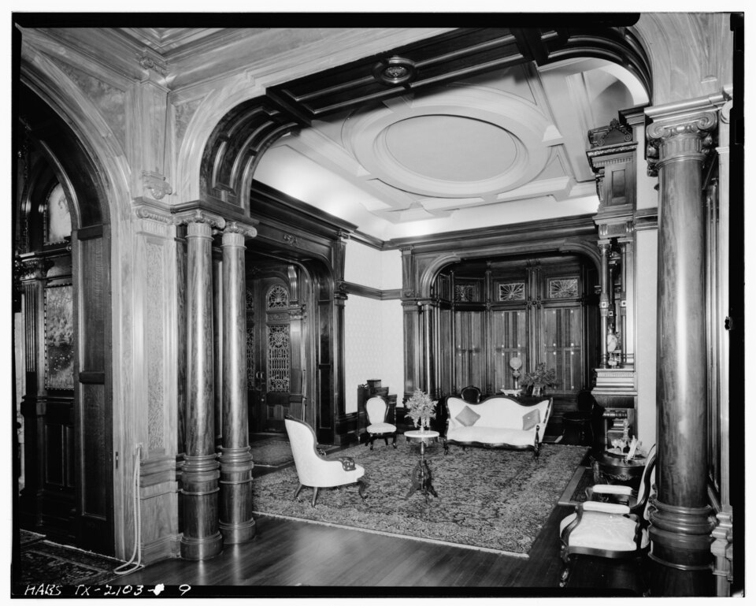

# Textiles and small objects — rugs, curtains, art, decor

One of six L14 parts: the soft layer at 1–10 m.
The bridge from L13 lives in `./previous-l13.md`; the dive lives in `./entry.md`; the timeline in `./lifetime.md`.
For the enclosure see `./shell.md`; for the pieces see `./furniture.md`; for the keeping see
`./storage.md`; for the served systems see `./light-power.md`; for the plan see `./layout.md`.
Currency: dimensions verified against 2026-available trade size guides and the Access Board reach
guides; Pazyryk claims checked against Hermitage and Central Asia Program pages October 2026;
2020–2026 developments checked October 2026.

## How it looks

Textiles are the soft layer over the hard room: rugs on the floor, curtains at the window, art
on the wall, small objects on the shelf. Standard rectangular rugs sell at 2-by-3, 3-by-5,
4-by-6, 5-by-7, 5-by-8, 6-by-9, 8-by-10, 9-by-12, 10-by-12, 10-by-14, and 12-by-15 ft —
living rooms mostly buy 8-by-10 (the most popular standard living-room size) and 9-by-12 [S001][S002].
In inches: 5-by-8 is 60 by 96 (152 by 244 cm, 40 sq ft),
8-by-10 is 96 by 120 (244 by 305 cm, 80 sq ft), 9-by-12 is 108 by 144 (274 by 366 cm,
108 sq ft), 10-by-12 is 120 by 144. Runners run 2 to 3 ft wide by 6 to 14 long (usually
2-and-a-half to 3 ft wide); round rugs run 4, 5, 6, 8, and 10 ft across [S001][S002]. Pile
is trimmed knotted yarn standing up — about 2 mm on the oldest surviving pile carpet —
knotted symmetrical (Turkish/Ghiordes) at about 3,600 knots per square decimeter (about
360,000 per square meter, denser than most modern carpets) for density [S003][S004][S005].
Placement follows the furniture: 8-by-10 holds the front legs of sofa and chairs (the conversation
zone), 9-by-12 and up hold all four legs of every piece, 12 to 18 in of bare floor left to the
wall; a dining rug extends 24 to 30 in past the table edge on every side so pulled-out chairs
stay on the rug (a six-chair table typically needs 8-by-10, eight chairs 9-by-12);
bedroom rugs slide about two-thirds under the bed, stopping before the nightstands —
8-by-10 the sweet spot for a queen, 9-by-12 for a king [S002].

Target visual (file in `images/`, credit and license at the bottom):

The frame is the HABS record view of the parlor of the Colonel Walter Gresham House (Bishop's
Palace), 1402 Broadway, Galveston, Texas — built 1887–1892 to Nicholas J. Clayton's
Richardsonian Romanesque / late-Victorian design for lawyer-politician Walter Gresham, later
the diocesan residence and now a museum house: patterned rug, tall curtained windows,
upholstered settee and chairs, overmantel mirror, and chandelier, photographed as the survey
found it (HABS No. TX-2103, photo TEX,84-GALV,26-9) [S006][S007].

Sources: standard rug-size chart [S001]; rug sizes and placement [S002]; Hermitage and Pazyryk
pages [S003][S004]; HABS Gresham House record and house history [S006][S007].

## How it changes over time

Textiles age fastest in the room. Carpet keeps 8 to 10 years with maintenance and normal
traffic — against vinyl's 50, linoleum's 25, wood's century-plus [S008]. Dyed wool fades: the oldest
surviving pile carpet's once-bright yellows, blues, and reds read faded now but must have glowed —
its reds from Armenian cochineal, its figures once crisp under 2 mm of trimmed pile [S003][S005].
Sun takes curtains and south-facing rugs first; feet take the traffic lanes; whole rugs retire
to smaller rooms before they retire outright. Curtains themselves grade by light control: sheer
(translucent voile or lace, view out by day with basic UV screening) to uncoated opaque weaves
to coated blackout (rubber-backed, up to 3-pass for near-total block) to lined curtains pairing
a face fabric with an insulative lining — with the gap to the window kept small against
convection drafts [S009]. Change comes by rotation and cleaning, by fading
into dimmer versions of themselves, and by replacement on the decade — the soft layer turns
over several times inside one shell's life.

What is new (2020–2026): no fiber-system turnover replaced wool and synthetics (nylon,
polypropylene, polyester, acrylic over wool pile) in this window; the visible 2020s moves are
styling and stewardship. Interiors layer rugs (a smaller hand-knotted piece over a large
natural-fiber jute or sisal base) and order custom sizes where stock rectangles miss the
architecture — both 2026-standard trade guidance [S002] — while smaller new-house footprints
(Census 2025 completions median 2,142 sq ft; see `./storage.md` and `./shell.md`) keep the
soft layer as the cheapest room redo rather than the shell. Stewardship-side, the Gresham
House itself (the target visual) entered phased restoration: copper-roof and conservatory work
from 2020 and a full 1920s tile-roof replacement with replica Ludowici tiles and rooftop
figurines in 2025 [S007]; at Pazyryk, Gornoaltai University with the Hermitage re-studied
Barrow 5 and its adjoining structures from 2017–2020 toward full museumification of the
necropolis [S004].

Sources: NAHB life-expectancy study [S008]; curtain light and heat control [S009]; Pazyryk
dye and pile detail [S003][S005]; rug-layering and custom sizing [S002]; Bishop's Palace
restoration phases [S007]; Pazyryk re-investigation [S004].

## How it is created

The oldest surviving intact pile carpet is the Pazyryk, from Barrow No. 5 in the Pazyryk valley,
Altai — wool, symmetrical (Turkish/Ghiordes) knots, excavated by Rudenko's 1949 dig after
Griaznov's 1929 Barrow 1, 183 by 200 cm, about 360,000 knots per square meter (about 1.3
million in the whole rug), pile trimmed near 2 mm [S003][S004][S005]. (Older knotted
fragments exist — Yanghai pieces from the Taklamakan dated near 700 BCE — but Pazyryk
remains the oldest surviving whole pile carpet [S010].) Barrows 1–5 are now dated to the
4th–3rd centuries BCE (revised from Rudenko's 5th-century label); the Pazyryk culture spans
roughly the 6th–2nd centuries BCE [S003][S004]. Origin is foreign, not local Altai: the
rider, deer, griffin, and rosette program borrows from ancient Iranian and Middle Eastern
art — the horse-handling and headwear match the Persepolis tribute reliefs — and the rug was
most likely a diplomatic gift, possibly made to decorate a carriage interior; at about
1.83 by 2.00 m a weaver would need at least a year and a half [S004]. It sits in the
State Hermitage, St. Petersburg (halls 26–29 hold the Pazyryk collection), inventory 1687-93 [S004].
Beside it lay the large felt rug: a thin white felt base about 30 sq m covered with colored
felt appliques sewn in sinew thread, repeating an investiture scene (a goddess enthroned with a
mythical branch, a mounted warrior approaching) plus a repaired-in second rug of sphinx and
phoenix combat — frieze composition borrowed from imported models, stretched over poles as a
funeral tent [S004]. The method persists into every machine era:
knot, trim, lay flat — only the loom and the dye change. Hand knotting (symmetrical Turkish
vs asymmetrical Persian/Senneh, plus Jufti around four warps for large single-color fields)
still makes oriental rugs, but most domestic floor carpet today is tufted — pile gunned into
a primary backing, bonded to a secondary hessian or synthetic backing, often sheared —
alongside flatweave (kilim, soumak), hooked, embroidered, and needle-felt
constructions [S010][S011]. Pile fiber runs wool (durable, dyeable, the costly minority),
nylon 6 and 6-6 (most common, stain-treated dye sites), polypropylene/olefin (cheap berber,
stain-resistant but oil-vulnerable), polyester/PET and PTT/Sorona (hydrophobic, crush-prone),
and acrylic (wool-like, washable) [S011]. Curtain and shade hardware follows the
window: rails, tracks, and rods sized to the opening, hung to clear the glazing and the egress
path — panels in flat, tab-top, grommet, rod-pocket, pencil- and pinch-pleat hangs, held by
tie-backs or draw-pulls [S009][S012]. Small objects arrive last in the build sequence, after fixtures — the room is finished
before it is dressed.

Sources: Hermitage and Pazyryk pages [S003][S004][S005]; knot types [S010]; carpet techniques
and fibers [S011]; curtain styles and hardware [S009][S012]; Central Asia Program Pazyryk
pages [S004].

## How it interacts with the others

Rugs anchor furniture groupings the way tables anchor rooms: legs on or off the rug decide the
zone, and the bare-floor border to the wall keeps the shell visible [S002]. Curtains answer the shell's
windows — glazing area (at least 8 percent of floor area per IRC R303), sill height, egress clear opening —
softening daylight by day and framing the lamp glow by night; sheer grades keep the outward view,
blackout and lined grades take the bedroom and the media corner [S009] (see `./shell.md` for the
enclosure rule and legal minimums). Art answers the wall: its weight meets the stud rule from
`./shell.md`, its subject the room's use from `./layout.md`. Small objects live on the storage's
shelves at the reach band's heights — unobstructed reach 15 to 48 in, dropping to 44 in forward
over a 20-to-25-in counter (see `./storage.md`) — dusted where the vents from
`./light-power.md` blow: supplies near window and door, returns central, registers never blocked
top or bottom. The soft layer is the cheapest redo in the room — new rug, new
curtains, same shell.

Sources: rug-size placement guides [S002]; curtain control grades [S009]; shell outlet and stud rules (see `./shell.md`).

## Typical size and mass

The working numbers: 8-by-10 at 80 sq ft (28 less than 9-by-12's 108), runners to 14 ft, rounds
to 10 ft across, Pazyryk at 183 by 200 cm. One parlor's soft set — a 9-by-12 rug, four curtain
panels, six framed pieces, a dozen small objects — covers about 10 sq m of floor and wall and
masses a few dozen kilograms of wool, cotton, glass, and wood.

Sources: rug-size chart [S001]; Hermitage Pazyryk pages [S003][S004].

## Example objects

- The Pazyryk carpet, 4th–3rd century BCE (culture 6th–2nd c. BCE) — oldest surviving intact pile carpet, 183 by 200 cm of knotted wool at about 360,000 knots per square meter, State Hermitage St. Petersburg (inventory 1687-93); pile near 2 mm, dyes faded from bright yellow, blue, and red (reds from Armenian cochineal); foreign Iranian/Middle Eastern work, likely a diplomatic gift; found with the large felt applique rug and the disassembled birch funeral carriage in Barrow 5 [S003][S004][S005].
- The Gresham House parlor, Galveston, Texas — 1887–1892 Nicholas J. Clayton house for Walter Gresham at 1402 Broadway (later Bishop's Palace, now a Galveston Historical Foundation museum house): Victorian furnished parlor with patterned rug, tall curtained windows, upholstered settee and chairs, overmantel mirror, and chandelier, photographed as HABS found it (HABS No. TX-2103) [S006][S007].
- The Smithsonian Castle parlor (Room 201), Washington, DC — furnished secretary's anteroom in the east wing's second floor, landscape of kept things in a federal interior (see `./layout.md` for the plan reading).

Sources: Hermitage Pazyryk pages [S003][S004][S005]; HABS Gresham House record [S006] and house history [S007]; HABS Smithsonian photo DC,WASH,520B-77 [S013].

## Image credits and licenses

| File | Shows | Credit (required) | License / terms |
|---|---|---|---|
| `textiles-gresham-parlor-habs.jpg` | Gresham House parlor: patterned rug, tall curtained windows, upholstered chairs and chandelier (screensize, detail of full scene) | Historic American Buildings Survey HABS TEX,84-GALV,26-9 (Survey No. TX-2103), Library of Congress, Prints & Photographs Division | Public domain (U.S. federal HABS/NPS work) (`https://commons.wikimedia.org/wiki/File:INTERIOR_VIEW_OF_PARLOR_-_Colonel_Walter_Gresham_House,_1402_Broadway,_Galveston,_Galveston_County,_TX_HABS_TEX,84-GALV,26-9.tif`) |

## Sources

- [S001] RugSizing, standard rug-size chart (2x3 through 12x15, rounds to 10 ft, 8x10/9x12 popular): `https://www.rugsizing.com/rug-sizes`
- [S002] Jaipur Rugs, rug-size and placement guide (front-legs / all-legs, 24-to-30-in dining extension, queen 8x10 / king 9x12, runners, layering, custom, 2026): `https://www.jaipurrugs.com/blog/what-are-the-standard-rug-sizes`
- [S003] Pazyryk burials overview (4th–3rd c. BCE dating revision, Griaznov 1929 / Rudenko 1947–49, 183x200 cm rug at ~360,000 knots per sq m, Armenian-cochineal reds, Hermitage holding): `https://en.wikipedia.org/wiki/Pazyryk_burials`
- [S004] Central Asia Program, Pazyryk treasures in the Hermitage (Azbelev interview: Turkish double-symmetric knots ~3,600 per sq dm, ~2 mm pile, 1.83x2.00 m, 4th–3rd c. BCE weave, foreign gift reading, felt applique rug, funeral carriage, 2017–2020 re-study): `https://centralasiaprogram.org/regional-platforms/the-treasures-of-pazyryk-kurgans-in-the-hermitage-museum/`
- [S005] Hermitage, Pazyryk carpet (inventory 1687-93): `https://hermitagemuseum.org/wps/portal/hermitage/digital-collection/25.+archaeological+artifacts/879870`
- [S006] HABS Gresham House parlor photo record TEX,84-GALV,26-9 (Survey TX-2103, PD NPS work, source file page): `https://commons.wikimedia.org/wiki/File:INTERIOR_VIEW_OF_PARLOR_-_Colonel_Walter_Gresham_House,_1402_Broadway,_Galveston,_Galveston_County,_TX_HABS_TEX,84-GALV,26-9.tif`
- [S007] Bishop's (Gresham) Palace history (1887–1892 Clayton for Walter Gresham, 1402 Broadway, diocese 1923, GHF 2013, 2020 and 2025 restoration phases): `https://en.wikipedia.org/wiki/Bishop%27s_Palace_(Galveston,_Texas)`
- [S008] NAHB, life-expectancy study (carpet 8–10 years; vinyl 50; linoleum 25): `https://teamcomplete.com/wp-content/uploads/2015/12/07-NAHB-Life-Expectancy-Depreciation-Feb-2007.pdf`
- [S009] Curtain types and control (sheer / uncoated / coated blackout / lined; light and heat control; tie-backs, rods, tracks): `https://en.wikipedia.org/wiki/Curtain`
- [S010] Knotted-pile carpet (Ghiordes/Turkish symmetric vs Senneh/Persian asymmetric vs Jufti knots; Pazyryk Ghiordes use; Yanghai ~700 BCE fragments as oldest known knotted pieces): `https://en.wikipedia.org/wiki/Knotted-pile_carpet`
- [S011] Carpet techniques and fibers (woven / flatweave / knotted / tufted / hooked / embroidery / needle felt; wool, nylon, polypropylene, polyester, acrylic): `https://en.wikipedia.org/wiki/Carpet`
- [S012] Curtain and shade hardware lineage (rails, tracks, rods sized to the opening; portiere and shutter history): `https://en.wikipedia.org/wiki/Curtain`
- [S013] HABS Smithsonian Castle Room 201 parlor photo DC,WASH,520B-77 (see `./layout.md` for the plan reading): `https://commons.wikimedia.org/wiki/File:ROOM_201_(PARLOR_-_SECRETARY%27S_ANTEROOM),_EAST_WING,_SECOND_FLOOR,_LOOKING_NORTHWEST_-_Smithsonian_Institution_Building,_1000_Jefferson_Drive,_between_Ninth_and_Twelfth_Streets,_HABS_DC,WASH,520B-77.tif`

## References

- [S001](#sources) · [S002](#sources) · [S003](#sources) · [S004](#sources) · [S005](#sources) · [S006](#sources) · [S007](#sources) · [S008](#sources) · [S009](#sources) · [S010](#sources) · [S011](#sources) · [S012](#sources) · [S013](#sources)
