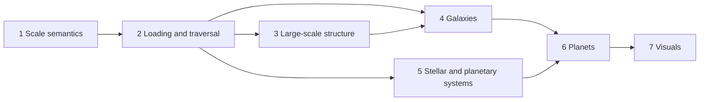

# Realism review of the universe

Issue #143. A six-profile review of the universe as it is rendered today:
what is unrealistic, what "as real as possible" means in numbers, and
what to change, in which order. This document proposes; it changes
nothing by itself. Every proposed change to the ladder, the memory bound,
or the rendering rule is applied later through its own Issue and ADR,
after the owner approves.

Spec v1 and the owner decisions are on Issue #143. The shape of this
file is checked by `python scripts/validation/review_lint.py`.

> Numbering note: this review records the Issue #143 proposal numbering
> (eleven levels L1–L11, Earth at L11), frozen at Spec v1. The canonical
> ladder has since moved on (R8 amendment, owner-approved 2026-10-04):
> old L3 folded into L2 as content, old L4–L11 shifted down one number,
> Earth at L10, plus the beyond-MVP tail L11–L14. Read old L3 as L2
> content, old L4 as L3, old L5 as L4, old L6 as L5, old L7 as L6,
> old L8 as L7, old L9 as L8, old L10 as L9, old L11 as L10.
> The findings and targets are unchanged; only the rung numbers moved.

## 1. How to read this

The application is a **dive**: you start outside the observable universe
and move toward ever smaller things until you reach a planet. Along the
way the universe is cut into **levels** (L1, the whole observable
universe, down to L11, a planet). Each level is a **cell**: a box of unit
size, holding a handful of **markers** drawn as spheres. Every marker *is*
the next level's cell: fly into a galaxy marker at L5 and you are inside
an L6 cell showing that galaxy's structures. The size of a marker relative
to its cell is the **ratio** between two neighbouring levels; it comes
from a table of real sizes in metres (the **ladder**, `../../../docs/universes/ladder.md`).

Words used below:

- **Anchor**: the real object that gives a level its size (the Milky Way
  for L5, the Sun for L10, Earth for L11).
- **Target**: the marker you clicked (or the autopilot chose). Today the
  camera only moves straight toward it.
- **Open / close**: entering a marker's cell when it fills enough of the
  view (0.14 rad of angular radius), leaving it when the cell shrinks
  below 0.10 rad.
- **Preview**: the children of the six largest-looking markers are
  generated one level early so a cell is never empty when you enter it.
- **Live cells**: how many cells exist in memory at once. Today at most
  2 + 6 (the open cell, its parent, six previews).
- **Generator**: the deterministic recipe that fills a cell from a seed.
  Same seed, same universe, on every machine.
- **Pass-through** (owner's words): "the target should always continue;
  the passed-through cell shows its children". A cell you cross on the way
  to your target opens, shows its contents, and is left behind.
- **Free flight**: a second camera mode where you steer yourself.
- **Source numbers** `[S<k>]` point to section 12. Finding numbers
  `F<profile><n>` are unique across the document (A astronomer,
  S astrophysicist, G planetary scientist / geologist, M mathematician,
  R artist, E engineer).
- **Needs owner approval** marks every proposal that touches a frozen
  rule (the ladder, the live-cell bound, the no-mesh rule, determinism).

Tables carry the numbers; prose explains why. Section 10 is the one page
to read if you only read one.

## 2. Current state audit

Everything below is read from the code on `main` (commit `dae3352`).
Positions are dimensionless cell units in `[-0.5, 0.5)`; the only metres
in the live model are the exponents of the ladder.

### 2.1 The ladder as implemented

`LADDER_EXPONENTS` (`crates/universe-core/src/nest.rs:25`) holds log10 of
each level's size in metres; the child/parent ratio of a rung is
`10^(e(l+1) - e(l))` and every marker of a level has the same radius
`ratio * 0.5` (`nest.rs:76-87`). The per-object sizes computed by the
generators are discarded (`nest.rs:225-227`, `nav.rs:240-242`).

| Level | Name and anchor (`labels.rs`) | log10 m | Ratio to next | Markers drawn |
|---|---|---|---|---|
| L1 | Observable universe, 93 Gly | 26.94 | 1.48e-2 | 32 |
| L2 | Cosmic web, Sloan Great Wall 1.37 Gly | 25.11 | 3.80e-1 | 5 |
| L3 | Superclusters, Laniakea 520 Mly | 24.69 | 2.88e-2 | 32 |
| L4 | Galaxy clusters and groups, Virgo 15 Mly | 23.15 | 6.76e-3 | 32 |
| L5 | Galaxies, Milky Way 100 kly | 20.98 | 3.24e-3 | 32 |
| L6 | Galactic structures, molecular-cloud complex 100 pc | 18.49 | 1.35e-2 | 32 |
| L7 | Stellar neighborhood, Alpha Centauri 4.37 ly | 16.62 | 3.55e-1 | 6 |
| L8 | Outer solar system, Oort cloud edge 100,000 AU | 16.17 | 1.20e-3 | 32 |
| L9 | Planetary system, heliopause 120 AU | 13.25 | 7.76e-5 | 32 |
| L10 | Stars, Sun 1.39e9 m | 9.14 | 9.33e-3 | 32 |
| L11 | Planets and moons, Earth 1.28e7 m | 7.11 | - | 24 |

Marker counts come from `base_count` (48 for L1-L4, 32 for L5-L10, 24 for
L11, `nest.rs:91-98`) capped by sphere packing `0.3 / ratio^3`
(`PACKING_FRACTION`, `nest.rs:59`) and floored at `MIN_MARKERS = 4`
(`nest.rs:55`); the L1-L4 generator then emits `DENSITY_BASE_COUNT = 32`
(`density.rs:38`). Counts observed in the golden file
`crates/universe-app/tests/golden/verify.txt`. The ratio column above is
confirmed: each entry equals `10^(e(l+1) - e(l))` from the exponent column
(recomputed rung by rung against the frozen R5 anchors; all eleven agree).

What is wrong or arbitrary here:

- **The strict chain forces nonsense at four rungs.** "Every marker is the
  next level's cell" (ADR 0004, owner decision in `ladder.md`) makes an L8
  Oort-cloud cell hold 32 planetary systems, an L9 planetary system hold
  32 stars, and an L10 star hold 32 planets. Reality is the reverse: one
  star, its planets around it, each planet's moons around it.
- **Two rungs are nearly the same size.** L2 to L3 is 0.42 decades (the
  Sloan Great Wall is a *length*, Laniakea a *diameter*), so a cosmic-web
  cell holds five superclusters; L7 to L8 is 0.45 decades, so a stellar
  neighbourhood holds six "outer solar systems" and each star owns a
  10^16 m sphere.
- **Two rungs are huge.** L5 to L6 spans 2.5 decades and L9 to L10 spans
  4.1 decades; the autopilot's longest leg is L9 to L10 (26.9 s to 34.9 s
  of a 38.8 s journey). The ladder's own gap note says anonymous octree
  cells should fill such gaps; the marker tree does not use them.
- **Counts are not densities.** 32 is a budget, not an expected number
  from a physical density times a volume. Nothing says how many galaxies
  a 15 Mly cell really contains or how many stars a 4.37 ly cell contains
  (about one).

### 2.2 What each level generates

| Level | Generator (`nest.rs:198-209`) | Placement | What is physically motivated | What is arbitrary |
|---|---|---|---|---|
| L1-L4 | `DensityGenerator` (`density.rs`) | rejection sampling until 3-octave value-noise fBm >= 0.5, up to 8 tries; misses become "void" markers | filament-like clustering from a thresholded field; neighbouring cells sample a shared lattice | octaves, threshold, counts; no voids / walls / filaments / nodes as kinds; no power spectrum; the lattice is anchored on a 1-D index line (`nest.rs:202-203`) |
| L5-L10 | `GalaxyGenerator` (`astro.rs:450-494`) | **uniform random** in the cell | none that reaches the screen | the same scatter for galaxies, cloud complexes, stellar neighbourhoods, Oort clouds, planetary systems and stars; only colour and count differ |
| L11 | `TerrainSampler` (`terrain.rs:327-361`) | 3 x 3 grid per cube face, 54 candidates capped at 24, heights scaled by 0.25 | cube-sphere mapping, 5-octave fBm heightmap | the 24 points land on a flat sheet, not a sphere; biomes are computed in tests only |

Code that exists, is unit-tested, and is **not connected to the dive**:
spiral-arm and exponential-disk star layouts, a bulge, elliptical and
irregular morphologies, the elliptical fraction rising with density
(`astro.rs:85-154`); a truncated Salpeter mass function 0.08-120 solar
masses (`astro.rs:47-50`); an octree with 1000 objects per leaf and depth 8
(`astro.rs:238-401`); height-and-latitude biomes and a distance-based LOD
(`terrain.rs:67-141`); an LRU cell cache (`cache.rs`); the octree `Frame`
(`coords.rs:176-325`). The 8 child-octant constraint sets every generator
produces are never consumed (`level_budget` recomputes from scratch).

### 2.3 Navigation and loading

- The camera (`universe-render/src/camera.rs`) is a 3D perspective camera
  with a 45 degree vertical field of view and an infinite reverse-Z depth
  range; it always sits on the line from the open cell's centre to the
  target and moves along it (`nav.rs:140-151`). No sideways motion, no
  orbiting, no roll.
- Entry is **target-gated**: only the targeted marker opens, when its
  angular radius passes `OPEN_ANGLE = 0.14` (`nest.rs:35`, `nav.rs:303-311`).
  A non-target marker never opens however close you fly.
- Preview is **size-gated**: the six largest-looking markers above
  `PREVIEW_ANGLE = 0.02` get their children generated one level deep
  (`nest.rs:448-475`, `nav.rs:367-405`); grandchildren never.
- Live cells: `1 (open) + 1 (parent) + previews <= 2 + PREVIEW_CAP = 8`
  (ADR 0005, `nav.rs:514`, `nav.rs:633`); each cell holds at most 48
  points, so the whole live universe is at most about 384 points.
- Opening and closing regenerate cells from their seed each time
  (`nav.rs:218-224`); the LRU cache is unused.
- Speed: a dive step moves a fixed fraction of the remaining distance per
  second (`KEY_RATE = 1.5`, `AUTOPILOT_RATE = 1.2`, `nav.rs:110-113`), so
  travel time per rung is `decades * ln 10 / rate`.

Camera-navigation research (multi-scale cameras, planet approach,
transition hysteresis) lives in the
[navigation topic](../../navigation/documents/README.md).

### 2.4 Rendering

- Gizmo spheres and lines only (`E-RENDER-NO-MESH`, ADR 0002): the open
  cell as a shell of radius 0.5, every marker as a sphere of the level's
  radius clamped to a minimum angular size of 0.004 rad (`nav.rs:129-131`),
  the target in magenta with a halo, the hovered marker in white, the
  parent's siblings dimmed around the open cell.
- One colour per level group (`style.rs:15-22`): cyan for L1-L4, warm
  yellow for L5-L10, green for L11. No per-object colour: a 30,000 K blue
  giant and a 3,000 K red dwarf look the same, a red elliptical and a blue
  spiral look the same.
- Brightness fades shells out and children in by angular size
  (`nest.rs:410-430`). Nothing moves: no rotation, no orbit, no time.
- Tonemapping is off (`camera.rs:24`); there is no exposure control
  across the 20 decades of brightness the dive crosses.

### 2.5 Rules a change must respect or revise

| Rule | Where | What it fixes today |
|---|---|---|
| `E-LADDER-FROZEN` | `docs/engineering.md`, `ladder.md` | the level table and anchors (owner approval to change) |
| ADR 0004 marker-tree nesting | `docs/decisions/0004-*.md` | every marker is the next level's cell |
| ADR 0005 bounded memory | `docs/decisions/0005-*.md` | at most 2 + 6 live cells, no per-frame allocation |
| ADR 0002 indicator rendering | `docs/decisions/0002-*.md` | no meshes, materials, textures |
| `E-DET-TIERS`, `E-TRANSCENDENTAL` | `docs/engineering.md` | byte-identical results on Windows and Linux; `sin`/`cos`/`exp`/`ln`/`powf` only inside core generators |
| `E-GOLDEN`, `E-REPLAY-CORE` | `docs/engineering.md` | the fixed L1-L11 autopilot journey is the test of record; any content change rewrites the golden file with `UPDATE_GOLDEN=1` |
| `E-CORE-NO-BEVY` | `docs/engineering.md` | all physics lives in `universe-core`, std only |

The owner has allowed the review to propose changes to the first four
(Q3, Q5, Q6) and asked to keep the last three (Q7).

## 3. Panel findings

### Astronomer / cosmologist (L1-L5, galaxy populations, home path in deep space)

- **FA1** L1 shows 32 equal markers, each standing for a whole cosmic-web cell; the observable universe holds an estimated 2 trillion galaxies (Conselice et al. 2016, ApJ: a deep Hubble census finds 10 times the earlier ~200-billion estimate, the extra ~90 percent being small faint early systems that merged into the larger galaxies seen today), with other estimates in the hundreds of billions, and about 1e24 stars in total [S1][S2]. Recommendation: treat L1 and L2 markers as statistical samples of a population with counts from density times volume, not as 32 objects.
- **FA2** L2 holds 5 markers and L3 holds 32, yet the anchors sit 0.42 decades apart: the Sloan Great Wall is 1.37 billion light-years long (1.30e25 m, a sixtieth of the observable-universe diameter, 1.8-2.7 times the CfA2 wall), announced in 2003 by Gott, Juric and colleagues from SDSS data (Gott et al. 2005, ApJ, "A Map of the Universe"), contains superclusters such as SCl 126 (the richest, in the highest-density region), may be a chance alignment of three structures (suggested 2011), and is not gravitationally bound [S3][S9]. Recommendation: keep the wall as the L2 anchor but generate filaments, walls, voids and nodes as populations with density contrast instead of equal markers.
- **FA3** Voids dominate the volume but not the galaxies: one SpineWeb measurement gives voids 77 percent of the volume with 45 percent of the galaxies, walls 20 percent with 43 percent, filaments 2 percent with 10 percent, nodes under 1 percent with 2 percent [S5], and NASA notes voids fill most of space with the largest near 1 billion light-years across [S9]. Recommendation: type every L2 marker (void, wall, filament, node) and sample galaxy counts per type from these proportions.
- **FA4** L4 shows 32 equal markers; the Virgo anchor holds roughly 2,000 galaxies (90 percent dwarfs) in 15 million light-years at 52 million light-years distance, with 160 large galaxies and M87 (over a trillion stars, 15,000 globular clusters) at the center [S6]. Recommendation: a cluster cell holds thousands of population points plus portals for the large members, with counts from cluster richness, not a fixed 32.
- **FA5** Between clusters (15 million light-years) and galaxies (100,000 light-years) sit groups: the Local Group holds over 30 galaxies across nearly 10 million light-years, with M31 (2.3 million light-years away) and the Milky Way the most massive members, a future Milky Way-M31 merger expected, and a possible later merger with Virgo [S7]. Recommendation: fill the L4-L5 gap with anonymous group-scale cells and put the Local Group, M31 and M33 on the home path.
- **FA6** L5 shows uniform scatter; the Milky Way anchor is a barred spiral about 100,000 light-years across with the Sun 26,000 light-years from the center on a 250-million-year orbit [S8] (about 230 million in the newer Sun-facts estimate [S18]), a thin disk 300 parsecs high with a 2.6-kiloparsec scale length, the Sun at 8.2 kiloparsecs in the Orion Spur between the Perseus and Sagittarius arms [S17], and it sits with Andromeda in the green valley between blue star-forming spirals and red dead ellipticals [S30]. Recommendation: generate L5 galaxies with disk, bulge and halo components, spiral arms, and color by type and environment.

### Astrophysicist, stellar and planetary systems (L6-L10, the Sun)

- **FS1** L7 shows 6 equal outer-system markers; the true stellar density near the Sun is 0.004 stars per cubic light-year (0.14 per cubic parsec, 0.059 solar masses per cubic parsec), falling fast out of the plane [S11], so a 4.37-light-year cell (1.34 parsecs, ~2.4 cubic parsecs as a cube) holds about 0.3 stars on average: usually one system or none. Recommendation: sample L7 counts from a Poisson distribution with mean from density times volume; the usual content is the anchor system itself.
- **FS2** L7-L10 markers have no types; three of every four stars are M dwarfs [S13], and the main-sequence mix runs M 76.5 percent, K 12.1, G 7.6, F 3, A 0.6, B 0.13, O 0.00003 percent [S29]. Recommendation: sample every star's type from this mix and connect the existing Salpeter-mass code to the dive so types affect color and brightness.
- **FS3** Every system is single today; multiplicity runs from nearly 100 percent for O stars to 54 percent for solar types to about 27 percent for M dwarfs [S13], and the home system itself is triple (Alpha Centauri A and B at 4.37 light-years, Proxima at 4.24) [S18]. Recommendation: give systems 1 to 3 stars from these fractions and model Alpha Centauri as the home example.
- **FS4** L8 shows 32 equal planetary-system markers inside one Oort cloud; the real Oort cloud (proposed 1950 by Jan Oort for the source of long-period comets) is a thick spherical bubble, not a belt, from 2,000-5,000 AU inside to 10,000-100,000 AU outside (a quarter to half the way to the next star), holding hundreds of billions to trillions of bodies, with Pluto at 30-50 AU and sunlight taking 10-28 days to reach its inner edge and up to a year and a half to cross it [S14]. Recommendation: L8 shows one system's cloud as population shells around its star, never as portals to more systems.
- **FS5** Planet counts are arbitrary today; most M dwarfs are orbited by at least one planet [S13], and small-planet radii avoid the 1.5-2 Earth-radii valley (bare rocky cores below, gas-enveloped sub-Neptunes above) [S22]. Recommendation: give every star at least one planet on average, with radii drawn from the observed bimodal distribution including the valley.
- **FS6** L6 shows uniform scatter; real star-forming structure is giant molecular clouds under 1 to about 300 light-years across, 10 to 10 million solar masses of gas, over 100,000 solar masses for giants, 1,000-2,000 per spiral, strung along the arms [S16]. Recommendation: place L6 clouds on the galaxy's arms with this size and mass spectrum.

### Planetary scientist / geologist (L11, Earth, moons)

- **FG1** L11 shows 24 points on a flat sheet; Earth is an oblate spheroid (equatorial radius 6,378.137 km, polar 6,356.8 km, flattening 1/298) [S20], 12,756 km across [S21]. Recommendation: render planets as spheroid meshes with true flattening and a declared, visible vertical exaggeration for terrain.
- **FG2** L11 has no sea level; Earth's ocean covers about 71 percent of the surface with 3.6 km mean depth [S21], and Earth's elevation histogram is bimodal (continents vs ocean floors) while other bodies are single-peaked for lack of plate tectonics [S42]. Recommendation: give Earth-like planets a bimodal height distribution cut by sea level, and single-peak distributions elsewhere.
- **FG3** Planet sizes and orbits are arbitrary today; the Solar System template runs Mercury 0.39 AU/88 days to Neptune 30 AU/59,800 days, with moon counts 0, 0, 1, 2, 95, 274, 28, 16 and rings on all four giants [S15], and every orbit obeys period-squared proportional to distance-cubed [S27]. Recommendation: build every system from this template (axes, periods, moons, rings) with Kepler's law enforced.
- **FG4** L11 has no moons; the Moon is 1,738 km in radius at 384,400 km with a 27.3-day period, albedo 0.11, receding 3.8 cm per year [S19], the fifth-largest moon in the system and likely the product of a giant impact, and it stabilizes Earth's tilt [S21]. Recommendation: attach moons per the per-planet counts [S23] inside stability limits, with the Earth-Moon pair as the home example.
- **FG5** Nothing tilts or spins today; Earth is tilted 23.4 degrees with a 23.9-hour day [S21], Mars 25.2, Saturn 26.7, Uranus 97.8, Venus 177 (retrograde), Jupiter 3.1 [S41], Mars varies chaotically 0-60 degrees while the Moon stabilizes Earth, and only 4 exoplanet tilts are measured at all [S41]. Recommendation: give every planet a tilt and spin from this pattern and drive seasons and day-night cycles from them once dynamics lands.

### Mathematician (ladder, nesting, noise, precision, pass-through)

- **FM1** Ladder rungs span 0.42 to 4.1 decades, so child/parent ratios run 0.38 down to 0.00008; above 30-200 megaparsecs the universe shows no further structure (the End of Greatness) [S1]. Recommendation: keep the named rungs but insert anonymous octree subdivisions wherever a gap exceeds about 1.5 decades, so no cell ever holds more than a handful of portals.
- **FM2** Counts are fixed budgets (48/32/24) capped by packing; physical counts come from density times volume (L7: 0.3 stars [S11]; Virgo: about 2,000 galaxies in 15 million light-years, some 250 times the cosmic mean of about 0.16 galaxies per cubic megaparsec from 2 trillion galaxies in 12,200 cubic gigaparsecs [S1][S2][S6]). Recommendation: draw counts from a Poisson distribution with the physical mean and keep the budget only as a cap.
- **FM3** All scatter is uniform random, which clumps and leaves holes; Poisson-disk sampling keeps a guaranteed minimum distance between points (Bridson 2007) [S24]. Recommendation: use stratified plus Poisson-disk placement per level, anchored on the shared lattice so neighbours agree at borders.
- **FM4** Determinism rests on a hash plus a small PRNG; SplitMix64 is the reference design for a seedable 64-bit stream (Steele, Lea and Flood 2014, Java's default, published test vectors) [S25]. Recommendation: keep one hash per cell coordinate, publish the test vectors, and give worker threads per-cell streams so parallelism never changes results.
- **FM5** Twenty-seven decades cannot fit one float frame: doubles carry 53 bits (15-17 decimal digits) [S26], so the chained relative frames must stay; rendering must go camera-relative (one planet renderer hit float precision within hundreds of kilometers of origin and moved heights into view space [S39], and modern engines keep a 64-bit world frame with an 88-million-km default limit [S34]). Recommendation: keep f64 chained frames in core, upload camera-relative f32 to the GPU.
- **FM6** Pass-through entry is a ray crossing nested spheres: crossings have a strict along-ray order, and with speed proportional to distance the crossings per second are bounded; Gaia Sky gates octree loading on a minimum visual solid angle with a star budget and unloads longest-unseen octants first [S33]. Recommendation: enter crossed cells in ray order and bound live cells by a travel-time horizon plus a hard cap, reusing the angular-size gate.

### Concept / space artist (look, color, scale readability, references)

- **FR1** Every star is the same warm yellow; real colors run the Harvard OBAFGKM sequence from O blue-violet over 30,000 K (Orion's Belt stars) through B blue-white (Rigel), A white (Sirius), F yellow-white (Polaris), G yellow (Sun), K orange (Arcturus), to M red-orange under 3,500 K (Proxima Centauri) [S29], while the white Sun (B-V +0.65) is misnamed yellow, Sirius is +0.00 and Proxima +1.83 [S28]. Recommendation: color every star from its type with a blackbody table and render the Sun white.
- **FR2** Every galaxy is the same yellow; galaxies split into a red sequence of ellipticals and a blue cloud of spirals with a thin green valley, and the Milky Way and Andromeda sit in the valley as quenching spirals [S30], with ellipticals crowding dense regions [S10]. Recommendation: color galaxies by type and environment and connect the existing morphology code to the screen.
- **FR3** The dive has no scale cues; Powers of Ten (Eames, 1977) reads scale with one decade per 10 seconds out and per 2 seconds back, from a picnic to 100 million light-years and down to quarks [S32]. Recommendation: add a persistent scale bar, level label and distance readout, and pace the autopilot like the film.
- **FR4** The reference model is catalog plus procedural: SpaceEngine renders the observable universe 1:1 from real catalogs (Hipparcos, NGC/IC, exoplanets) extended procedurally, flies any direction at any speed with saved locations, and honestly scopes dynamics out (galaxies fixed, no proper motion) [S31]. Recommendation: adopt the same split (catalog home path, procedural rest, saved locations) and the same honest scoping.
- **FR5** The planet is a green dot; Earth is 71 percent blue ocean under a 78/21/1 nitrogen-oxygen atmosphere [S21], and believable air needs precomputed scattering with custom profiles, as tested against full spectral rendering [S35]. Recommendation: paint planets ocean/land/cloud with an atmospheric rim, full scattering for Earth first.

### Graphics / engine engineer (LOD, streaming, budgets, Bevy, determinism)

- **FE1** The 2+6 live-cell bound cannot survive pass-through; Gaia Sky streams hundreds of millions of stars through an octree gated on minimum visual solid angle (draw-distance angle theta) with a star budget (nu, `scene::octree::maxstars`), unloading longest-unseen octants first, catalogs generated by the Rust `gaiasky-catgen` tool from Gaia DR3 plus Hipparcos bright stars [S33]. Recommendation: replace the fixed bound with the same three controls (angle gate, cell budget, unload policy) sized for the dev PC.
- **FE2** Positions cross 27 decades; Unreal keeps a 64-bit world frame (88-million-km default limit) because 32-bit floats cap world size [S34], and doubles give 15-17 digits [S26]. Recommendation: keep the chained f64 frames (they already work), add camera-relative f32 upload, and never widen the GPU frame.
- **FE3** Stars are gizmo spheres with tonemapping off; Bevy renders HDR emissive meshes with bloom and a filmic tonemapper out of the box [S36], converting HDR to screen through a configurable tonemap stage [S37]. Recommendation: draw stars as instanced emissive billboards with per-star color and brightness, bloom for the bright ones, and a real exposure control.
- **FE4** Planets are flat point grids; seamless planet renderers use fractal-refined terrain from space to surface [S38] with a quadtree that splits on a distance-doubling rule, one shared mesh drawn per tile, fBm height on the sphere at 200 fps on a 2010 GPU [S39]. Recommendation: build L11 as a quadtree cube-sphere with that split rule, generated off the frame thread.
- **FE5** There is no air; the reference atmosphere model precomputes scattering textures with custom molecule/aerosol profiles and unit tests against spectral rendering [S35]. Recommendation: ship it for Earth, use a cheap analytic rim for other atmospheres, both behind the new mesh ADR.
- **FE6** The budget is one integrated laptop GPU at 60 fps (dev PC baseline in section 11, recorded on Issue #143); Gaia-style budget controls (angle gate, star cap, unload policy) are the proven mechanism [S33]. Recommendation: hard-cap 32 live cells, budget 2 ms of generation per frame, prefetch along the predicted path, measure on the dev PC.

## 4. Realism targets per level

| Level | Real-world quantity | Target value | Today | Gap |
|---|---|---|---|---|
| L1 | Galaxies in the observable universe | About 2 trillion (other estimates: hundreds of billions); about 1e24 stars [S1][S2] | 32 equal markers | Markers are objects, not samples; counts carry no density |
| L2 | Filament sizes; volume share of environments | Filaments over 1 Gly (SGW 1.37 Gly [S3]); voids 77 percent of volume, 45 percent of galaxies [S5] | 5 uniform markers | No voids/walls/filaments/nodes; no density contrast |
| L3 | Supercluster size and content | 500 Mly, 1e17 solar masses, 100,000 galaxies (Laniakea) [S4] | 32 uniform markers | No internal structure; anchor pair 0.42 decades from L2 |
| L4 | Cluster and group richness | Virgo: about 2,000 galaxies (90 percent dwarfs) in 15 Mly [S6]; groups: 30-plus over 10 Mly [S7] | 32 equal markers | Richness ignored; groups missing between L4 and L5 |
| L5 | Galaxy size, place and color | MW 100 kly across, Sun 26 kly out on a 250-Myr orbit [S8]; thin disk 300 pc high, 2.6 kpc long [S17]; red ellipticals vs blue spirals [S30] | Uniform scatter, one color | No disks, arms, bulges, or type colors |
| L6 | Cloud sizes and masses | Under 1 to 300 ly, 10 to 10M solar masses, 1,000-2,000 per spiral, on arms [S16] | Uniform scatter | Same generator as galaxies and stars |
| L7 | Stars per volume and mix | 0.14 per cubic parsec [S11]; 75 percent M dwarfs [S13]; 100-pc census [S12] | 6 uniform systems | A 4.37-ly cell holds about 0.3 stars, not 6 systems |
| L8 | Outer-system structure | Oort bubble 2,000-100,000 AU, trillions of bodies [S14] | 32 uniform systems | 32 heliopauses inside one Oort cloud |
| L9 | Planets per star and orbits | Most M dwarfs have 1-plus planets [S13]; valley at 1.5-2 Earth radii [S22]; Mercury-Neptune 0.39-30 AU [S15] | 32 stars, no planets | A system holds stars instead of planets |
| L10 | Star types, colors, companions | O-M mix with temperatures and colors [S28][S29]; companions 100/54/27 percent [S13]; Sun G2V, 700,000 km [S18] | 32 same-size yellow markers | No types, colors, sizes, or companions |
| L11 | Planet size, surface, moons | Earth 6,378 km, 71 percent ocean, tilt 23.4 [S20][S21]; Moon 1,738 km at 384,400 km [S19]; moons 0-293 per planet [S23] | 24 points on a flat sheet | No sphere, sea level, biomes, or moons |

## 5. Themes

### 5.1 Scale semantics / ladder fixes (size: medium)

- **Problem:** The strict "every marker is the next cell" rule (ADR 0004)
  makes an Oort cloud hold 32 planetary systems, a planetary system hold
  32 stars, and a star hold 32 planets (section 2.1). Two rung pairs are
  nearly the same size (L2/L3, L7/L8) and two spans are huge (L5/L6,
  L9/L10).
- **Realism target:** One star per planetary system with its planets
  around it [S13][S15]; one Oort cloud per star [S14]; groups between
  clusters and galaxies [S7]; superclusters distinct from walls [S3][S4].
- **Options:** (a) Keep 11 named rungs, fix content rules only: markers
  become either portals (open the next cell) or population points (shown,
  counted, never opened); anonymous octree cells fill gaps over about 1.5
  decades [S5]; L10 becomes the star close-up rung (disc, companions,
  activity), planets are targeted from L9 or L10. (b) Renumber the bottom:
  merge old L9/L10 into "stars and their planets" and shift planets up,
  losing the L11-Earth anchor. (c) Keep the chain but shrink counts so the
  nonsense is smaller (rejected: smaller nonsense is still nonsense).
- **Recommended option:** (a). It keeps every anchor and the fixed
  journey, and the portal/population split is a content rule, not a ladder
  change.
- **Rules and decisions touched:** ADR 0004 (amend: markers are portals or
  populations); `E-LADDER-FROZEN` (the table keeps its rows; the L10
  meaning changes: needs owner approval); `E-GOLDEN` (counts change, golden
  rewrite with explanation).
- **Dependencies:** None; this is the foundation every other theme builds on.
- **Follow-up Issue title:** "Ladder content rules: portal vs population markers, anonymous gap cells, L10 star rung".

### 5.2 Large-scale structure (size: medium)

- **Problem:** L1-L4 use thresholded value noise with arbitrary octaves
  and threshold; no voids, walls, filaments, or nodes exist as kinds, and
  counts ignore density.
- **Realism target:** Voids 77 percent of volume / 45 percent of galaxies,
  walls 20/43, filaments 2/10, nodes under 1/2 [S5]; largest voids near 1
  Gly, walls not bound [S9]; 2 trillion galaxies from mergers of faint
  early systems [S1][S2]; no structure above 30-200 Mpc [S1].
- **Survey watch (context, not a ladder change):** DESI DR1 (March 2025:
  18.7 million redshifts: 13.1M galaxies, 1.6M quasars, 4M stars) with
  3-year cosmology results strengthening hints of evolving dark energy at
  3.2-3.4 sigma, below the 5-sigma discovery bar [S43]; Euclid first data
  release (March 2025: 26 million galaxies) mapping billions of galaxies
  out to 10 billion light-years over more than a third of the sky [S44];
  DESI completed its 5-year map in April 2026, the largest 3D map to date
  [S43]. These update the L1-L2 map context; the frozen anchors stand.
- **Options:** (a) Gaussian random field with a cosmological power
  spectrum, exponentiated, sampled per cell from the seed (standard
  initial-conditions practice per [S5]), typed into four environments with
  the proportions above. (b) Voronoi foam: seed points as void centers,
  walls/filaments as cell boundaries (cheap, deterministic, less physical).
  (c) Keep fBm but calibrate threshold and octaves to hit the proportions
  (cheapest, keeps current code, still arbitrary).
- **Recommended option:** (a), with (c) as a fallback if the field cost
  breaks the frame budget on the dev PC.
- **Rules and decisions touched:** `E-TRANSCENDENTAL` (field synthesis
  stays in core generators); `E-DET-TIERS` (same seed, same field);
  `E-GOLDEN` (snapshots change).
- **Dependencies:** 5.1 (portal/population split decides what a filament
  marker opens).
- **Follow-up Issue title:** "L1-L4 density field with typed environments and physical counts".

### 5.3 Galaxies (size: large)

- **Problem:** L5-L10 share one uniform scatter; no disks, arms, bulges,
  halos, types, or colors. The realistic code (arms, disks, Salpeter,
  morphology-density) runs only in tests.
- **Realism target:** Barred spirals with 300 pc thin disks, 2.6 kpc scale
  lengths, 3-4 kpc bulges, 100 kpc halos [S17]; red ellipticals vs blue
  spirals with the Milky Way in the green valley [S30]; ellipticals
  crowding dense regions [S10].
- **Options:** (a) Connect the existing `astro.rs` layouts to the dive
  (arms, disks, bulge, type-by-density) with per-galaxy color and size;
  distant galaxies degrade to colored impostors. (b) Sprite library: a few
  dozen hand-tuned galaxy sprites sampled by type (fastest on the UHD 620,
  less physical). (c) Full per-star rendering of every galaxy (rejected:
  breaks the memory bound by orders of magnitude).
- **Recommended option:** (a), impostor fallback past a distance gate.
- **Rules and decisions touched:** ADR 0002 amendment (instanced billboards
  with per-object color); ADR on the memory bound (section 7); `E-GOLDEN`.
- **Dependencies:** 5.1 (what a galaxy marker opens), 5.2 (which
  environments host which types), 5.7 (loading foreseeable counts).
- **Follow-up Issue title:** "L5 galaxies with disks, arms, types and colors".

### 5.4 Stellar and planetary systems (size: large)

- **Problem:** L7 cells hold 6 systems where 0.3 stars belong [S11]; L9
  cells hold 32 stars instead of planets; no types, companions, or orbits.
- **Realism target:** Poisson counts from 0.14 stars per cubic parsec
  [S11] checked against the 100-pc census [S12]; types from the O-M mix
  [S29] with 75 percent M dwarfs [S13]; companions 100/54/27 percent
  [S13]; 1-plus planets per star [S13] with the 1.5-2 Earth-radii valley
  [S22]; orbits obeying period-squared over distance-cubed [S27]; clouds
  1,000-2,000 per spiral on the arms [S16].
- **Options:** (a) Full physical sampling per the targets above, planets
  placed by orbital-spacing rules from the Solar template [S15]. (b) Same
  but planets only around the targeted/home systems, statistical dots
  elsewhere (cheaper, less uniform). (c) Keep uniform scatter, fix only the
  counts (rejected: keeps the wrong geometry the owner ranked first).
- **Recommended option:** (a); (b) is the documented fallback if
  generation exceeds 2 ms per frame on the dev PC.
- **Rules and decisions touched:** ADR 0004 amendment (one star per
  system); `E-GOLDEN`; `E-TRANSCENDENTAL` (Kepler math in core only).
- **Dependencies:** 5.1 (system content rule), 5.7 (pass-through needs
  multi-star cells to open cleanly).
- **Follow-up Issue title:** "L6-L9 physical sampling: densities, types, companions, planets".

### 5.5 Planets (size: large)

- **Problem:** L11 is 24 points on a flat sheet: no sphere, sea level,
  biomes, moons, tilt, or air.
- **Realism target:** Oblate spheroids (Earth 1/298) [S20]; bimodal land/
  ocean heights with 71 percent ocean [S21][S42]; temperature-moisture
  biomes [S40]; quadtree cube-sphere LOD with distance-doubling splits
  [S39]; seamless space-to-surface worlds [S38]; tilts 0-177 degrees with
  chaotic exceptions [S41]; Moon 1,738 km at 384,400 km [S19], counts
  0-293 per planet [S23]; scattering atmospheres with custom profiles
  [S35].
- **Options:** (a) Quadtree cube-sphere with fBm heights, sea level,
  Whittaker biomes, moons, tilt/spin, analytic atmosphere rim, full
  scattering for Earth. (b) Same geometry with flat-shaded facets and no
  atmosphere (cheaper, lands sooner, looks it). (c) Keep points, add sphere
  impostors only (rejected: not a planet).
- **Recommended option:** (a), Earth first, then a rocky template, then
  giants.
- **Rules and decisions touched:** ADR 0002 amendment (meshes, textures);
  new-dependency check for any scattering code (`E-DENY`); `E-GOLDEN`.
- **Dependencies:** 5.4 (which planets exist around which stars), 5.7
  (planet cells stream like all cells).
- **Follow-up Issue title:** "L11 spherical planets with terrain, biomes, moons and air".

### 5.6 Loading and traversal (size: large)

- **Problem:** Entry needs an explicit target; the camera moves on one
  radial line; only 2+6 cells live; free flight does not exist.
- **Realism target:** The owner's rule: the target always continues, what
  is crossed shows its children [Issue]; fly any direction at any speed,
  save any position and time [S31]; stream with angle gate, budget and
  unload policy [S33].
- **Options:** (a) Pass-through on the target line (crossed cells open in
  ray order, target kept) plus a free-flight mode on a switch key, under a
  32-cell hard cap with travel-time horizon, prefetch and unload
  longest-unseen-first. (b) Pass-through only, no free flight (smaller, but
  refuses half of Q4). (c) Free flight only, keep target-gated entry
  (keeps the loading complaint).
- **Recommended option:** (a); the sketch is section 7.
- **Rules and decisions touched:** ADR 0005 replacement (new bound);
  navigation-model ADR; `E-REPLAY-CORE` (headless replay covers both modes).
- **Dependencies:** 5.1 (what opens when crossed: portals open, populations
  only preview).
- **Follow-up Issue title:** "Pass-through entry plus free-flight mode under a 32-cell cap".

### 5.7 Visuals (size: medium)

- **Problem:** One color per level group, gizmo spheres, tonemapping off,
  no exposure control, no scale cues, nothing moves.
- **Realism target:** Per-star blackbody colors with a white Sun [S28]
  [S29]; per-galaxy type colors [S30]; ocean/land/cloud planets under air
  [S21][S35]; HDR emissive sources with bloom and filmic tonemap [S36]
  through a configured tonemap stage [S37]; scale bar and pacing after
  Powers of Ten [S32].
- **Options:** (a) Instanced emissive billboards for stars, impostors for
  distant galaxies, meshes for planets, bloom plus exposure, scale HUD
  (needs the ADR 0002 amendment). (b) Stay with gizmos, add per-object
  color/brightness/size only (no ADR, visibly poorer). (c) Full PBR planet
  surfaces with day-night terminators in this theme (rejected: belongs to
  5.5/5.6 follow-ups).
- **Recommended option:** (a), exposure control first (one frame of work,
  unlocks everything bright).
- **Image proposals (URLs only, license check required before any
  download):** the DESI 5-year 3D map figures via the DESI data portal
  (https://data.desi.lbl.gov/doc/) as L1-L2 reference; a Euclid cosmic-atlas
  mosaic via the ESA Euclid page
  (https://www.esa.int/Science_Exploration/Space_Science/Euclid) as L2
  reference. Verify each image license (attribution-style expected) and
  record source, credit and license in the level docs before saving
  anything under `images/`.
- **Rules and decisions touched:** ADR 0002 amendment; `E-VOCAB` (no new
  reserved words on stdout); frame proof covers every visual PR.
- **Dependencies:** 5.3-5.5 (colors need types to color by); 5.6 (free
  flight needs the scale HUD most).
- **Follow-up Issue title:** "Per-object color, HDR bloom, exposure and scale HUD".

## 6. Proposed ladder

Current anchors keep their rows; every changed row says so. Content rules
(portal vs population) come from theme 5.1; sizes below are the existing
exponents unless marked. Status against the canonical R8 ladder
(`docs/universes/ladder.md`, reference only): the portal/population split
proposed here for L8-L10 has since landed as ADR 0010, the proposed L10
star close-up rung has landed as canonical L9, and the anonymous gap
sub-cells of 5.1 have landed instead as invisible magnification milestones
(gap note, #151). This section keeps its Spec-v1 wording; read it through
the numbering note in section 1.

| Level | Current anchor | Proposed | Change? |
|---|---|---|---|
| L1 | Observable universe, 93 Gly | Same anchor; markers become statistical samples with density counts [S1][S2] | Content rule only |
| L2 | Cosmic web, Sloan Great Wall 1.37 Gly | Same anchor; markers typed void/wall/filament/node with density contrast [S3][S5][S9] | Content rule only |
| L3 | Superclusters, Laniakea 520 Mly | Same anchor; members with internal groups and flows [S4] | Content rule only |
| L4 | Galaxy clusters and groups, Virgo 15 Mly | Same anchor; thousands of population points plus portals for large members [S6]; anonymous group cells below [S7] | needs owner approval (anonymous sub-cells) |
| L5 | Galaxies, Milky Way 100 kly | Same anchor; disks, arms, bulges, type colors [S17][S30] | Content rule only |
| L6 | Galactic structures, 100 pc cloud complex | Same anchor; arm-aligned clouds with size/mass spectrum [S16] | Content rule only |
| L7 | Stellar neighborhood, Alpha Centauri 4.37 ly | Same anchor; Poisson counts (usually one system), types, companions [S11][S13] | Content rule only |
| L8 | Outer solar system, Oort edge 100,000 AU | Same anchor; one system's shells as populations, never portals [S14] | needs owner approval (portal rule change) |
| L9 | Planetary system, heliopause 120 AU | Same anchor; one star plus ordered planets, planets are portals [S13][S15][S22] | needs owner approval (portal rule change) |
| L10 | Stars, Sun 1.39e9 m | Same anchor, new meaning: the star close-up rung (disc, color, companions, activity); planets targetable from here [S13][S18][S28] | needs owner approval (rung meaning change) |
| L11 | Planets and moons, Earth 1.28e7 m | Same anchor; spheres with terrain, biomes, moons, air [S19][S21][S35] | Content rule only |

Rejected alternative: renumbering the bottom rungs (merge old L9/L10).
It fixes the chain too but moves Earth off L11, breaks every anchor label
and the fixed journey. The proposal above keeps all anchors, all level
numbers, and the L1-L11 journey.

## 7. Loading and traversal design sketch

Pass-through rule, in the owner's words: the target always continues to
its destination; a cell crossed on the way is entered, shows its children,
and is left behind. Concretely: each frame the camera path is a ray; every
marker the ray pierces is entered in along-ray order without touching the
stored target (new entries push onto the chain, exits pop it); only
portals (theme 5.1) open, populations only preview. The crossing rate is
bounded because speed is proportional to distance (FM6), and entry still
respects the angular-size gate (0.14 rad open, 0.10 rad close).

Free-flight mode: a switch key (default `F`) toggles between the
target-driven dive and 6-DOF steering (move keys plus pointer look, speed
proportional to distance from the nearest surface, after the reference
model that flies any direction at any speed [S31]). A second press, or
clicking a marker, returns to the targeted dive with the clicked marker as
target. Saved positions and times persist per the same reference [S31];
Gaia Sky's bookmarks, location log and camera paths are the prior art for
the format [S33].

Replacement bound for "2 + 6 cells alive": live cells = open-chain cells
(at most 12) + crossed-behind cells inside a 5-second travel horizon (at
most 8) + previews (at most 8, two levels deep along the target line).
Hard cap: 32 live cells; each cell at most 64 points, so at most about
2,000 live points. Generation runs off the frame thread with per-cell
seeded streams (FM4); at most 2 ms of generation results are absorbed per
frame at 60 fps on the dev PC (section 11). Unload order:
longest-unseen-first, previews before chain-adjacent cells, exactly the
policy proven by the octree streamer [S33]. The headless replay covers both
modes (`E-REPLAY-CORE`): the autopilot exercises the dive, a scripted
free-flight leg exercises steering, determinism unchanged (`E-DET-TIERS`).

## 8. Home path

The default journey lands on real objects; everything else is procedural
(the catalog-plus-procedural split [S31]). Distances below are current
best values from the cited pages; procedural neighbours must never move
the home objects.

| Step | Object | Numbers | Lives in |
|---|---|---|---|
| L3 | Laniakea Supercluster | 500 million light-years across, 1e17 solar masses, 100,000 galaxies; Milky Way in its outskirts; mapped from galaxy motions (Nature, 2014) [S4] | L2 wall/filament of the home region |
| L4 | Virgo Cluster | About 2,000 galaxies (90 percent dwarfs) in 15 million light-years, 52 million light-years away, M87 at the center [S6] | Laniakea, toward the Great Attractor [S4] |
| L4- | Local Group | Over 30 galaxies across nearly 10 million light-years; M31 2.3 million light-years away; Milky Way and M31 the largest members [S7] | Between Virgo and the home galaxy; anonymous group cell |
| L5 | Milky Way | Barred spiral, 100,000 light-years across, Sun 26,000 light-years out [S8]; thin disk 300 pc high, Sun at 8.2 kpc in the Orion Spur [S17]; green-valley color [S30] | Local Group |
| L6- | Orion Spur, local clouds | Sun between the Perseus and Sagittarius arms [S17]; clouds 1-300 light-years, up to 10M solar masses [S16] | Milky Way thin disk |
| L7 | Alpha Centauri system | A and B at 4.37 light-years, Proxima at 4.24 [S18]; triple, matching the multiplicity pattern [S13] | Local 1.34-parsec cell (0.3 expected stars [S11]) |
| L8- | Solar Oort cloud | Shells 2,000-100,000 AU, trillions of bodies [S14] | Around the Sun |
| L9 | Solar System | Eight planets, Mercury 0.39 AU to Neptune 30 AU, periods by Kepler's law [S15][S27] | Inside the Oort cloud |
| L10 | Sun | G2V yellow dwarf (renders white), 700,000 km radius, 4.6 billion years old, 99.8 percent of system mass [S18]; white color B-V +0.65 [S28] | System center |
| L11 | Earth and Moon | Earth 6,378 km, 71 percent ocean, tilt 23.4 [S20][S21]; Moon 1,738 km at 384,400 km [S19] | 1 AU from the Sun |

Coexistence rule: home objects are fixed seeds with catalog values; the
procedural generator fills around them and is forbidden from placing any
generated object within the home object's exclusion radius (half the
distance to its nearest catalog neighbour). If a later catalog corrects a
value, only the seed changes, never the generator.

## 9. Proposed decisions (ADRs)

Each item below becomes a real ADR (one per decision, `E-ADR-ONE`) in the
theme Issue that needs it, after owner approval. Nothing here is decided.

1. **Live-cell bound replacement.** Replace "2 + 6 cells alive" (ADR 0005)
   with open-chain + travel-horizon + previews under a 32-cell hard cap,
   2 ms per-frame generation budget, longest-unseen-first unload
   (section 7). Themes depending on it: 5.6 first, then all content themes.
2. **Meshes, materials and textures.** Amend ADR 0002 to allow instanced
   billboards (stars), impostors (distant galaxies), meshes with standard
   materials (planets), HDR emissive plus bloom and tonemapping [S36]
   [S37]. Themes depending on it: 5.3, 5.5, 5.7.
3. **Ladder content revision.** Amend ADR 0004 (portal vs population
   markers), approve anonymous gap sub-cells at L4 and the L9/L10 spans,
   and approve the new L10 star close-up meaning (section 6). Themes
   depending on it: all of them; this one goes first.
4. **Navigation model.** Target-driven pass-through plus a free-flight
   mode with a switch key, saved positions, and a two-mode headless replay
   (section 7). Themes depending on it: 5.6 implements it; content themes
   assume its entry rules.
5. **New dependencies.** If planet terrain or scattering needs a crate
   outside std (e.g. a math library for the field synthesis), it arrives
   as its own PR with a license check (`E-DENY`, `E-VERSION-POLICY`).
   Themes depending on it: 5.2, 5.5 (only if the std implementation misses
   the frame budget).

## 10. Implementation order

1. **Scale semantics / ladder fixes first.** Every other theme assumes the
   portal/population split and the gap cells. Geometry before all.
2. **Loading and traversal second.** Content themes need its entry rules
   (what opens when crossed) and its budget (how much may live). This is
   the one inversion of the owner's ranking: traversal machinery before
   content statistics, because content is built against the entry rules.
3. **Large-scale structure third.** Statistics for the biggest volumes;
   sets the densities the lower levels inherit.
4. **Galaxies fourth.** Geometry (disks, arms) plus statistics (types,
   colors, environments).
5. **Stellar and planetary systems fifth.** Geometry the owner ranked
   first (one star with its planets), with statistical counts.
6. **Planets sixth.** The home-path end (Earth and Moon) lands here, fully
   formed, after the systems that host the planets exist.
7. **Visuals last.** Colors need types, bloom needs bright sources,
   atmosphere needs planets; appearance crowns finished geometry, per the
   owner's order geometry, statistics, home path, appearance, dynamics.
   Dynamics (orbits, spins, time rate) rides inside themes 5.4-5.6 as a
   final pass once positions are right, which respects dynamics-last.

Mapping to the owner's ranking (geometry, statistics, home path,
appearance, dynamics): geometry leads (themes 1, 4, 5), statistics follows
(3, 4, 5), the home path objects land theme by theme with Earth last (6),
appearance crowns the work (7), dynamics closes each system theme once
positions are right. The only order inversion is traversal machinery (2)
before content statistics (3-5), stated with its reason above.

## 11. Hardware baseline

Measured on the development PC on 2026-10-04 (posted on Issue #143). No
user name, host name, serial number, or credential is included.

| Item | Value |
|---|---|
| Processor | Intel Core i5-8350U @ 1.70 GHz, 4 cores / 8 threads |
| Graphics | Intel UHD Graphics 620 (integrated, shared memory; driver 31.0.101.2130) |
| Memory | 15.9 GB installed |
| Display | 1920 x 1080 @ 60 Hz |
| OS | Windows 11 Pro, build 26200, 64-bit |
| Toolchain | rustc 1.97.1, cargo 1.97.1 |

The 60 fps budget therefore targets an integrated laptop GPU with no
dedicated video memory. Every cap in section 7 and every visual proposal
in section 5 is sized for this machine; a discrete GPU is a bonus, not
the baseline.

## 12. Sources

Every address below was fetched and read on 2026-10-04 (the NSSDC Earth
fact sheet was read during the stage-5 preflight the same day). Each
number is cited from the finding or row it supports.

- **[S1]** Observable universe, Wikipedia — https://en.wikipedia.org/wiki/Observable_universe — read 2026-10-04
- **[S2]** Hubble Reveals Observable Universe Contains 10 Times More Galaxies Than Previously Thought, NASA — https://science.nasa.gov/missions/hubble/hubble-reveals-observable-universe-contains-10-times-more-galaxies-than-previously-thought/ — read 2026-10-04
- **[S3]** Sloan Great Wall, Wikipedia — https://en.wikipedia.org/wiki/Sloan_Great_Wall — read 2026-10-04
- **[S4]** Newly Identified Galactic Supercluster Is Home to the Milky Way, NRAO — https://public.nrao.edu/news/supercluster-gbt/ — read 2026-10-04
- **[S5]** Hierarchical structure of the cosmic web and galaxy properties, arXiv 2304.14387, Jaber et al. — https://arxiv.org/html/2304.14387v2 — read 2026-10-04
- **[S6]** The Virgo Cluster, Atlas of the Universe — http://www.atlasoftheuniverse.com/galgrps/vir.html — read 2026-10-04
- **[S7]** The Local Group, NASA Imagine the Universe — https://imagine.gsfc.nasa.gov/features/cosmic/local_group_info.html — read 2026-10-04
- **[S8]** The Milky Way Galaxy, NASA Imagine the Universe — https://imagine.gsfc.nasa.gov/science/featured_science/milkyway/ — read 2026-10-04
- **[S9]** Sheets and Voids, NASA Imagine the Universe — https://imagine.gsfc.nasa.gov/features/cosmic/sheets_voids_info.html — read 2026-10-04
- **[S10]** Evolution of Galaxies in Clusters (morphology-density review), Annual Reviews 1984, Dressler — https://ned.ipac.caltech.edu/level5/Dressler/Dressler4_2.html — read 2026-10-04
- **[S11]** Stellar density, Wikipedia — https://en.wikipedia.org/wiki/Stellar_density — read 2026-10-04
- **[S12]** Gaia Catalogue of Nearby Stars, ESA Cosmos — https://www.cosmos.esa.int/web/gaia/edr3-gcns — read 2026-10-04
- **[S13]** The Solar Neighborhood LVI, the RMSTAR Catalog of the Nearest 3352 M Dwarf Systems, arXiv 2609.17729, LeBlanc et al. — https://arxiv.org/html/2609.17729v3 — read 2026-10-04
- **[S14]** Oort Cloud Facts, NASA — https://science.nasa.gov/solar-system/oort-cloud/facts/ — read 2026-10-04
- **[S15]** Planetary Fact Sheet, NSSDC — https://nssdc.gsfc.nasa.gov/planetary/factsheet/planet_table_british.html — read 2026-10-04
- **[S16]** Giant Molecular Clouds and Protostars, Chandra — https://chandra.harvard.edu/edu/formal/stellar_ev/story/index2.html — read 2026-10-04
- **[S17]** Milky Way Structure (disk, bulge, halo), Varsity Tutors Astronomy — https://www.varsitytutors.com/practice/subjects/astronomy/lessons/milky-way-structure — read 2026-10-04
- **[S18]** Our Sun Facts, NASA — https://science.nasa.gov/sun/facts/ — read 2026-10-04
- **[S19]** Moon Fact Sheet, NSSDC — https://nssdc.gsfc.nasa.gov/planetary/factsheet/moonfact.html — read 2026-10-04
- **[S20]** Earth Fact Sheet, NSSDC — https://nssdc.gsfc.nasa.gov/planetary/factsheet/earthfact.html — read 2026-10-04
- **[S21]** Facts About Earth, NASA — https://science.nasa.gov/earth/facts/ — read 2026-10-04
- **[S22]** Small planet radius gap, Wikipedia — https://en.wikipedia.org/wiki/Small_planet_radius_gap — read 2026-10-04
- **[S23]** How Many Moons Does Each Planet Have, NASA Space Place — https://spaceplace.nasa.gov/how-many-moons/ — read 2026-10-04
- **[S24]** PoissonDisk, SciPy Manual (Bridson 2007) — https://docs.scipy.org/doc/scipy/reference/generated/scipy.stats.qmc.PoissonDisk.html — read 2026-10-04
- **[S25]** Pseudo-random numbers, Splitmix64, Rosetta Code — https://rosettacode.org/wiki/Pseudo-random_numbers/Splitmix64 — read 2026-10-04
- **[S26]** IEEE Arithmetic, Oracle Numerical Computation Guide — https://docs.oracle.com/cd/E19957-01/806-3568/ncg_math.html — read 2026-10-04
- **[S27]** Kepler's Third Law, NMSU Astronomy 505 — http://astronomy.nmsu.edu/nicole/teaching/astr505/lectures/lecture08/slide13.html — read 2026-10-04
- **[S28]** Star color details, Mitchell Charity — http://www.vendian.org/mncharity/dir3/starcolor/details.html — read 2026-10-04
- **[S29]** Types of Stars, Las Cumbres Observatory — https://lco.global/spacebook/stars/types-stars/ — read 2026-10-04
- **[S30]** Galaxy color-magnitude diagram, Wikipedia — https://en.wikipedia.org/wiki/Galaxy_color%E2%80%93magnitude_diagram — read 2026-10-04
- **[S31]** SpaceEngine, Wikipedia — https://en.wikipedia.org/wiki/SpaceEngine — read 2026-10-04
- **[S32]** Powers of Ten film series, Wikipedia — https://en.wikipedia.org/wiki/Powers_of_Ten_(film_series) — read 2026-10-04
- **[S33]** Star catalog formats (LOD octree), Gaia Sky docs — https://gaia.ari.uni-heidelberg.de/gaiasky/docs/master/LOD-catalogs.html — read 2026-10-04
- **[S34]** Large World Coordinates in Unreal Engine 5, Epic Developer Community — https://dev.epicgames.com/documentation/unreal-engine/large-world-coordinates-in-unreal-engine-5 — read 2026-10-04
- **[S35]** Precomputed Atmospheric Scattering, a New Implementation, Eric Bruneton — https://ebruneton.github.io/precomputed_atmospheric_scattering/ — read 2026-10-04
- **[S36]** 3D Bloom example, Bevy Engine — https://bevy.org/examples/3d-rendering/bloom-3d/ — read 2026-10-04
- **[S37]** HDR and Tonemapping, Unofficial Bevy Cheat Book (Bevy 0.12, outdated) — https://bevy-cheatbook.github.io/graphics/hdr-tonemap.html — read 2026-10-04
- **[S38]** Outerra, Wikipedia — https://en.wikipedia.org/wiki/Outerra — read 2026-10-04
- **[S39]** Planetary Scale LOD Terrain Generation, Leif Node — https://leifnode.com/2014/04/planetary-scale-lod-terrain-generation/ — read 2026-10-04
- **[S40]** Whittaker Diagram, Procedural Content Generation Wiki — https://pcg.wikidot.com/pcg-algorithm:whittaker-diagram — read 2026-10-04
- **[S41]** Axial tilt, Wikipedia — https://en.wikipedia.org/wiki/Axial_tilt — read 2026-10-04
- **[S42]** Hypsometry, Wikipedia — https://en.wikipedia.org/wiki/Hypsometry — read 2026-10-04
- **[S43]** Dark Energy Spectroscopic Instrument, Wikipedia — https://en.wikipedia.org/wiki/Dark_Energy_Spectroscopic_Instrument — read 2026-10-08
- **[S44]** Euclid, ESA Science and Exploration — https://www.esa.int/Science_Exploration/Space_Science/Euclid — read 2026-10-08
